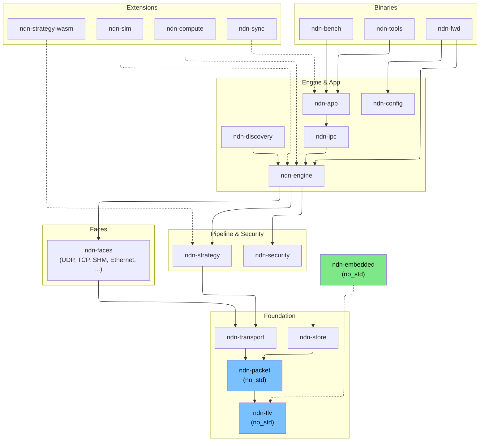

# ndn-rs Wiki

**ndn-rs** is a Rust NDN forwarder stack that models Named Data Networking as composable data pipelines with trait-based polymorphism — embeddable as a library, scalable from Cortex-M to multi-core routers.

> **Pre-release.** The workspace reads `0.1.0` but no tag has been published yet — this wiki documents `main`. Pull `ghcr.io/quarmire/ndn-fwd:latest` or build from source. See the [draft release notes](./releases/v0-1-0.md) for planned scope.

NDN replaces host-addressed networking with **named data**: consumers request content by name (Interest), the network locates and returns it (Data), and every Data packet is cryptographically signed at birth — enabling in-network caching and security that travels with the data.

| What ndn-rs brings | How |
|---------------------|-----|
| Library, not daemon | `ForwarderEngine` embeds in any Rust process |
| Zero-copy pipeline | Wire-format `Bytes` flow from `recv()` to `send()` untouched |
| Compile-time safety | Move semantics prevent use-after-short-circuit; `SafeData` typestate enforces verification |
| Lock-free hot path | `DashMap` PIT, `RwLock`-per-node FIB trie, sharded CS |
| Pluggable everything | Faces, strategies, CS backends, discovery, routing — all traits |
| Embedded to server | `no_std` TLV/packet crates on Cortex-M; same code on multi-core routers |

## Navigating This Wiki

| Section | For... |
|---------|--------|
| [Getting Started](./getting-started/installation.md) | Building, running, first program |
| [Concepts](./concepts/ndn-overview.md) | NDN fundamentals and ndn-rs data structures |
| [Design](./design/overview.md) | Architecture decisions and comparisons with NFD/ndnd |
| [Deep Dive](./deep-dive/tlv-encoding.md) | Detailed walkthroughs of subsystems |
| [Guides](./guides/implementing-face.md) | How to extend ndn-rs |
| [Benchmarks](./benchmarks/pipeline-benchmarks.md) | Performance data and methodology |
| [Reference](./reference/spec-compliance.md) | Spec compliance, external links |
| [Explorer](../explorer/) | Interactive crate map and pipeline visualizer |

## Crate Map

Dependencies flow strictly downward. `ndn-tlv` and `ndn-packet` compile `no_std`.



```d3graph
{
  "columns": [
    { "label": "Foundation", "nodes": [
        {"id": "ndn-tlv"}, {"id": "ndn-packet"}, {"id": "ndn-store"},
        {"id": "ndn-transport"}, {"id": "ndn-embedded"}
    ]},
    { "label": "Faces", "nodes": [
        {"id": "ndn-faces"}, {"id": "ndn-faces"},
        {"id": "ndn-faces"}, {"id": "ndn-faces"}
    ]},
    { "label": "Pipeline & Strategy", "nodes": [
        {"id": "ndn-engine"}, {"id": "ndn-strategy"}, {"id": "ndn-security"}
    ]},
    { "label": "Engine & App", "nodes": [
        {"id": "ndn-engine"}, {"id": "ndn-app"}, {"id": "ndn-ipc"},
        {"id": "ndn-config"}, {"id": "ndn-discovery"}
    ]},
    { "label": "Binaries", "nodes": [
        {"id": "ndn-fwd"}, {"id": "ndn-tools"}, {"id": "ndn-bench"}
    ]}
  ],
  "satellites": {
    "label": "Research  (depend on engine / app / strategy)",
    "nodes": [
        {"id": "ndn-sim"}, {"id": "ndn-compute"},
        {"id": "ndn-sync"}, {"id": "ndn-strategy-wasm"}
    ]
  },
  "edges": [
    ["ndn-tlv",       "ndn-packet"],
    ["ndn-tlv",       "ndn-embedded"],
    ["ndn-packet",    "ndn-store"],
    ["ndn-packet",    "ndn-transport"],
    ["ndn-transport", "ndn-faces"],
    ["ndn-transport", "ndn-faces"],
    ["ndn-transport", "ndn-faces"],
    ["ndn-transport", "ndn-faces"],
    ["ndn-faces",    "ndn-engine"],
    ["ndn-faces",  "ndn-engine"],
    ["ndn-faces", "ndn-engine"],
    ["ndn-faces",     "ndn-engine"],
    ["ndn-store",       "ndn-engine"],
    ["ndn-engine",    "ndn-strategy"],
    ["ndn-engine",    "ndn-security"],
    ["ndn-strategy",    "ndn-engine"],
    ["ndn-security",    "ndn-engine"],
    ["ndn-engine",    "ndn-ipc"],
    ["ndn-engine",    "ndn-discovery"],
    ["ndn-engine",      "ndn-fwd"],
    ["ndn-engine",      "ndn-tools"],
    ["ndn-engine",      "ndn-bench"],
    ["ndn-app",         "ndn-ipc"],
    ["ndn-app",         "ndn-tools"],
    ["ndn-app",         "ndn-bench"],
    ["ndn-config",      "ndn-fwd"]
  ],
  "satellite_edges": [
    ["ndn-sim",           "ndn-engine"],
    ["ndn-compute",       "ndn-engine"],
    ["ndn-sync",          "ndn-app"],
    ["ndn-strategy-wasm", "ndn-strategy"]
  ]
}
```
