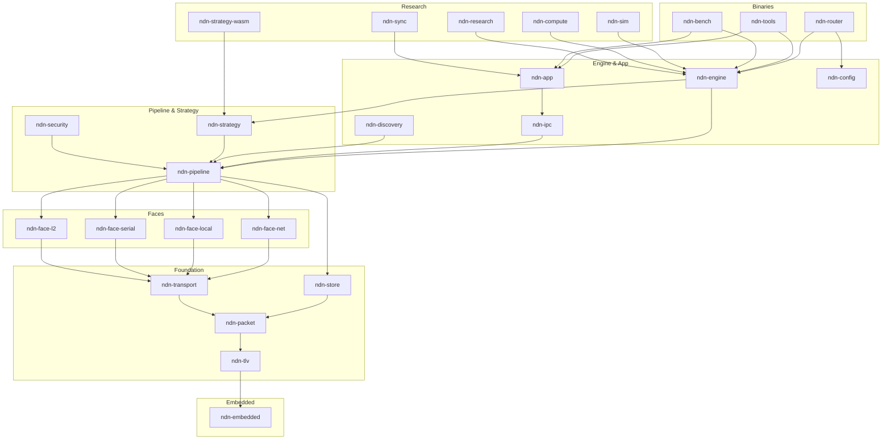

# ndn-rs Wiki

**ndn-rs** is a Named Data Networking (NDN) forwarder stack written in Rust. It models NDN as composable data pipelines with trait-based polymorphism, departing from the class hierarchy approach of NFD/ndn-cxx.

## What is NDN?

Named Data Networking is a network architecture where communication is driven by **named data** rather than host addresses. Consumers request data by name (Interest packets), and the network locates and returns the data (Data packets). Every Data packet is cryptographically signed by its producer, enabling in-network caching and security that travels with the data.

## Why ndn-rs?

- **Library, not daemon** -- `ForwarderEngine` embeds in any Rust application
- **Zero-copy pipeline** -- wire-format `Bytes` flow from recv to send without re-encoding
- **Compile-time safety** -- packet ownership through the pipeline prevents use-after-short-circuit; `SafeData` typestate enforces verification
- **Concurrent data structures** -- `DashMap` PIT, `RwLock`-per-node FIB trie, sharded CS
- **Pluggable everything** -- faces, strategies, CS backends, and pipeline stages via traits
- **Embedded to server** -- `no_std` TLV and packet crates run on Cortex-M; same code scales to multi-core routers

## Navigating This Wiki

| Section | For... |
|---------|--------|
| [Getting Started](./getting-started/installation.md) | Building, running, first program |
| [Concepts](./concepts/ndn-overview.md) | NDN fundamentals and ndn-rs data structures |
| [Design](./design/overview.md) | Architecture decisions and comparisons with NFD/ndnd |
| [Deep Dive](./deep-dive/tlv-encoding.md) | Detailed walkthroughs of subsystems |
| [Guides](./guides/implementing-face.md) | How to extend ndn-rs |
| [Benchmarks](./benchmarks/pipeline-benchmarks.md) | Performance data and methodology |
| [Reference](./reference/spec-compliance.md) | Spec compliance, external links |

## Crate Map

```
Binaries        ndn-router  ndn-tools  ndn-bench
                     |          |          |
Engine/App      ndn-engine  ndn-app  ndn-ipc  ndn-config  ndn-discovery
                     |          |        |
Pipeline        ndn-pipeline  ndn-strategy  ndn-security
                     |             |
Faces           ndn-face-net  ndn-face-local  ndn-face-serial  ndn-face-l2
                     |              |
Foundation      ndn-store  ndn-transport  ndn-packet  ndn-tlv
                                                         |
Embedded                                           ndn-embedded

Research        ndn-sim  ndn-compute  ndn-sync  ndn-research  ndn-strategy-wasm
```

Dependencies flow strictly downward. `ndn-tlv` and `ndn-packet` compile `no_std`.


