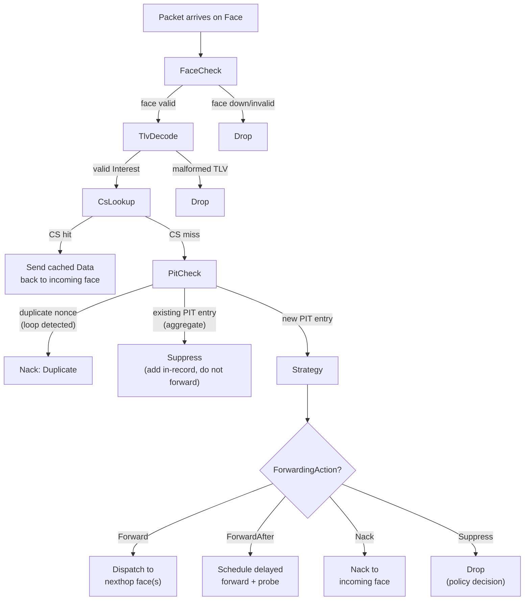
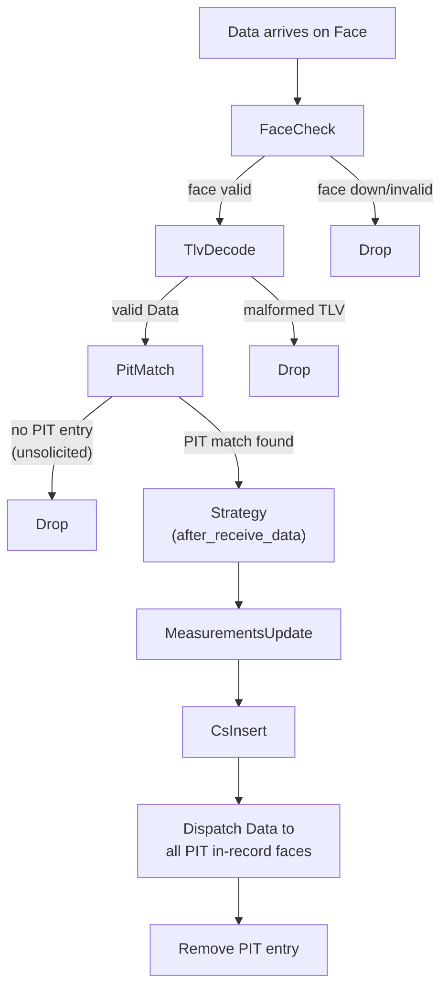
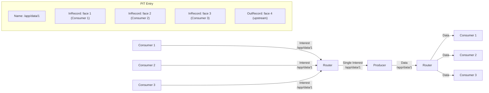
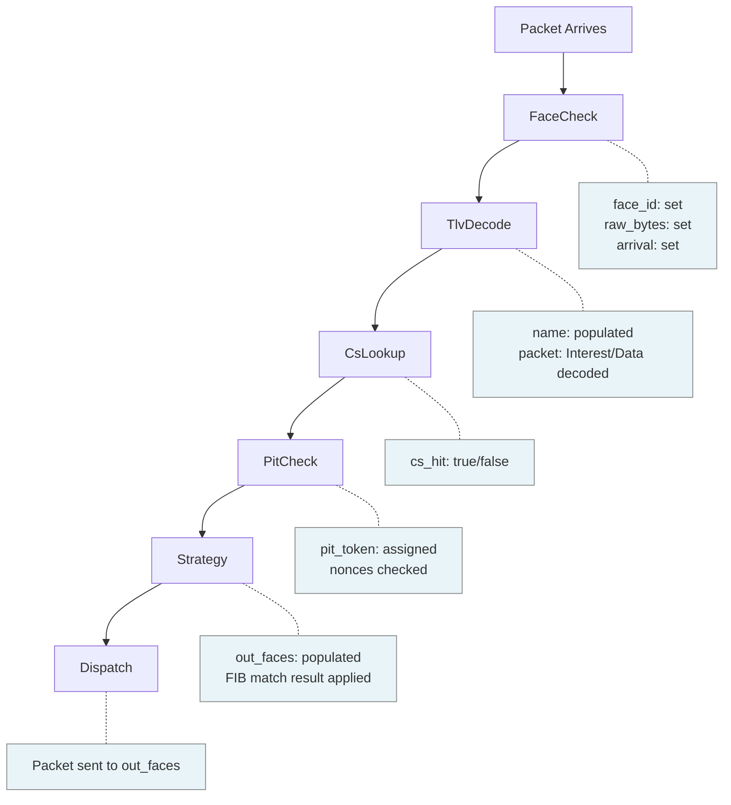

# Interest and Data Lifecycle

This page traces the full lifecycle of Interest and Data packets through the ndn-rs forwarding pipeline. Both packet types flow through a sequence of `PipelineStage` trait objects, each returning an `Action` enum that drives the next step.

## Pipeline Architecture

The pipeline is a fixed sequence of stages, determined at build time so the compiler can monomorphize the hot path. Each stage receives a `PacketContext` by value and returns an `Action`:

```rust
pub trait PipelineStage: Send + Sync + 'static {
    fn process(
        &self,
        ctx: PacketContext,
    ) -> impl Future<Output = Result<Action, DropReason>> + Send;
}
```

The `Action` enum controls dispatch:

```rust
pub enum Action {
    Continue(PacketContext),  // pass to next stage
    Send(PacketContext, SmallVec<[FaceId; 4]>),  // forward and exit
    Satisfy(PacketContext),   // satisfy PIT entries and exit
    Drop(DropReason),        // discard silently
    Nack(PacketContext, NackReason),  // send Nack to incoming face
}
```

A runner loop drains a shared `mpsc` channel (fed by all face tasks) and dispatches each packet through the appropriate pipeline. There is no `next` closure threading -- the runner simply matches on the `Action` returned by each stage.

## PacketContext

`PacketContext` is the unit of state that flows through the pipeline. It starts with raw bytes and accumulates decoded information as stages execute:

```rust
pub struct PacketContext {
    pub raw_bytes: Bytes,              // original wire bytes
    pub face_id:   FaceId,            // face the packet arrived on
    pub name:      Option<Arc<Name>>,  // None until TlvDecodeStage
    pub packet:    DecodedPacket,      // Raw -> Interest/Data after decode
    pub pit_token: Option<PitToken>,   // set by PitCheckStage
    pub out_faces: SmallVec<[FaceId; 4]>,  // populated by StrategyStage
    pub cs_hit:    bool,
    pub verified:  bool,
    pub arrival:   u64,                // ns since Unix epoch
    pub tags:      AnyMap,             // extensible per-packet metadata
}
```

Fields are populated progressively. For example, `name` is `None` until the TLV decode stage runs. This design means a Content Store hit can short-circuit the pipeline before expensive fields like nonce or lifetime are ever accessed.

## Interest Pipeline

When an Interest packet arrives on a face, it flows through these stages:



### Stage-by-Stage Detail

1. **FaceCheck** -- Validates that the incoming face is still active. If the face has been removed or is shutting down, the packet is dropped immediately.

2. **TlvDecode** -- Parses the raw `Bytes` into a typed `Interest` struct. Populates `ctx.name` with an `Arc<Name>`. Malformed packets are dropped. Fields like nonce and lifetime are decoded lazily via `OnceLock<T>` -- they are only accessed if later stages need them.

3. **CsLookup** -- Checks the Content Store for a matching Data packet. On a hit, the cached Data (stored as wire-format `Bytes` for zero-copy) is sent directly back to the incoming face. The pipeline short-circuits here -- no PIT entry is created, no upstream forwarding happens.

4. **PitCheck** -- Looks up the PIT by `(Name, Option<Selector>)`. Three outcomes:
   - **New entry**: Creates a PIT entry with an in-record for the incoming face. Continues to Strategy.
   - **Existing entry, new face**: Adds an in-record (Interest aggregation). The Interest is not forwarded again.
   - **Duplicate nonce**: Loop detected. Returns `Nack(Duplicate)`.

5. **Strategy** -- Performs a FIB longest-prefix match to find nexthops, then invokes the strategy assigned to that prefix. The strategy receives an immutable `StrategyContext` (it cannot mutate global state) and returns one or more `ForwardingAction` values:

   ```rust
   pub enum ForwardingAction {
       Forward(SmallVec<[FaceId; 4]>),
       ForwardAfter { faces: SmallVec<[FaceId; 4]>, delay: Duration },
       Nack(NackReason),
       Suppress,
   }
   ```

   `ForwardAfter` enables probe-and-fallback without the strategy spawning its own timers.

6. **Dispatch** -- Sends the Interest out on the selected face(s). Creates out-records in the PIT entry.

## Data Pipeline

When a Data packet arrives (typically from an upstream router or producer), it flows through a different set of stages:



### Stage-by-Stage Detail

1. **FaceCheck** -- Same as the Interest pipeline.

2. **TlvDecode** -- Parses raw bytes into a typed `Data` struct. Populates `ctx.name`.

3. **PitMatch** -- Looks up the PIT for a matching entry. If no entry exists, the Data is unsolicited (nobody asked for it) and is dropped. If a match is found, the PIT entry's in-records tell us which faces to send the Data back on.

4. **Strategy** (`after_receive_data`) -- Notifies the strategy that Data was received. This allows strategies to update internal state (e.g., mark a path as working, cancel retransmission timers).

5. **MeasurementsUpdate** -- Updates the `MeasurementsTable` with per-face/per-prefix statistics: EWMA RTT (computed from PIT out-record timestamp to Data arrival) and satisfaction rate. These measurements inform future strategy decisions.

6. **CsInsert** -- Inserts the Data into the Content Store. The wire-format `Bytes` are stored directly (no re-encoding) so that future CS hits can be served with zero-copy. `FreshnessPeriod` is decoded once at insert time to compute `stale_at`.

7. **Dispatch** -- Sends the Data packet to every face listed in the PIT entry's in-records. The PIT entry is then consumed (removed).

## PIT Aggregation

When multiple consumers request the same data, the PIT aggregates their Interests so that only a single Interest is forwarded upstream. When the Data returns, it fans out to all consumers:



## PacketContext Population Through Pipeline Stages

As a packet moves through the pipeline, `PacketContext` fields are progressively populated by each stage:



## Nack Pipeline

NDN also supports Network Nacks (negative acknowledgements). When a router cannot forward an Interest (no route, congestion, etc.), it sends a Nack back to the downstream face. In ndn-rs, Nacks are produced by returning `Action::Nack(ctx, reason)` from any pipeline stage or `ForwardingAction::Nack(reason)` from a strategy.

When a Nack arrives from upstream, it follows a shortened pipeline: decode, PIT match, and strategy notification. The strategy decides whether to try alternative nexthops or propagate the Nack downstream.

## Summary

The two pipelines are symmetric: Interests flow upstream (consumer toward producer), Data flows downstream (producer toward consumer), and the PIT is the bridge that connects them. Each stage is a small, composable unit with a single responsibility, and the `Action` enum provides explicit control flow without hidden callbacks or middleware chains.
