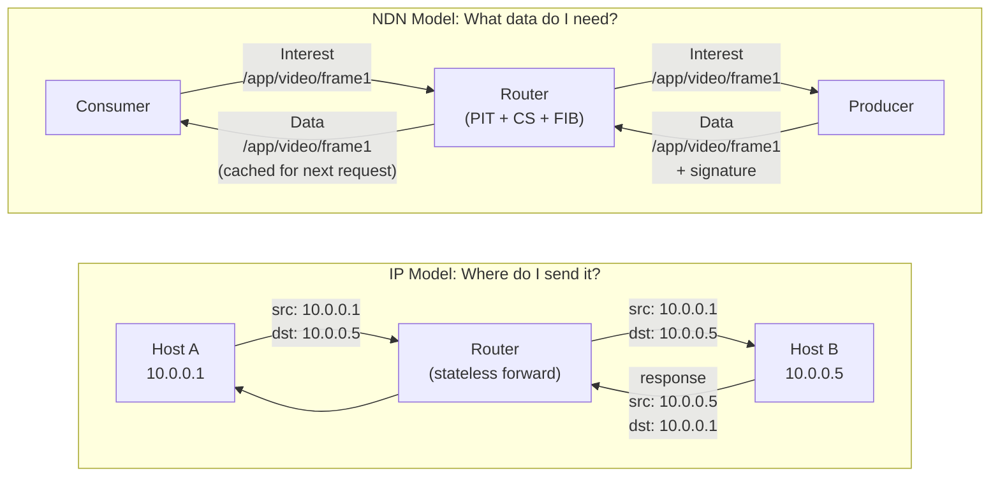
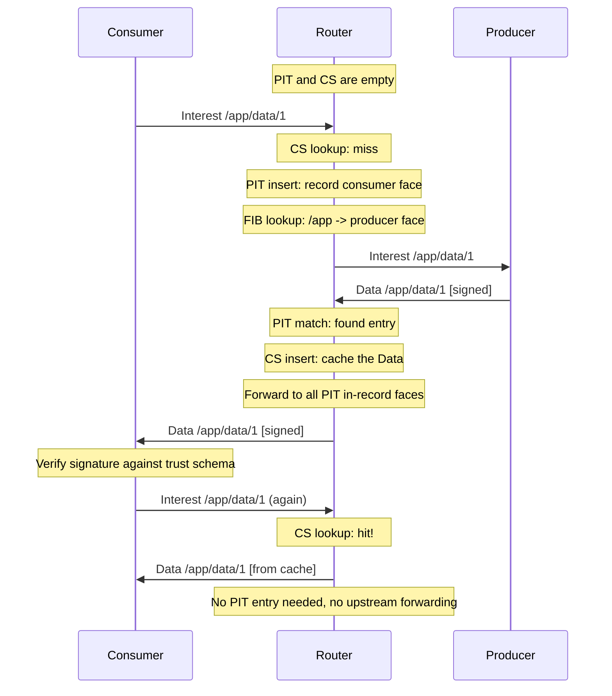
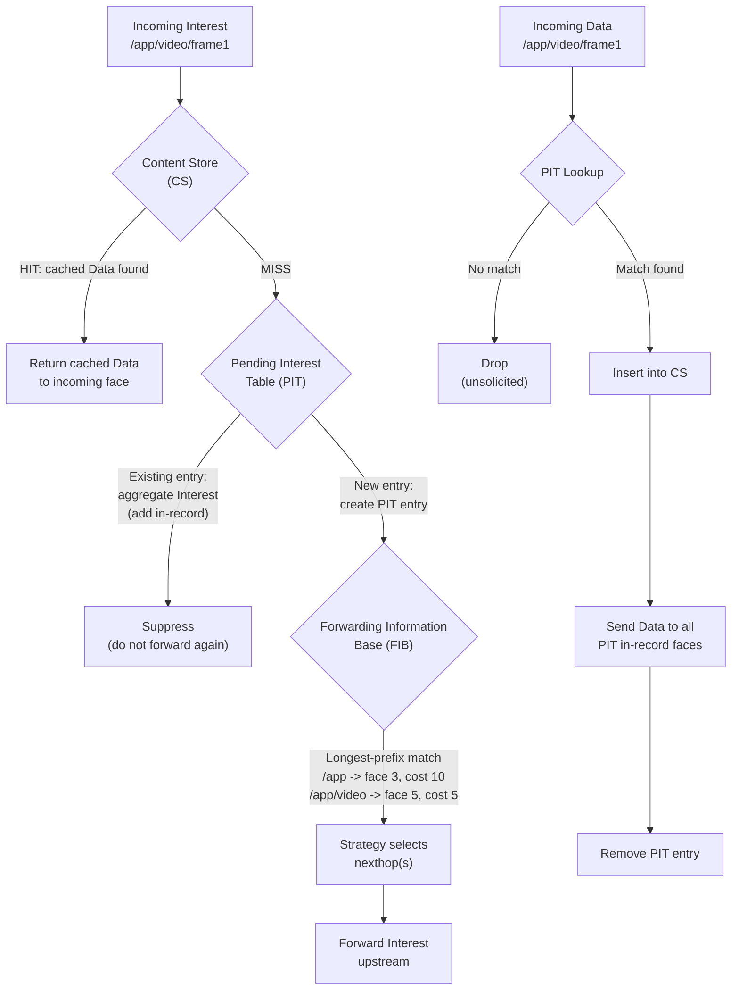

# NDN Overview for IP Developers

## What If the Network Knew About Data?

Every network you have ever used works the same way: you ask to talk to a machine, and the network tries to connect you. "Send these bytes to 10.0.0.5." The network does not know or care what those bytes mean -- it just shuffles them toward an address. If the machine is down, you get nothing. If a copy of exactly what you need is sitting on a router one hop away, the network ignores it and dutifully tries to reach the original host anyway.

Named Data Networking starts from a different question: *what if you could just ask for the data by name?*

Instead of "connect me to host X," you say "I need `/ucla/papers/2024/ndn-overview`." Any node in the network that has a copy -- the original producer, a router that cached it earlier, a nearby peer -- can answer. The data itself carries a cryptographic signature from its producer, so it does not matter *where* it came from. You can verify it is authentic regardless.

This is not just a caching layer bolted onto IP. It is a fundamental architectural inversion: from "where is the host?" to "what is the data?" -- and it changes everything about how forwarding, security, and multicast work.

NDN was conceived by Van Jacobson and developed into a full architecture by the [NDN project](https://named-data.net/) team led by Lixia Zhang at UCLA, with collaborators across multiple universities and research labs.

<figure>

<figcaption>The NDN hourglass: just as IP is the thin waist of today's Internet, named data becomes the thin waist of an NDN network. Applications, security, and transport all build on named, secured data rather than on host-to-host channels. (Image: named-data.net)</figcaption>
</figure>

## The Core Shift: Addresses vs. Names

If you are coming from IP networking, the easiest way to feel the difference is to look at the same scenario through both lenses:

| IP Networking | Named Data Networking |
|---|---|
| "Connect to host 10.0.0.5 and fetch `/index.html`" | "Fetch `/example/site/index.html`" |
| Security applied to the channel (TLS) | Security applied to the data itself (signature on every Data packet) |
| Caching requires explicit infrastructure (CDN) | Every router can cache and re-serve data natively |
| Routing tables map address prefixes to next hops | FIB maps name prefixes to next hops |
| No built-in multicast or aggregation | Duplicate Interests are aggregated automatically (PIT) |

The following diagram illustrates the contrast. In IP, the router is stateless and oblivious to content. In NDN, the router maintains a Pending Interest Table (PIT), a Content Store (CS), and a Forwarding Information Base (FIB) -- it understands what data flows through it.

## The Two Packet Types

NDN's network layer has exactly two packet types. That is not a simplification for this overview -- it is the actual design.

An **Interest** is a request: "I want the data named X." A consumer sends it into the network, and the network figures out where to find a copy. A **Data** packet is the answer: "Here is the data named X, signed by producer Y." It travels back along the exact reverse path the Interest took, because the network remembers where each Interest came from.

There is no separate routing protocol for return traffic, no connection state, and no session layer. The Interest leaves breadcrumbs (PIT entries) on its way in, and the Data follows them back out.

## How Data Stays Trustworthy Without Trusted Channels

In IP, you secure the *pipe*: TLS encrypts the channel between two endpoints, so you trust the data because you trust the connection. But this breaks down when data is cached, replicated, or served by a third party. Who signed the TLS certificate for a CDN edge node you have never heard of?

NDN sidesteps this entirely. Every Data packet carries a cryptographic signature from its original producer. A cached copy served by a router three hops away is exactly as trustworthy as one served by the producer directly -- the consumer verifies the signature against a trust schema and either accepts or rejects the data, regardless of where it came from.

In ndn-rs, this principle is encoded into the type system. The `SafeData` type can only be constructed after signature verification succeeds. Application callbacks receive `SafeData`, never raw unverified `Data`. The compiler itself prevents you from forwarding unverified content.

## Inside the Forwarder

An NDN forwarder is more sophisticated than an IP router. Where an IP router has a single table (the routing table) and is stateless per-packet, an NDN forwarder maintains three core data structures that work together on every packet:

<figure>

<figcaption>The internal structure of an NDN forwarder, showing how Interest and Data packets interact with the Content Store, PIT, FIB, and Strategy layer. (Image: named-data.net)</figcaption>
</figure>

### Content Store (CS): In-Network Caching

Every NDN forwarder -- not just dedicated cache servers -- can store Data packets it has forwarded and serve them to future Interests for the same name. When an Interest arrives and the CS has a match, the forwarder responds immediately without forwarding the Interest upstream. In ndn-rs, the CS is trait-based (`ContentStore`) with pluggable backends: LRU, sharded, and persistent (RocksDB/redb).

### Pending Interest Table (PIT): Stateful Forwarding

When an Interest arrives and the CS does not have the data, the forwarder creates a PIT entry recording which face the Interest came from and forwards it upstream. If a second Interest for the same name arrives before the Data comes back, the forwarder simply adds the new face to the existing PIT entry -- it does not forward a duplicate Interest. When the Data finally arrives, the forwarder sends it back to *all* faces listed in the PIT entry, then removes the entry.

This built-in aggregation is one of NDN's most powerful features. It provides native multicast, loop prevention, and congestion control at the network layer.

### Forwarding Information Base (FIB): Name-Based Routing

The FIB maps name prefixes to outgoing faces, just as an IP routing table maps address prefixes to next hops. The key difference is longest-prefix match on hierarchical names rather than IP addresses. In ndn-rs, the FIB is a name trie with `HashMap<Component, Arc<RwLock<TrieNode>>>` per level, enabling concurrent longest-prefix match without holding parent locks.

### Strategy Layer: Adaptive Forwarding

Instead of a single forwarding algorithm, NDN allows per-prefix forwarding strategies. A strategy decides which nexthop(s) to use, whether to probe alternative paths, whether to retry on a different face after a timeout, or whether to suppress forwarding entirely. This makes NDN forwarding adaptive in a way that IP routing generally is not.

In ndn-rs, a name trie (parallel to the FIB) maps prefixes to `Arc<dyn Strategy>` implementations. Strategies receive an immutable `StrategyContext` and return a `ForwardingAction`.

## Packet Flow: A Complete Example

Let us trace what happens when a consumer requests data, step by step. The first request goes all the way to the producer. The second request for the same data is satisfied from the router's cache.

And here is how all three data structures cooperate within a single forwarder node. Notice how an Interest that hits the CS never touches the PIT or FIB, and how unsolicited Data (with no matching PIT entry) is dropped:

## NDN in Rust: Why the Fit Is Natural

If you have read this far, you might have noticed something: NDN's architecture is full of shared ownership, concurrent access, and type-level safety guarantees. These are exactly the problems Rust's ownership model and trait system are designed to solve.

ndn-rs is not a port of C++ code (like ndn-cxx/NFD) or Go code (like ndnd). It is a ground-up design that uses Rust's strengths to express NDN concepts directly:

- **`Arc<Name>`** -- names are shared across PIT, FIB, and pipeline stages without copying. Rust's reference counting ensures they are freed exactly when no longer needed.
- **`bytes::Bytes`** -- zero-copy slicing for TLV parsing and Content Store storage. A cached Data packet in the CS is the same allocation that came off the wire.
- **`DashMap`** for PIT -- sharded concurrent access with no global lock on the hot path. Multiple pipeline tasks process packets in parallel without contention.
- **`PipelineStage` trait** -- each processing step (decode, CS lookup, PIT check, strategy, dispatch) is a composable trait object. The pipeline is a fixed sequence of stages, optimized by the compiler.
- **`SafeData` newtype** -- the compiler prevents unverified data from being forwarded. This is not a runtime check you might forget; it is a type error.
- **Trait-based `ContentStore`** -- swap cache backends (LRU, sharded, persistent) without changing the pipeline.

The architecture is documented in detail in [ARCHITECTURE.md](https://github.com/user/ndn-rs/blob/main/ARCHITECTURE.md), and the next pages in this section cover the [Interest/Data lifecycle](interest-data-lifecycle.md) through the pipeline, the [PIT, FIB, and CS data structures](pit-fib-cs.md), and a [glossary](glossary.md) of NDN terms.

## Further Reading

The foundational papers and resources for understanding NDN:

- Van Jacobson, Diana K. Smetters, James D. Thornton, Michael F. Plass, Nicholas H. Briggs, and Rebecca L. Braynard. **"Networking Named Content."** *Proceedings of the 5th ACM International Conference on Emerging Networking Experiments and Technologies (CoNEXT)*, 2009. -- The paper that started it all.
- Lixia Zhang, Alexander Afanasyev, Jeffrey Burke, Van Jacobson, kc claffy, Patrick Crowley, Christos Papadopoulos, Lan Wang, and Beichuan Zhang. **"Named Data Networking."** *ACM SIGCOMM Computer Communication Review*, 44(3):66-73, 2014. -- The NDN project paper describing the full architecture.
- [NDN Publications](https://named-data.net/publications/) -- The complete list of NDN project publications covering security, routing, applications, and more.
- [named-data.net](https://named-data.net/) -- The NDN project homepage.
