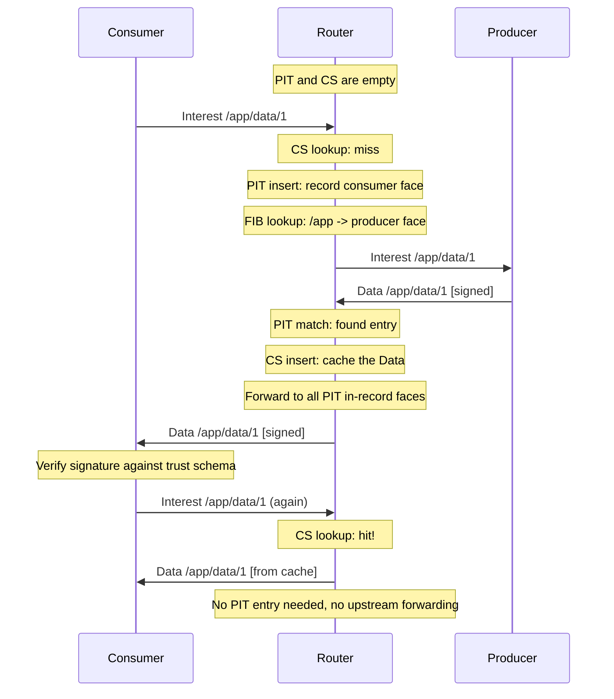

# NDN Overview for IP Developers

This page introduces Named Data Networking (NDN) for developers who are familiar with IP networking. NDN replaces the host-centric model of TCP/IP with a data-centric model where every packet is identified by a hierarchical name rather than a source/destination address pair.

## From IP to NDN: The Core Shift

In IP networking, communication is between two endpoints identified by addresses. The network's job is to move packets from source address A to destination address B. Applications must establish connections, manage sessions, and handle security at the transport or application layer.

NDN inverts this model:

| IP Networking | Named Data Networking |
|---|---|
| "Connect to host 10.0.0.5 and fetch `/index.html`" | "Fetch `/example/site/index.html`" |
| Security applied to the channel (TLS) | Security applied to the data itself (signature on every Data packet) |
| Caching requires explicit infrastructure (CDN) | Every router can cache and re-serve data natively |
| Routing tables map address prefixes to next hops | FIB maps name prefixes to next hops |
| No built-in multicast or aggregation | Duplicate Interests are aggregated automatically (PIT) |

## Key Concepts

### Named Data

Every piece of content has a hierarchical name, such as `/ndn/edu/ucla/papers/2024/ndn-overview`. Names are structured as a sequence of typed components -- they are not flat strings. The name is part of the packet itself, not just a field in a header.

### Interest / Data Exchange

NDN has exactly two network-layer packet types:

- **Interest**: "I want the data named X." Sent by a consumer into the network.
- **Data**: "Here is the data named X, signed by producer Y." Returned by any node that has the data (producer, router cache, or another consumer that cached it).

A Data packet is returned along the reverse path of the Interest that requested it. There is no separate "response routing" -- the network remembers which face each Interest arrived on and sends the Data back the same way.

### Content-Centric Security

Every Data packet carries a cryptographic signature from the producer. Security is bound to the data, not to the channel it travels over. A cached copy served by a router is just as trustworthy as one served directly by the producer, because the consumer verifies the signature against a trust schema regardless of where the packet came from.

In ndn-rs, the `SafeData` type enforces this at compile time: only data that has passed signature verification can be stored or forwarded as `SafeData`. Application callbacks receive `SafeData`, never raw `Data`.

### In-Network Caching (Content Store)

Every NDN node -- not just dedicated cache servers -- can store Data packets it forwards and serve them to future Interests for the same name. This is the Content Store (CS). In ndn-rs, the CS is trait-based (`ContentStore`) with pluggable backends: LRU, sharded, and persistent (RocksDB/redb).

### Stateful Forwarding (PIT)

Unlike IP routers that are stateless (each packet is forwarded independently), NDN routers maintain a Pending Interest Table (PIT). When an Interest arrives, the router records which face it came from. When the matching Data arrives, the router sends it back to all faces that expressed interest. If a duplicate Interest for the same name arrives before the Data, it is aggregated into the existing PIT entry rather than forwarded again.

### Strategy-Based Forwarding

Instead of a single forwarding algorithm, NDN allows per-prefix forwarding strategies. A strategy decides which nexthop(s) to use, whether to probe alternative paths, or whether to suppress forwarding entirely. In ndn-rs, a name trie (parallel to the FIB) maps prefixes to `Arc<dyn Strategy>` implementations.

## Packet Flow

The following diagram shows how an Interest and Data packet flow through the network, involving the PIT and CS at each router:

## How ndn-rs Maps These Concepts to Rust

NDN's architecture maps naturally to Rust's ownership and trait system:

- **`Arc<Name>`** -- names are shared across PIT, FIB, and pipeline stages without copying.
- **`bytes::Bytes`** -- zero-copy slicing for TLV parsing and Content Store storage.
- **`DashMap`** for PIT -- sharded concurrent access with no global lock on the hot path.
- **`PipelineStage` trait** -- each processing step (decode, CS lookup, PIT check, strategy, dispatch) is a composable trait object.
- **`SafeData` newtype** -- the compiler prevents unverified data from being forwarded.
- **Trait-based `ContentStore`** -- swap cache backends without changing the pipeline.

The next pages in this section cover the [Interest/Data lifecycle](interest-data-lifecycle.md) through the pipeline, the [PIT, FIB, and CS data structures](pit-fib-cs.md), and a [glossary](glossary.md) of NDN terms.
