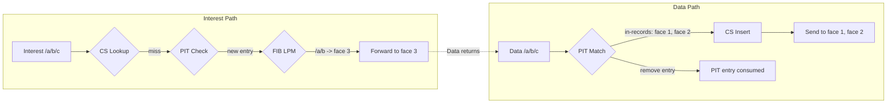
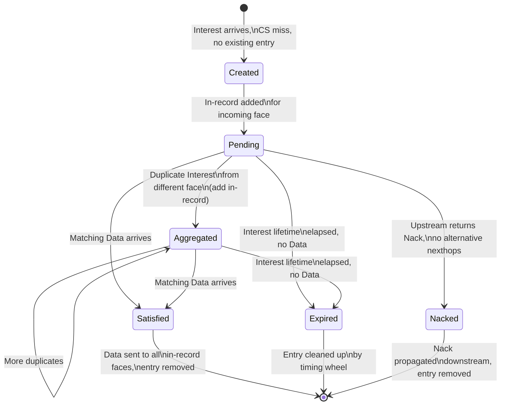

# PIT, FIB, and Content Store

Three data structures answer three questions for every packet: **CS** — "Do I already have this data?", **PIT** — "Is someone already looking for it?", **FIB** — "Where should I look?"

## Quick Reference

| | Content Store | Pending Interest Table | Forwarding Information Base |
|---|---|---|---|
| **Purpose** | Cache recently seen Data | Track outstanding Interests | Map name prefixes → nexthop faces |
| **Implementation** | Trait: `LruCs`, `ShardedCs`, `PersistentCs` | `DashMap<PitToken, PitEntry>` | `NameTrie<Arc<FibEntry>>` |
| **Key** | Name (exact) | Name + selector hash | Name prefix (longest match) |
| **Concurrency** | Backend-dependent (sharding available) | Sharded `RwLock` (DashMap) | `RwLock` per trie node (hand-over-hand) |
| **Eviction** | LRU by byte count, or persistent | Timeout (timing wheel, O(1)) | Manual (management API) |
| **Hot-path cost** | O(1) LRU lookup, zero-copy hit | O(1) insert/lookup | O(k) where k = name components |
| **Consulted by** | Interest path (before PIT) | Interest path (after CS miss) + Data path | Interest path (after PIT) |

## The Cooperation

When an Interest arrives, the forwarder consults all three in sequence. When Data returns, the PIT and CS work in concert to cache and deliver:



Interest hits CS → miss → PIT records the requester → FIB finds the route → Interest goes upstream. Data returns → PIT reveals the waiting consumers → CS caches → Data fans out. Three structures, one fluid motion.

## Content Store: "Do I Already Have This?"

The CS is the first structure consulted when an Interest arrives, and it has the power to end the pipeline immediately. If a cached Data packet matches the Interest, the forwarder sends it back to the consumer without ever touching the PIT or FIB. This short-circuit is the single most important optimization in the forwarding plane.

### The Trait Abstraction

The CS is defined as a trait, not a concrete type. This means the pipeline doesn't care *how* data is cached -- only that the interface is honored:

```rust
pub trait ContentStore: Send + Sync + 'static {
    fn get(&self, interest: &Interest) -> impl Future<Output = Option<CsEntry>> + Send;
    fn insert(&self, data: Bytes, name: Arc<Name>, meta: CsMeta) -> impl Future<Output = InsertResult> + Send;
    fn evict(&self, name: &Name) -> impl Future<Output = bool> + Send;
    fn capacity(&self) -> CsCapacity;
}

pub struct CsEntry {
    pub data:    Bytes,  // wire-format, not re-encoded
    pub stale_at: u64,   // FreshnessPeriod decoded once at insert time
}
```

Three built-in backends implement this trait, each suited to different deployment scenarios.

**LruCs** is a byte-bounded LRU cache -- the default choice for most deployments. When total cached bytes exceed the configured limit, the least recently used entries are evicted. It stores wire-format `Bytes` directly, so a cache hit sends the stored bytes to the face with no re-encoding or copying.


**ShardedCs** wraps any `ContentStore` implementation with sharding by name hash. Each shard is an independent instance of the inner store. When many pipeline tasks hit the CS concurrently, sharding ensures they don't all contend on a single lock -- the same principle that makes the PIT scale, applied here.

**PersistentCs** is backed by an on-disk key-value store (RocksDB or redb). It's the right choice when the cache should survive restarts or when the dataset exceeds available memory. Its existence is invisible to the pipeline -- the trait abstraction means swapping backends requires no code changes upstream.

### Why Wire-Format Storage Matters

The CS stores Data as the original wire-format `Bytes`, not as decoded Rust structs. On a cache hit, those bytes are handed directly to `face.send()` with zero allocation and zero copying -- `Bytes` uses reference-counted shared memory internally.

> **💡 Key insight:** Storing wire-format bytes instead of decoded structs is a deliberate tradeoff. It means the CS cannot patch fields (e.g., decrementing a hop count) on cache hits. But NDN Data packets are immutable and cryptographically signed -- modifying them would invalidate the signature anyway. So wire-format storage is both the fastest and the most correct approach.

This design choice connects directly to the PIT: because the CS returns raw bytes, a cache hit bypasses not just the PIT and FIB, but also any decoding that would be needed to re-encode the Data for transmission. The pipeline stage that performs CsLookup simply returns `Action::Send` with the cached bytes -- no further stages execute.

## Pending Interest Table: "Is Someone Already Looking?"

If the CS can't satisfy an Interest, the next question is whether another consumer has already asked for the same data. The PIT tracks every outstanding Interest that has been forwarded upstream but not yet satisfied. It is the bridge between the Interest and Data pipelines -- Interests create PIT entries on the way up, and Data consumes them on the way down.

### Structure

```rust
// Conceptual: DashMap keyed on PIT token hash
type Pit = DashMap<PitToken, PitEntry>;

pub struct PitEntry {
    pub name:        Arc<Name>,
    pub selector:    Option<Selector>,
    pub in_records:  Vec<InRecord>,
    pub out_records: Vec<OutRecord>,
    pub nonces_seen: SmallVec<[u32; 4]>,
    pub is_satisfied: bool,
    pub created_at:  u64,
    pub expires_at:  u64,
}

pub struct InRecord  { pub face_id: FaceId, pub nonce: u32, pub expiry: u64, pub lp_pit_token: Option<Bytes>, }
pub struct OutRecord { pub face_id: u32, pub last_nonce: u32, pub sent_at: u64 }
```

The PIT key is a `PitToken` derived from the Interest name and selectors. Two Interests for the same name but different `MustBeFresh` or `CanBePrefix` values produce distinct PIT entries, matching NDN semantics exactly.

Each entry maintains two lists. **In-records** track which downstream faces sent Interests -- these are the faces that need to receive Data when it arrives. **Out-records** track which upstream faces the Interest was forwarded to -- these provide the timestamps needed to compute round-trip time and detect forwarding failures.

### Concurrency Without Compromise

The PIT is the hottest data structure in the forwarder. Every Interest and every Data packet touches it. A naive global mutex would serialize all packet processing onto a single core. ndn-rs uses `DashMap` instead.

> **📊 Performance:** `DashMap` provides sharded concurrent access -- internally it is a fixed number of `RwLock<HashMap>` shards. Different PIT entries hash to different shards, so operations on unrelated Interests never contend. A global mutex (as NFD uses) serializes all packet processing onto one core. `DashMap`'s sharded design means N cores can process N unrelated packets in parallel with zero contention. This is the single biggest architectural difference enabling multi-core scaling.

### Loop Detection

Each Interest carries a random 32-bit nonce. When an Interest arrives and a PIT entry already exists for that name, the entry's `nonces_seen` list is checked. If the nonce is already present, the Interest has looped back to a router it already visited -- a forwarding loop. The forwarder responds with a Nack carrying the `Duplicate` reason code.

> **🔧 Implementation note:** `nonces_seen` uses `SmallVec<[u32; 4]>` to keep the common case (1--4 nonces) on the stack. Most PIT entries see exactly one nonce and are satisfied quickly. Only in unusual aggregation scenarios does the vector spill to the heap.

### The Lifecycle of a PIT Entry

A PIT entry is born when a new Interest passes the CS (miss) and PIT (no existing entry) checks. It lives through possible aggregation -- additional consumers requesting the same data add their in-records. It dies in one of three ways: Data arrives and satisfies it, its lifetime expires, or a Nack propagates through it.



> **🔧 Implementation note:** ndn-rs does not scan the entire PIT for expired entries. Instead, a hierarchical timing wheel provides O(1) insertion and expiry notification. When a PIT entry is created, it is registered with the wheel at its `expires_at` time. The wheel fires a callback when that time passes, and the entry is removed -- no periodic sweeps, no wasted CPU.

The PIT's connection to the other structures is direct and essential. It depends on the CS having already been checked (no point tracking an Interest the CS can satisfy). And when Data arrives, the PIT entry's in-records tell the dispatch stage exactly where to send it -- information that the FIB never had, because the FIB only knows about *upstream* paths, not about which *downstream* faces are waiting.

## Forwarding Information Base: "Where Should I Look?"

When an Interest passes both the CS (miss) and PIT (new entry), the forwarder needs to decide where to send it. The FIB maps name prefixes to sets of nexthop faces, and a longest-prefix match (LPM) finds the best entry for any given name.

### Structure

The FIB is a name trie where each node holds an optional `FibEntry`:

```rust
pub struct Fib(NameTrie<Arc<FibEntry>>);

pub struct FibEntry {
    pub nexthops: Vec<FibNexthop>,
}

pub struct FibNexthop {
    pub face_id: u32,
    pub cost: u32,
}
```

### The Concurrent Trie

Each trie node uses `HashMap<NameComponent, Arc<RwLock<TrieNode<V>>>>`:

```rust
pub struct NameTrie<V: Clone + Send + Sync + 'static> {
    root: Arc<RwLock<TrieNode<V>>>,
}

struct TrieNode<V> {
    entry: Option<V>,
    children: HashMap<NameComponent, Arc<RwLock<TrieNode<V>>>>,
}
```

The `Arc` wrapper on each child node is the key to concurrency. When a thread performing LPM visits a child node, it grabs the child's `Arc`, then releases the parent's read lock. This hand-over-hand locking means concurrent lookups on different branches never contend after diverging from their common ancestor.

> **🔧 Implementation note:** The `Arc<RwLock<TrieNode>>` per child is what makes the FIB a *concurrent* trie, not just a trie behind a lock. A lookup for `/a/b/c` grabs the `Arc` for node `a`, releases the root lock, then grabs the `Arc` for `b`, releases `a`'s lock, and so on. Two concurrent lookups on different branches (e.g., `/a/b` and `/x/y`) never contend after the root level.

Here's how a FIB trie looks in practice, with green nodes holding actual nexthop entries:

```mermaid
%%{init: {"layout": "elk"}}%%
flowchart TD
    root["/ (root)"] --> ndn["/ndn"]
    ndn --> edu["/ndn/edu"]
    ndn --> com["/ndn/com"]
    edu --> ucla["/ndn/edu/ucla\n&#9745; nexthop: face 3, cost 10"]
    edu --> memphis["/ndn/edu/memphis\n&#9745; nexthop: face 5, cost 20"]
    edu --> mit["/ndn/edu/mit\n&#9745; nexthop: face 7, cost 15"]
    com --> google["/ndn/com/google\n&#9745; nexthop: face 2, cost 5"]
    ucla --> papers["/ndn/edu/ucla/papers"]
    ucla --> cs_dept["/ndn/edu/ucla/cs\n&#9745; nexthop: face 4, cost 8"]

    style ucla fill:#d4edda,stroke:#28a745
    style memphis fill:#d4edda,stroke:#28a745
    style mit fill:#d4edda,stroke:#28a745
    style google fill:#d4edda,stroke:#28a745
    style cs_dept fill:#d4edda,stroke:#28a745
```



Intermediate nodes like `/ndn/edu` exist only for trie structure -- they have no entry. A lookup for `/ndn/edu/ucla/papers/2024` walks the trie and returns the deepest match at `/ndn/edu/ucla`.

### Longest-Prefix Match in Action

LPM walks the trie component by component, tracking the deepest node that has an `entry`. For a lookup of `/a/b/c/d`:

1. Read-lock root, check child `a`, clone its `Arc`, release root lock.
2. Read-lock node `a`, record its entry (if any), check child `b`, clone, release.
3. Continue until the name is exhausted or no child matches.
4. Return the deepest recorded entry.

This is O(k) where k is the number of name components, with each level holding a lock only briefly. The result -- a set of nexthops with associated costs -- is handed to the strategy, which makes the final forwarding decision.

> **💡 Key insight:** The FIB only provides *candidates*. It says "these faces might lead to the data." The strategy layer, informed by measurements the PIT helped gather (RTT from out-record timestamps, satisfaction rates from PIT entry outcomes), makes the actual choice. The FIB and PIT are connected not just through the pipeline, but through the feedback loop that makes forwarding adaptive.

## The Three Together: A Complete Example

Let's trace a concrete scenario to see all three structures in action.

A consumer sends an Interest for `/app/video/segment-42`. The forwarder's CS is checked first -- no cached copy exists. The PIT is consulted next -- no existing entry, so a new one is created with an in-record for face 1 (the consumer's face). The FIB performs LPM and finds a match at `/app/video` with nexthop face 5 (cost 10) and face 7 (cost 20). The strategy picks face 5, the cheaper path. An out-record is added to the PIT entry with the current timestamp, and the Interest goes out on face 5.

Seconds later, a second consumer on face 2 sends the same Interest. The CS still has nothing. But the PIT already has an entry -- the Interest is aggregated. Face 2 is added as a second in-record. No second Interest goes upstream.

The producer responds with Data on face 5. The PIT entry is matched, revealing two in-records (faces 1 and 2). The out-record's timestamp is used to compute RTT, which is fed into the measurements table. The Data is inserted into the CS for future cache hits. Then the Data is dispatched to both face 1 and face 2. The PIT entry is consumed and removed.

If a *third* consumer now requests the same segment, the CS has the answer immediately. The PIT and FIB are never consulted. The cached bytes flow directly back to the consumer.

## Summary Table

| Structure | Implementation | Key | Concurrency | Hot-Path Cost |
|---|---|---|---|---|
| FIB | `NameTrie<Arc<FibEntry>>` | Name prefix (trie) | `RwLock` per trie node | O(k) LPM, k = component count |
| PIT | `DashMap<PitToken, PitEntry>` | Name + selector hash | Sharded `RwLock` | O(1) insert/lookup |
| CS | Trait (`LruCs`, `ShardedCs`, `PersistentCs`) | Name | Implementation-dependent | O(1) LRU, zero-copy hit |

Together, these three structures form a self-reinforcing system. The CS absorbs repeated requests, keeping them off the network. The PIT aggregates concurrent requests, preventing duplicate upstream traffic. The FIB directs new requests toward the right sources, guided by measurements that the PIT helped collect. No single structure works in isolation -- their power comes from how they cooperate.
