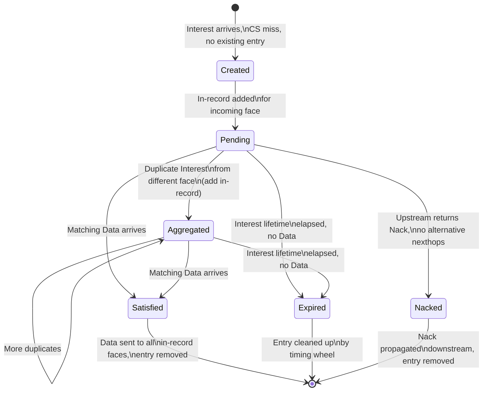
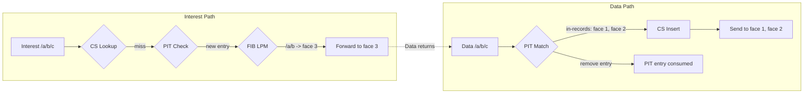

# PIT, FIB, and Content Store

The three core data structures in any NDN forwarder are the Pending Interest Table (PIT), the Forwarding Information Base (FIB), and the Content Store (CS). In ndn-rs, each is designed around Rust's concurrency primitives to avoid global locks on the forwarding hot path.

## Forwarding Information Base (FIB)

The FIB maps name prefixes to sets of nexthops. When an Interest arrives and passes PIT checks, the forwarder performs a longest-prefix match (LPM) against the FIB to find where to send it.

### Structure

The FIB is a name trie (`NameTrie`) where each node holds an optional `FibEntry`:

```rust
pub struct Fib(NameTrie<Arc<FibEntry>>);

pub struct FibEntry {
    pub nexthops: Vec<FibNexthop>,
}

pub struct FibNexthop {
    pub face_id: FaceId,
    pub cost: u32,
}
```

### Trie Implementation

Each trie node uses `HashMap<NameComponent, Arc<RwLock<TrieNode<V>>>>`:

```rust
pub struct NameTrie<V: Clone + Send + Sync + 'static> {
    root: Arc<RwLock<TrieNode<V>>>,
}

struct TrieNode<V> {
    entry: Option<V>,
    children: HashMap<NameComponent, Arc<RwLock<TrieNode<V>>>>,
}
```

The `Arc` wrapper on each child node is key: it allows a thread performing LPM to grab a reference to a child node and then release the parent's read lock. This means concurrent lookups never hold locks on ancestor nodes while traversing deeper into the trie.

The following diagram shows how a FIB trie branches for example name prefixes:

```mermaid
flowchart TD
    root["/ (root)"] --> ndn["/ndn"]
    ndn --> edu["/ndn/edu"]
    ndn --> com["/ndn/com"]
    edu --> ucla["/ndn/edu/ucla\n&#9745; nexthop: face 3, cost 10"]
    edu --> memphis["/ndn/edu/memphis\n&#9745; nexthop: face 5, cost 20"]
    edu --> mit["/ndn/edu/mit\n&#9745; nexthop: face 7, cost 15"]
    com --> google["/ndn/com/google\n&#9745; nexthop: face 2, cost 5"]
    ucla --> papers["/ndn/edu/ucla/papers"]
    ucla --> cs_dept["/ndn/edu/ucla/cs\n&#9745; nexthop: face 4, cost 8"]

    style ucla fill:#d4edda,stroke:#28a745
    style memphis fill:#d4edda,stroke:#28a745
    style mit fill:#d4edda,stroke:#28a745
    style google fill:#d4edda,stroke:#28a745
    style cs_dept fill:#d4edda,stroke:#28a745
```



Nodes with a checkmark hold a `FibEntry` with nexthops. Intermediate nodes (like `/ndn/edu`) exist only for trie structure and have no entry. A lookup for `/ndn/edu/ucla/papers/2024` walks the trie and returns the deepest match at `/ndn/edu/ucla`.

### Longest-Prefix Match

LPM walks the trie component by component, tracking the deepest node that has an `entry`. For example, looking up `/a/b/c/d`:

1. Read-lock root, check child `a`, clone its `Arc`, release root lock.
2. Read-lock node `a`, record its entry (if any), check child `b`, clone, release.
3. Continue until the name is exhausted or no child matches.
4. Return the deepest recorded entry.

This is O(k) where k is the number of name components, with each level holding a lock only briefly.

## Pending Interest Table (PIT)

The PIT records outstanding (not yet satisfied) Interests. It serves three purposes: tracking where to send Data back, aggregating duplicate Interests, and detecting forwarding loops.

### Structure

```rust
// Conceptual: DashMap keyed on PIT token hash
type Pit = DashMap<PitToken, PitEntry>;

pub struct PitEntry {
    pub name:        Arc<Name>,
    pub selector:    Option<Selector>,
    pub in_records:  Vec<InRecord>,
    pub out_records: Vec<OutRecord>,
    pub nonces_seen: SmallVec<[u32; 4]>,
    pub is_satisfied: bool,
    pub created_at:  u64,
    pub expires_at:  u64,
}

pub struct InRecord  { pub face_id: FaceId, pub nonce: u32, pub expiry: u64 }
pub struct OutRecord { pub face_id: FaceId, pub last_nonce: u32, pub expiry: u64 }
```

### DashMap for Concurrency

`DashMap` provides sharded concurrent access -- internally it is a fixed number of `RwLock<HashMap>` shards. Different PIT entries hash to different shards, so operations on unrelated Interests never contend. There is no single global lock on the hot path.

### PIT Token Hashing

The PIT key is a `PitToken` derived from the Interest name and selectors. Two Interests for the same name but different `MustBeFresh` or `CanBePrefix` values produce distinct PIT entries, matching NDN semantics.

### In-Records and Out-Records

- **InRecord**: Records which face sent the Interest and what nonce it used. When Data arrives, the forwarder sends it back to all in-record faces.
- **OutRecord**: Records which face the Interest was forwarded to. Used to compute RTT (out-record timestamp vs. Data arrival) and to detect forwarding failures (out-record expires before Data arrives).

### Nonce-Based Loop Detection

Each Interest carries a random 32-bit nonce. When an Interest arrives, the PIT entry's `nonces_seen` list is checked. If the nonce is already present, a forwarding loop is detected and the Interest is Nacked. `SmallVec<[u32; 4]>` keeps the common case (1-4 nonces) on the stack.

The following diagram shows the lifecycle of a PIT entry from creation to removal:



### Expiry

PIT entries have an `expires_at` timestamp derived from the Interest's lifetime. Expired entries are cleaned up by a background timer. ndn-rs does not scan the entire PIT for expired entries -- instead, a hierarchical timing wheel provides O(1) insertion and expiry notification.

## Content Store (CS)

The CS caches Data packets so that future Interests for the same name can be served directly from the router without forwarding upstream.

### Trait-Based Design

```rust
pub trait ContentStore: Send + Sync + 'static {
    fn get(&self, interest: &Interest) -> impl Future<Output = Option<CsEntry>> + Send;
    fn insert(&self, data: Bytes, name: Arc<Name>, meta: CsMeta) -> impl Future<Output = InsertResult> + Send;
    fn evict(&self, name: &Name) -> impl Future<Output = bool> + Send;
    fn capacity(&self) -> CsCapacity;
}

pub struct CsEntry {
    pub data:    Bytes,  // wire-format, not re-encoded
    pub stale_at: u64,   // FreshnessPeriod decoded once at insert time
}
```

The trait abstraction allows swapping backends without changing the pipeline. The three built-in implementations are:

### LruCs

A byte-bounded LRU cache. Entries are evicted when total cached bytes exceed the configured limit. Uses wire-format `Bytes` storage -- a CS hit sends the cached bytes directly to the face with no re-encoding or copying.

### ShardedCs

`ShardedCs<C>` wraps any `ContentStore` implementation with sharding by name hash. Each shard is an independent instance of the inner store. This reduces lock contention when many pipeline tasks hit the CS concurrently.

### PersistentCs

Backed by an on-disk key-value store (RocksDB or redb). Used when the CS should survive restarts or when the dataset exceeds available memory.

The following diagram shows how LRU eviction works in the Content Store. When a new entry is inserted and the cache exceeds its byte limit, the least recently used entry is evicted:


### Zero-Copy Cache Hits

The CS stores Data in wire-format `Bytes`. On a cache hit, the Interest pipeline short-circuits and the stored `Bytes` are sent directly to the incoming face via `face.send()`. There is no TLV re-encoding, no allocation, and no copy -- `Bytes` uses reference-counted shared memory internally.

## How They Work Together

The following diagram shows the path of a packet through all three data structures:



### Interest arrives (left path)

1. **CS Lookup**: Check if a cached copy exists. If yes, return it immediately. If no, continue.
2. **PIT Check**: Is there already an outstanding Interest for this name? If yes, aggregate (add an in-record). If no, create a new PIT entry.
3. **FIB LPM**: Find the longest matching prefix. The FIB entry provides nexthops with associated costs. The strategy selects which nexthop(s) to use.
4. **Forward**: Send the Interest upstream. Record an out-record in the PIT entry.

### Data arrives (right path)

1. **PIT Match**: Find the PIT entry for this Data's name. If no match, the Data is unsolicited and dropped.
2. **CS Insert**: Cache the Data (wire-format bytes) for future lookups.
3. **Dispatch**: Send the Data to every face listed in the PIT entry's in-records.
4. **Consume**: Remove the PIT entry -- it has been satisfied.

## Summary Table

| Structure | Implementation | Key | Concurrency | Hot-Path Cost |
|---|---|---|---|---|
| FIB | `NameTrie<Arc<FibEntry>>` | Name prefix (trie) | `RwLock` per trie node | O(k) LPM, k = component count |
| PIT | `DashMap<PitToken, PitEntry>` | Name + selector hash | Sharded `RwLock` | O(1) insert/lookup |
| CS | Trait (`LruCs`, `ShardedCs`, `PersistentCs`) | Name | Implementation-dependent | O(1) LRU, zero-copy hit |
