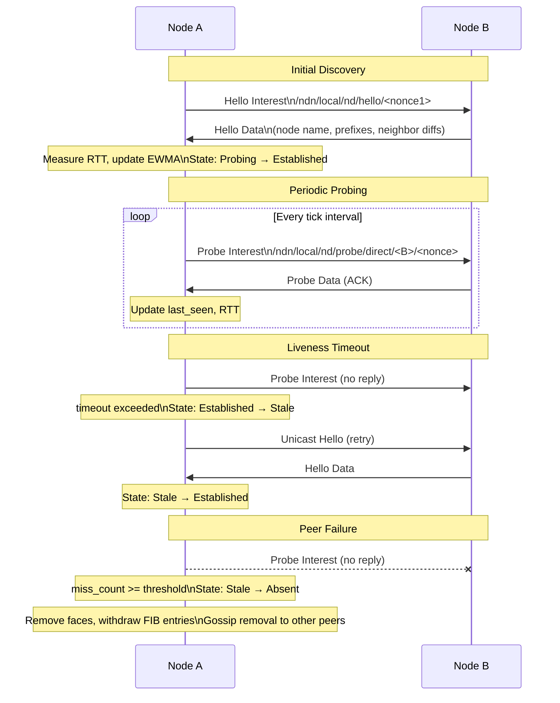
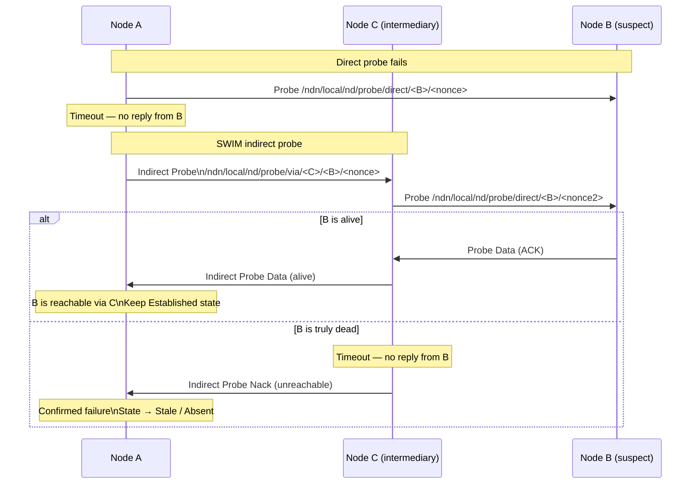
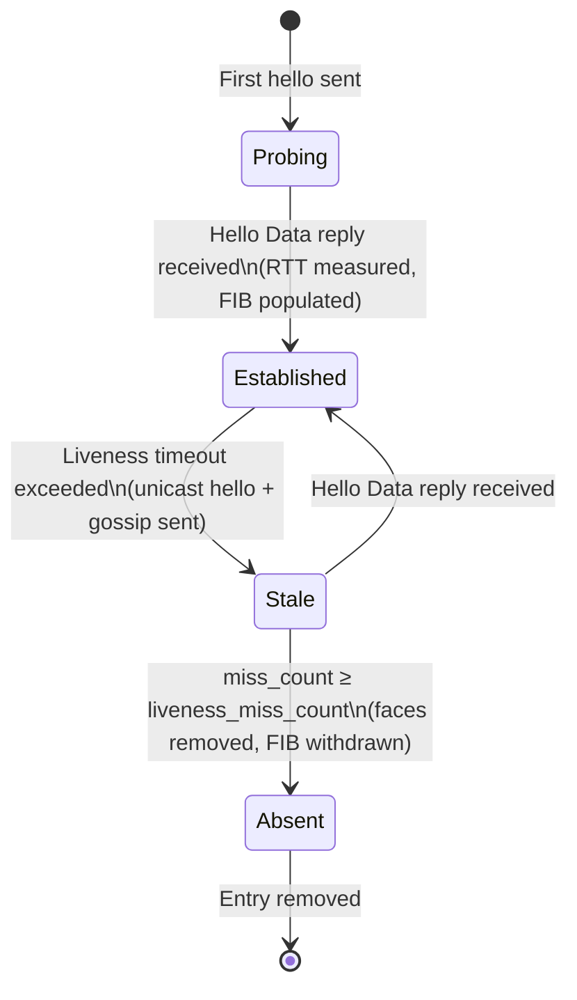
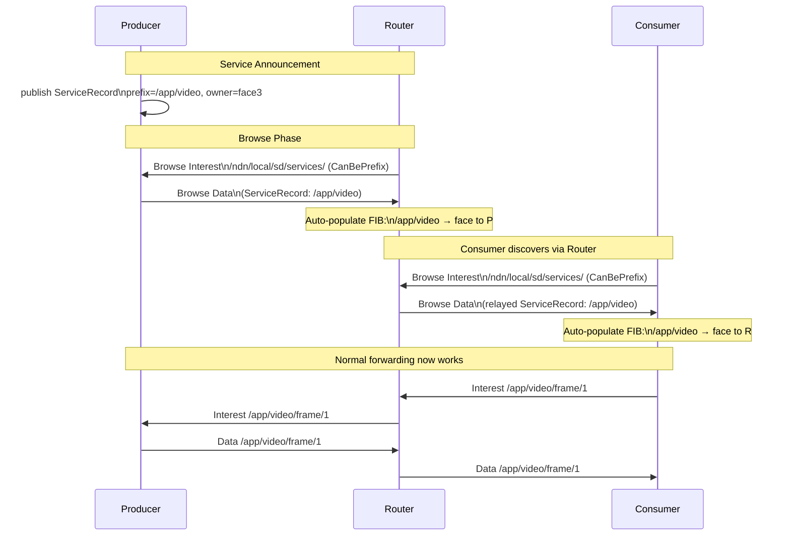

# Discovery Protocols

## The Problem: Finding Your Neighbors in a Content-Centric Network

When an ndn-router starts up, it knows nothing about its neighbors. It has faces configured -- maybe a UDP socket, maybe a raw Ethernet interface -- but no idea who else is out there. In IP networking, you'd configure static routes or run BGP. In NDN, the question is different: you don't need to know *addresses*, you need to know *who has the content your consumers want*.

Discovery in ndn-rs solves this in three layers, each building on the one below. First, find your neighbors. Then, learn what content they serve. Finally, wire it all together so Interests flow to the right place automatically. The first two layers are fully implemented; the third builds on their foundation.

> **💡 Key insight:** Discovery in NDN is fundamentally about content reachability, not host reachability. "Node B is alive" is useful, but "Node B serves `/app/video`" is what actually populates your FIB and makes forwarding work.

## The Discovery Trait: Plugging Into the Engine

All discovery protocols share a common interface. The `DiscoveryProtocol` trait lets the engine call into any protocol implementation at well-defined points -- when faces come up, when packets arrive, and on periodic ticks:

```rust
trait DiscoveryProtocol: Send + Sync {
    fn protocol_id(&self) -> ProtocolId;
    fn claimed_prefixes(&self) -> &[Name];
    fn tick_interval(&self) -> Duration;

    fn on_face_up(&self, face_id: FaceId, ctx: &dyn DiscoveryContext);
    fn on_face_down(&self, face_id: FaceId, ctx: &dyn DiscoveryContext);
    fn on_inbound(&self, raw: &Bytes, incoming_face: FaceId, meta: &InboundMeta,
                  ctx: &dyn DiscoveryContext) -> bool;
    fn on_tick(&self, now: Instant, ctx: &dyn DiscoveryContext);
}
```

> **🔧 Implementation note:** The engine calls `on_inbound` after TLV decode but *before* the forwarding pipeline. If a discovery protocol returns `true`, the packet is consumed and never enters the Interest/Data pipeline. This keeps discovery traffic invisible to applications -- they never see hello packets or browse requests cluttering their content streams.

Multiple protocols run simultaneously via `CompositeDiscovery`, which fans out every callback to each registered protocol. This is how neighbor discovery and service discovery coexist without knowing about each other.

## Layer 1: Finding Your Neighbors

### The Hello Protocol

Imagine two ndn-routers, A and B, sitting on the same Ethernet segment. Neither knows the other exists. Here's how they find each other.

Node A's `HelloProtocol` fires its periodic tick and sends a multicast hello Interest to `/ndn/local/nd/hello/<nonce>`. The nonce is random -- it ensures the Interest isn't satisfied by a cached reply. Node B receives this Interest, recognizes it as a hello, and responds with a Data packet containing a `HelloPayload`:

- **Node name** -- B's NDN identity (e.g., `/ndn/router-b`)
- **Served prefixes** -- prefixes B can route (when `InHello` mode is active)
- **Neighbor diffs** -- recent gossip about other nodes B knows about

When the hello Data arrives back at A, the protocol measures the round-trip time and feeds it into an EWMA estimator (alpha = 0.125, matching TCP's RTO algorithm). Node A now knows Node B exists, how fast the link is, and potentially what content B serves.



### One Protocol, Many Link Types

The hello exchange works the same conceptually over UDP and Ethernet, but the details differ -- UDP hellos are signed with Ed25519, Ethernet hellos are unsigned (the MAC layer provides implicit authentication on a local segment). Rather than duplicating the state machine, ndn-rs uses a generic `HelloProtocol<T>` parameterized over a `LinkMedium`:

```text
pub type UdpNeighborDiscovery  = HelloProtocol<UdpMedium>;
pub type EtherNeighborDiscovery = HelloProtocol<EtherMedium>;
```

The `LinkMedium` trait handles everything link-specific:

| Method | Purpose |
|--------|---------|
| `build_hello_data()` | Build signed hello reply (Ed25519 for UDP, unsigned for Ethernet) |
| `handle_hello_interest()` | Extract source address, create peer face |
| `verify_and_ensure_peer()` | Verify signature, ensure unicast face exists |
| `send_multicast()` | Broadcast on all multicast faces |
| `on_face_down()` / `on_peer_removed()` | Link-specific cleanup |

> **🔧 Implementation note:** The generic parameter is resolved at compile time, so `HelloProtocol<UdpMedium>` and `HelloProtocol<EtherMedium>` are fully monomorphized -- no dynamic dispatch on the hot path of hello processing.

### SWIM: Gossip-Based Failure Detection

Simple periodic probing has a weakness: if Node A can't reach Node B, is B actually dead, or is there just a transient link problem between A and B? If A immediately declares B dead, it might tear down perfectly good FIB entries for no reason.

This is where SWIM comes in. The core idea behind SWIM-style failure detection is that nodes don't just check their own neighbors -- they ask others to check too. It's gossip-based: "Hey C, I can't reach B. Can *you* reach B? Let me know what you find out."

When `swim_indirect_fanout > 0`, the protocol works in three phases:

1. **Direct probes** -- on every tick, A sends a probe Interest to each established neighbor via `/ndn/local/nd/probe/direct/<target>/<nonce>`.
2. **Indirect probes** -- if a direct probe to B times out, A picks K other established neighbors and asks them to probe B on its behalf: `/ndn/local/nd/probe/via/<intermediary>/<target>/<nonce>`.
3. **Gossip piggyback** -- recent neighbor additions and removals are piggybacked onto hello Data payloads, bounded to 16 entries per packet. This is how information about topology changes propagates without dedicated announcement traffic.



> **🌐 Protocol detail:** The indirect probe mechanism means a single transient link failure between A and B won't cause a false positive. Only when *multiple* nodes independently confirm that B is unreachable does A move B to the Absent state. This dramatically reduces unnecessary face teardowns and FIB churn in real networks.

### Adaptive Probing

The probing interval isn't fixed. A neighbor that just responded to a hello doesn't need to be probed again immediately, but one that missed a probe deserves closer attention. The `NeighborProbeStrategy` trait (with implementations `ReactiveStrategy`, `BackoffStrategy`, `PassiveStrategy`, and `CompositeStrategy`) adapts the probing rate based on events:

- `on_probe_success(rtt)` -- received a reply, may back off probing frequency
- `on_probe_timeout()` -- missed a reply, may probe more aggressively
- `trigger(event)` -- external events like `FaceUp`, `NeighborStale`, or `ForwardingFailure` can force immediate probing

> **⚠️ Important:** The adaptive probing strategies are composable. `CompositeStrategy` layers multiple strategies together, so you can combine a `BackoffStrategy` (exponential backoff on success) with a `ReactiveStrategy` (immediate probe on forwarding failure) to get both efficiency and responsiveness.

## The Neighbor Lifecycle

As hello and probe traffic flows, each neighbor transitions through a well-defined lifecycle. Think of it as a trust progression: a node starts as unknown, becomes a tentative contact, graduates to a confirmed neighbor, and might eventually be declared unreachable.



Each transition tells a story:

**Probing to Established.** A hello Data reply arrives from a new neighbor. The protocol records the RTT, updates the neighbor state, and creates a face binding. If `InHello` mode is active, any served prefixes advertised in the payload are immediately populated into the FIB -- the neighbor is reachable and already telling us what content it has.

**Established to Stale.** On each tick, the protocol checks `last_seen` against `liveness_timeout`. When the timeout is exceeded, two things happen simultaneously: a unicast hello is sent directly to the stale neighbor's face (maybe it just missed the multicast), and emergency gossip hellos are sent to K other established peers. The gossip accelerates convergence -- if B is down, A wants C and D to know about it quickly.

**Stale to Absent.** When `miss_count >= liveness_miss_count`, the neighbor is declared unreachable. This triggers a cascade of cleanup: link-specific teardown fires via `on_peer_removed`, all associated faces and FIB entries are removed, and a `DiffEntry::Remove` is queued for gossip propagation so the entire network learns about the departure.

> **⚠️ Important:** The neighbor table is engine-owned, not protocol-owned. This means it survives protocol swaps at runtime and can be shared across multiple simultaneous discovery protocols. If you replace `UdpNeighborDiscovery` with a custom protocol, the neighbors already discovered over Ethernet are still there.

### The Neighbor Table

The neighbor table stores the state for every known peer:

```rust
pub struct NeighborEntry {
    pub node_name: Name,
    pub state: NeighborState,
    /// Per-link face bindings: (face_id, source_mac, interface_name)
    /// A peer may be reachable over multiple interfaces simultaneously.
    pub faces: Vec<(FaceId, MacAddr, String)>,
    pub rtt_us: Option<u32>,    // EWMA RTT
    pub pending_nonce: Option<u32>,
}
```

Mutations go through `NeighborUpdate` variants (`Upsert`, `SetState`, `AddFace`, `RemoveFace`, `UpdateRtt`, `Remove`) applied via `DiscoveryContext::update_neighbor`. This ensures all state changes are atomic and auditable -- no partial updates to a neighbor entry.

## Layer 2: What Content Do They Have?

Once you know your neighbors, the next question is: *what content do they have?* Knowing that Node B exists and has a 2ms RTT is useful, but knowing that Node B serves `/app/video` is what actually lets you forward Interests to the right place.

The `ServiceDiscoveryProtocol` handles this second layer. It runs alongside neighbor discovery inside the same `CompositeDiscovery`, handling service record publication, browsing, and demand-driven peer queries.



### Announce, Browse, Withdraw

The lifecycle of a service record follows a simple pattern:

**Publish.** A producer registers a `ServiceRecord` containing an announced prefix, node name, freshness period, and capability flags. Records can be published with an owner face -- when that face goes down, the record is automatically withdrawn. No orphaned advertisements cluttering the network.

**Browse.** The protocol sends browse Interests to `/ndn/local/sd/services/` with `CanBePrefix` to all established neighbors. Peers respond with Data packets containing their local service records. This is how a router learns what each of its neighbors serves.

**Withdraw.** Calling `withdraw(prefix)` removes the local record. Peer records are evicted when the associated face goes down or when the auto-FIB TTL expires. The system is self-cleaning -- if a producer disappears without explicitly withdrawing, the records expire on their own.

> **🌐 Protocol detail:** When `relay_records` is enabled, incoming service records from one neighbor are relayed to all other established neighbors (excluding the source face). This provides multi-hop service discovery without network-wide flooding -- records propagate outward through the neighbor graph, one hop at a time.

### The Peer List

Any node can express an Interest for `/ndn/local/nd/peers` to receive a snapshot of the current neighbor table as a compact TLV list:

```text
PeerList ::= (PEER-ENTRY TLV)*
PEER-ENTRY  ::= 0xE0 length Name
```

This is useful for monitoring tools and for applications that want to make topology-aware decisions without implementing their own discovery protocol.

## The Payoff: FIB Auto-Population

Discovery isn't just about knowing who's there -- it's about knowing how to reach content. Every piece of discovery information ultimately exists to answer one question: "if an Interest arrives for prefix X, which face should I forward it to?"

When a service record Data arrives from a peer, the protocol automatically installs a FIB entry routing the announced prefix through that peer's face:

```rust
struct AutoFibEntry {
    prefix: Name,
    face_id: FaceId,
    expires_at: Instant,
    node_name: Name,
}
```

> **💡 Key insight:** Auto-FIB entries have a TTL and are expired by `on_tick`. The browse interval adapts to be half the shortest remaining TTL, ensuring records are refreshed *before* they expire. A 10-second floor prevents excessive traffic. This means the FIB is always fresh without manual configuration -- the network is self-organizing.

Here's the full picture of how discovery feeds the forwarding plane:

1. **Neighbor discovery** establishes that Node B is reachable on face 7 with 2ms RTT.
2. **Service discovery** learns that Node B serves `/app/video` and `/app/chat`.
3. **FIB auto-population** installs entries: `/app/video` -> face 7, `/app/chat` -> face 7.
4. **An Interest arrives** for `/app/video/frame/42`. The FIB lookup matches `/app/video`, and the Interest is forwarded out face 7 -- all without a single line of manual configuration.

When Node B eventually disappears (its face goes down, or its neighbor entry transitions to Absent), the auto-FIB entries are withdrawn, and the FIB returns to its previous state. The network heals itself.

## Layer 3: Network-Wide Routing (Planned)

The current discovery layers provide link-local neighbor detection and one-hop (or relayed) service discovery. This is sufficient for many deployments -- a local mesh of ndn-routers can fully self-organize using just these two layers.

Network-wide routing will build on this foundation, using the neighbor table as the link-state database input. The gossip infrastructure (SVS gossip, epidemic gossip) in `ndn-discovery` provides the dissemination substrate. The vision is a system where discovery scales seamlessly from a two-node setup to a continent-spanning network, with the same protocols operating at every level.


## Runtime Configuration

The `HelloProtocol` parameters can be tuned while the router is running without a restart. All fields are stored in an `Arc<RwLock<DiscoveryConfig>>` shared between the running protocol and the management handler.

| Parameter | Default | Description |
|-----------|---------|-------------|
| `hello_interval_base` | 5 s | Minimum hello period (backoff starts here) |
| `hello_interval_max` | 20 s | Maximum hello period after full back-off |
| `liveness_miss_count` | 3 | Missed hellos before a neighbor turns Stale |
| `gossip_fanout` | 2 | Neighbors contacted per gossip tick |
| `swim_indirect_fanout` | 2 | SWIM indirect probe targets (0 = disable probing) |

The management socket exposes these via:

```
# Read current values
/localhost/nfd/discovery/status    (status dataset)

# Apply new values (URL query string in ControlParameters.Uri)
/localhost/nfd/discovery/config    (command)
# e.g. Uri = "hello_interval_base_ms=3000&gossip_fanout=3"
```

The ndn-dashboard **Fleet** panel provides a GUI for these controls, including preset profiles (Static, LAN, Campus, Mobile, HighMobility).

## See Also

- [Routing Protocols](./routing-protocols.md) — how discovery feeds the RIB via DVR
- [Implementing a Discovery Protocol](../guides/implementing-discovery.md) — developer guide
- [Fleet and Swarm Security](../guides/fleet-security.md) — trust bootstrap for discovered neighbors
