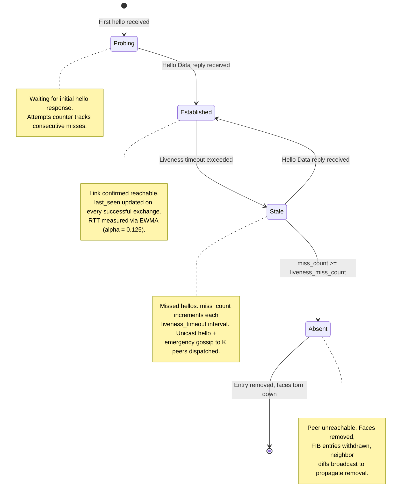

# Discovery Protocols

Discovery in ndn-rs operates at three layers: link-local neighbor discovery, service discovery, and (planned) network-wide routing. The first two are fully implemented; the third builds on their foundation.

## Architecture

Discovery protocols plug into the engine via the `DiscoveryProtocol` trait and are composed using `CompositeDiscovery`:

```rust
trait DiscoveryProtocol: Send + Sync {
    fn protocol_id(&self) -> ProtocolId;
    fn claimed_prefixes(&self) -> &[Name];
    fn tick_interval(&self) -> Duration;

    fn on_face_up(&self, face_id: FaceId, ctx: &dyn DiscoveryContext);
    fn on_face_down(&self, face_id: FaceId, ctx: &dyn DiscoveryContext);
    fn on_inbound(&self, raw: &Bytes, face: FaceId, meta: &InboundMeta,
                  ctx: &dyn DiscoveryContext) -> bool;
    fn on_tick(&self, now: Instant, ctx: &dyn DiscoveryContext);
}
```

The engine calls `on_inbound` after TLV decode but before the forwarding pipeline. If a discovery protocol returns `true`, the packet is consumed and never enters the Interest/Data pipeline.

## Layer 1: Link-Local Neighbor Discovery

### HelloProtocol\<T: LinkMedium\>

The core abstraction is `HelloProtocol<T>`, which implements the SWIM-inspired hello/probe state machine over any link type. Link-specific operations are delegated to a `LinkMedium` implementation:

```text
pub type UdpNeighborDiscovery  = HelloProtocol<UdpMedium>;
pub type EtherNeighborDiscovery = HelloProtocol<EtherMedium>;
```

The `LinkMedium` trait provides:

| Method | Purpose |
|--------|---------|
| `build_hello_data()` | Build signed hello reply (Ed25519 for UDP, unsigned for Ethernet) |
| `handle_hello_interest()` | Extract source address, create peer face |
| `verify_and_ensure_peer()` | Verify signature, ensure unicast face exists |
| `send_multicast()` | Broadcast on all multicast faces |
| `on_face_down()` / `on_peer_removed()` | Link-specific cleanup |

### Hello Exchange

The protocol sends periodic hello Interests to `/ndn/local/nd/hello/<nonce>`. Peers respond with hello Data containing a `HelloPayload`:

- **Node name** -- the responder's NDN identity
- **Served prefixes** -- prefixes this node can route (when `InHello` mode is active)
- **Neighbor diffs** -- SWIM gossip piggyback (recent additions/removals)

Each hello Interest carries a random nonce. When the hello Data returns, the protocol measures the round-trip time and updates the neighbor entry's EWMA RTT estimate (alpha = 0.125, matching TCP's RTO algorithm).

### SWIM Protocol Integration

When `swim_indirect_fanout > 0`, the protocol augments hello-based liveness with SWIM-style failure detection:

1. **Direct probes** -- sent to each established neighbor on every tick via `/ndn/local/nd/probe/direct/<target>/<nonce>`
2. **Indirect probes** -- if a direct probe times out, K indirect probes are dispatched via other established neighbors: `/ndn/local/nd/probe/via/<intermediary>/<target>/<nonce>`
3. **Gossip piggyback** -- recent neighbor additions/removals are piggybacked onto hello Data payloads (bounded to 16 entries)

### Probe Strategy

The probing interval is not fixed. The `NeighborProbeStrategy` trait (with implementations `ReactiveStrategy`, `BackoffStrategy`, `PassiveStrategy`, and `CompositeStrategy`) adapts the probing rate based on events:

- `on_probe_success(rtt)` -- received a reply, may back off
- `on_probe_timeout()` -- missed a reply, may probe more aggressively
- `trigger(event)` -- external event (FaceUp, NeighborStale, ForwardingFailure)

## Neighbor Lifecycle

Neighbors transition through four states based on hello/probe activity:



### State Transitions in Detail

**Probing -> Established**: A hello Data reply arrives. The protocol records the RTT, updates the neighbor state, and adds a face binding. If `InHello` mode is active, served prefixes from the payload are auto-populated into the FIB.

**Established -> Stale**: The `on_tick` handler checks `last_seen` against `liveness_timeout`. When exceeded:
- The neighbor moves to `Stale { miss_count: 1 }`
- A unicast hello is sent directly to the stale neighbor's face
- Emergency gossip: K unicast hellos are sent to other established peers to speed convergence

**Stale -> Absent**: When `miss_count >= liveness_miss_count`, the peer is declared unreachable. Link-specific cleanup fires (`on_peer_removed`), all associated faces and FIB entries are removed, and a `DiffEntry::Remove` is queued for gossip propagation.

## Neighbor Table

The `NeighborTable` is engine-owned (not protocol-owned) so it survives protocol swaps at runtime and can be shared across multiple simultaneous discovery protocols:

```rust
pub struct NeighborEntry {
    pub node_name: Name,
    pub state: NeighborState,
    /// Per-link face bindings: (face_id, source_mac, interface_name)
    /// A peer may be reachable over multiple interfaces simultaneously.
    pub faces: Vec<(FaceId, MacAddr, String)>,
    pub rtt_us: Option<u32>,    // EWMA RTT
    pub pending_nonce: Option<u32>,
}
```

Mutations go through `NeighborUpdate` variants (`Upsert`, `SetState`, `AddFace`, `RemoveFace`, `UpdateRtt`, `Remove`) applied via `DiscoveryContext::update_neighbor`.

## Layer 2: Service Discovery

The `ServiceDiscoveryProtocol` handles service record publication, browsing, and demand-driven peer queries. It runs alongside the neighbor discovery protocol inside a `CompositeDiscovery`.

### Announce / Browse / Withdraw

**Publish**: Producers register a `ServiceRecord` containing an announced prefix, node name, freshness period, and capability flags. Records can be published with an owner face -- when that face goes down, the record is automatically withdrawn.

**Browse**: The protocol sends browse Interests to `/ndn/local/sd/services/` with `CanBePrefix` to all established neighbors. Peers respond with Data packets containing their local service records.

**Withdraw**: Calling `withdraw(prefix)` removes the local record. Peer records are evicted when the associated face goes down or when the auto-FIB TTL expires.

### FIB Auto-Population

When a service record Data arrives from a peer, the protocol can automatically install a FIB entry routing the announced prefix through the peer's face:

```rust
struct AutoFibEntry {
    prefix: Name,
    face_id: FaceId,
    expires_at: Instant,
    node_name: Name,
}
```

Auto-FIB entries have a TTL and are expired by `on_tick`. The browse interval adapts to be half the shortest remaining TTL, ensuring records are refreshed before they expire, with a 10-second floor to avoid excessive traffic.

### Peer List

Any node can express an Interest for `/ndn/local/nd/peers` to receive a snapshot of the current neighbor table as a compact TLV list:

```text
PeerList ::= (PEER-ENTRY TLV)*
PEER-ENTRY  ::= 0xE0 length Name
```

### Record Relay

When `relay_records` is enabled, incoming service records from one neighbor are relayed to all other established neighbors (excluding the source face). This provides multi-hop service discovery without network-wide flooding.

## Layer 3: Network-Wide Routing (Planned)

The current discovery layers provide link-local neighbor detection and one-hop (or relayed) service discovery. Network-wide routing will build on this foundation, using the neighbor table as the link-state database input. The gossip infrastructure (SVS gossip, epidemic gossip) in `ndn-discovery` provides the dissemination substrate.
