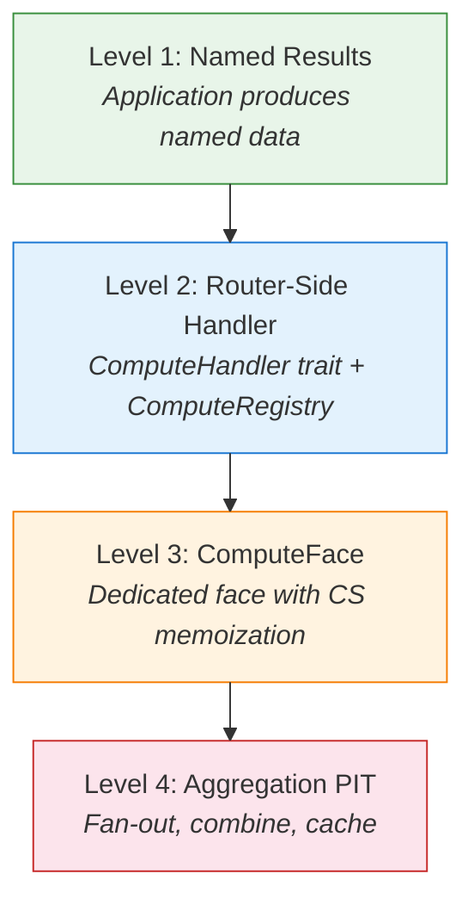
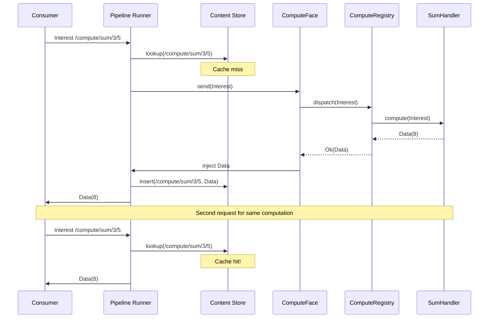
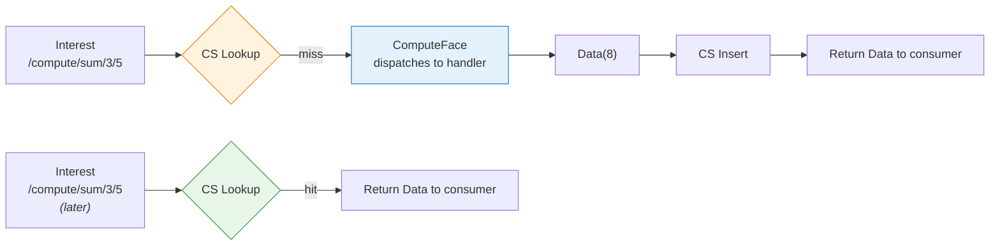

# In-Network Compute

## The Insight: Names Are Already Computations

NDN names data, not hosts. A consumer expressing an Interest for `/ndn/edu/ucla/cs/class` does not care which machine stores the data -- it cares about the data itself. So take that idea one step further: if names identify data, why not name *computations*?

An Interest for `/compute/sum/3/5` does not need to reach a specific server. It needs to reach *any node capable of computing the answer*. A router with a registered handler computes `8`, wraps it in a Data packet, and sends it back. The Content Store caches the result automatically. The next ten consumers asking for `/compute/sum/3/5` get a cache hit -- they never even reach the compute node.

This is not a bolt-on RPC system. It falls out naturally from how NDN already works: names identify content, the network routes by name, and the CS caches by name. Computation is just another way to produce content.

> **Key insight:** In IP networks, ten clients calling the same REST endpoint produce ten server requests. In NDN, the first computes the result, and the next nine are CS hits. Memoization is free -- you get it from the network architecture itself.

## The Four Levels of Compute Integration

ndn-rs approaches in-network compute as an escalating series of capabilities. Each level builds on the previous one, and each requires progressively deeper integration with the forwarder.



### Level 1: Named Results (No Engine Changes)

The simplest form of in-network compute requires zero changes to the forwarder. A producer application names its outputs with computation parameters embedded in the name:

```
/sensor/room42/temperature/aggregated/window=60s
```

The application computes the 60-second average via an `AppFace`, publishes it as Data, and the CS caches it. Consumers expressing Interests for this name do not know or care whether the Data came from a live computation or a cache hit. This is the most underappreciated form of in-network compute -- it already works with the standard pipeline.

### Level 2: Router-Side Handler

Level 2 moves computation into the router process itself. Instead of a separate application producing named data, the router has registered handler functions that respond to Interests directly. This is where the `ComputeHandler` trait and `ComputeRegistry` come in (covered in detail below).

The advantage: no IPC overhead, no separate process to manage, and the handler runs in the same async runtime as the forwarder. The cost: the handler must be compiled into (or dynamically loaded by) the router.

### Level 3: ComputeFace with CS Memoization

Level 3 gives computation a dedicated face in the face table. The `ComputeFace` implements the `Face` trait, so the FIB routes Interests to it like any other face. Internally, it dispatches to the `ComputeRegistry` and injects the resulting Data back into the pipeline. The pipeline's CS insert stage caches the result automatically.

This is where the architecture pays off. The compute subsystem does not need special hooks into the pipeline -- it is just another face. The FIB entry `/compute` points at the `ComputeFace`, and the standard Interest pipeline handles everything else: PIT aggregation, nonce deduplication, CS lookup on future requests.

### Level 4: Aggregation PIT

The most ambitious level: the forwarder fans out a single Interest into multiple sub-Interests, collects partial results, combines them, and returns a single Data to the consumer. A wildcard Interest like `/sensor/+/temperature/avg` triggers the aggregation strategy, which fans out to `/sensor/room1/temperature`, `/sensor/room2/temperature`, and so on. When all results arrive (or a timeout fires), a combine function produces the final Data.

This is implementable as a strategy type plus an `AggregationPitEntry` -- the existing pipeline architecture accommodates it without structural changes.

## The ComputeHandler Trait

At the heart of the compute system is a simple trait:

```rust
pub trait ComputeHandler: Send + Sync + 'static {
    fn compute(
        &self,
        interest: &Interest,
    ) -> impl Future<Output = Result<Data, ComputeError>> + Send;
}
```

A handler receives an Interest, extracts parameters from the name components, performs its computation, and returns a Data packet. The `ComputeError` enum covers the two failure modes:

- **`NotFound`** -- no handler matched this name (returned as `None` from dispatch, not as an error)
- **`ComputeFailed(String)`** -- the handler ran but the computation itself failed

Handlers are async. A handler can fetch data from other sources, call into libraries, or even express its own Interests through an `AppFace` to gather inputs before producing a result.

> **Design note:** The `ComputeHandler` trait uses `impl Future` in the return position, which avoids requiring handlers to manually box their futures. Internally, `ComputeRegistry` uses an `ErasedHandler` trait with `Pin<Box<dyn Future>>` for type-erased storage in the name trie. This means handler authors get ergonomic async syntax while the registry pays the boxing cost once at dispatch time.

## Handler Registration with ComputeRegistry

The `ComputeRegistry` maps name prefixes to handler instances using a `NameTrie` -- the same trie structure used by the FIB. Registration is straightforward:

```rust
let registry = ComputeRegistry::new();

// Register a handler for /compute/sum
let prefix = Name::from_uri("/compute/sum");
registry.register(&prefix, SumHandler);

// Register a different handler for /compute/thumbnail
let prefix = Name::from_uri("/compute/thumbnail");
registry.register(&prefix, ThumbnailHandler);
```

When an Interest arrives, the registry performs a longest-prefix match against the Interest name. This means `/compute/sum/3/5` matches the `/compute/sum` handler, which can then extract `3` and `5` from the remaining name components.



**Versioning** falls out naturally from the name structure. `/compute/fn/v=2/thumb/photo.jpg` routes to a different handler than `/compute/fn/v=1/thumb/photo.jpg` -- they are simply different FIB entries pointing at different handler registrations. Running multiple versions simultaneously requires no special machinery.

## CS Memoization: The Magic

The most powerful property of in-network compute in NDN is that memoization is structural, not opt-in. Here is what happens after a compute result is produced:

1. The `ComputeFace` injects the Data back into the pipeline.
2. The Data pipeline runs its normal stages: PIT match, strategy update, **CS insert**, dispatch.
3. The CS stores the Data keyed by its name.
4. Any future Interest for the same name hits the CS *before* reaching the `ComputeFace`.

The compute handler is never called again for the same inputs. The CS eviction policy (LRU, sharded, or persistent) determines how long results are cached -- but the memoization itself requires zero code from the handler author.



> **Contrast with IP:** A traditional microservice behind a load balancer needs an explicit caching layer (Redis, Memcached, Varnish) to avoid redundant computation. The cache key must be manually constructed, invalidation must be manually managed, and the caching layer is an additional piece of infrastructure. In NDN, the name *is* the cache key, the CS *is* the cache, and the pipeline *is* the cache-aside logic. There is nothing to configure.

## Use Cases

### Edge Computing

A fleet of IoT gateways each runs an ndn-rs router with compute handlers registered for local inference tasks. An Interest for `/inference/object-detect/camera7/frame=1234` routes to the nearest gateway that has the handler and the camera feed. The result is cached -- if multiple subscribers want the same detection result, only one inference runs.

### Sensor Aggregation

Level 4 aggregation shines here. A monitoring dashboard expresses Interest for `/datacenter/rack3/+/cpu/avg/window=5m`. The aggregation strategy fans out to every server in rack 3, collects CPU metrics, averages them, and returns a single Data packet. The result is cached for the window duration. No polling infrastructure, no time-series database query -- the network computes and caches the answer.

### Named Function Networking

The research frontier: treat the network as a distributed computation fabric. A computation DAG where each node is a named function and each edge is a named data dependency. Expressing an Interest for the root node causes the network to recursively resolve dependencies. Each intermediate result is cached in the CS at whatever router computed it.

This maps naturally onto federated learning workflows:
- `/model/v=5/gradient/shard=3` is computed locally at the data shard, cached in the local CS
- An aggregator expresses Interests for all shards -- the FIB routes each to the right node
- The aggregator combines gradients and publishes the updated model
- The aggregator does not know *where* shard 3 lives -- the network handles routing

## Honest Limitations

Two practical constraints deserve mention:

**Long-running compute.** An NDN Interest has a lifetime. If computation takes 30 seconds but the Interest lifetime is 4 seconds, the consumer must re-express periodically. ndn-rs supports `Nack(NotYet)` with a retry-after hint as one mitigation, and versioned notification namespaces as another. These are engineering solutions, not architectural gaps.

**Large results.** A 100 MB computation result must be segmented into many Data packets, requiring the consumer to pipeline segment Interests. The chunked transfer layer handles this correctly, but it adds latency compared to streaming a TCP response. For edge and wireless environments where ndn-rs operates, the tradeoff is usually acceptable -- and the caching benefits compound over multiple consumers.
