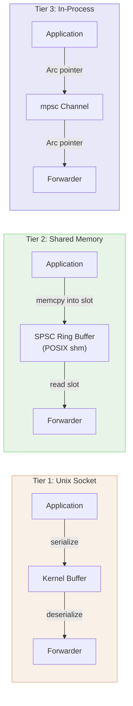
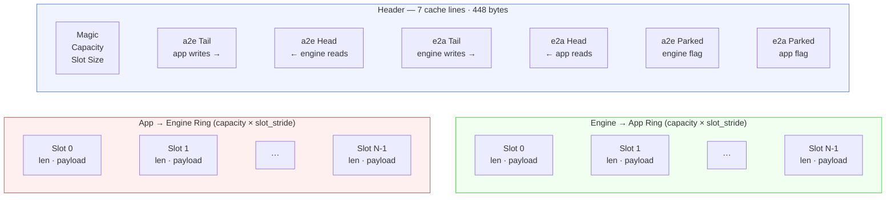
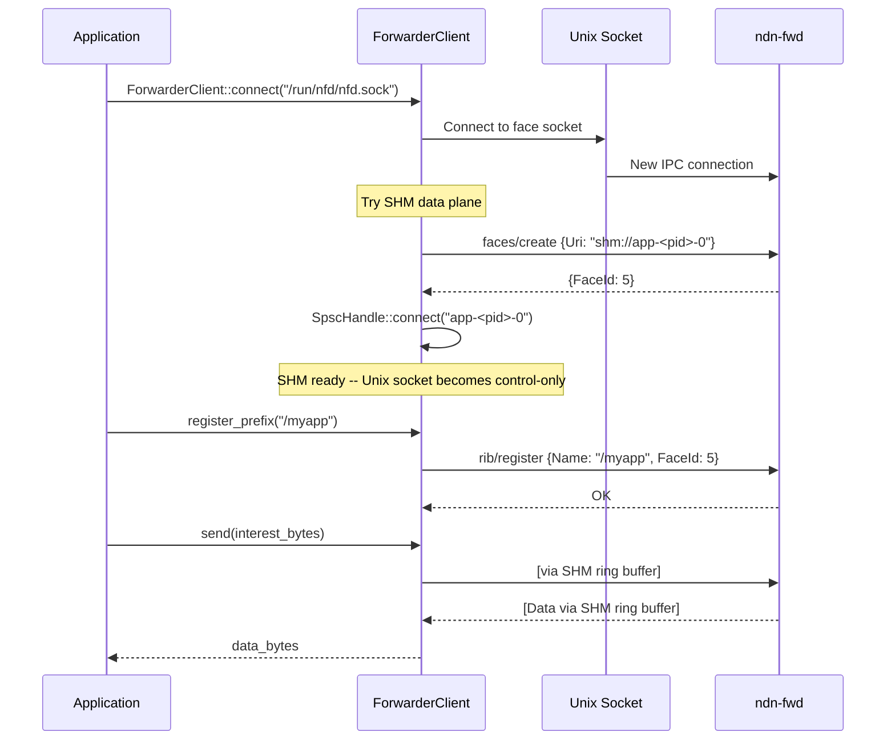

# IPC and Application Communication

## The Problem: Talking to a Forwarder Shouldn't Be This Hard

An application needs to talk to the NDN forwarder. In the reference C++ implementation (NFD), this means opening a Unix domain socket, serializing every Interest and Data packet into TLV wire format, pushing it through the kernel's socket buffer, and deserializing on the other side. For a temperature sensor publishing one reading per second, the overhead is invisible. For a video streaming application pushing 8 KB frames at line rate, the kernel copies alone consume more CPU than the forwarding logic.

Can we do better?

The answer is yes -- but "better" means different things depending on where your application lives relative to the forwarder. An application embedded in the same process has fundamentally different constraints than one running in a separate container. Rather than pick one transport and force everyone to use it, ndn-rs provides three tiers of escalating performance, with automatic negotiation so applications get the fastest transport available without changing their code.

## The Three Tiers

The design follows a simple principle: the closer you are to the forwarder, the less ceremony you need. Each tier removes a layer of overhead.



### Tier 1: Unix Socket (~2 us per packet)

The baseline. An application connects to the router's IPC socket (`/run/nfd/nfd.sock` on Unix, `\\.\pipe\ndn` on Windows) and sends TLV-encoded NDN packets over a stream. The `IpcFace` type abstracts over the platform differences -- Unix domain sockets on Linux and macOS, Named Pipes on Windows -- so application code is identical everywhere.

The control channel is always a socket, even when the data plane uses a faster transport. Management commands (create face, register prefix, query status) flow over this socket using the NFD management protocol: the application sends an Interest for a name like `/localhost/nfd/rib/register/<parameters>` and receives a Data packet containing a `ControlResponse`.

**NDNLPv2 framing.** External forwarders (NFD, yanfd/ndnd) use NDNLPv2 (LP) framing on all their Unix socket faces — they reject bare TLV packets silently. `ForwarderClient` and `MgmtClient` therefore wrap all outgoing packets in a minimal `LpPacket` (type `0x64`) before sending, and strip LP from received packets via `strip_lp`. The wrapping is idempotent — packets that are already LP-wrapped pass through unchanged. ndn-fwd (our own forwarder) accepts both LP and bare TLV, so this is compatible in all deployment configurations.

> **📊 Performance.** Unix sockets are fast for control traffic, but each packet crosses the kernel twice (send buffer, receive buffer) and requires at least one context switch. At high packet rates (100K+ pps), the kernel copy cost dominates. For a 1 KB Interest, the round trip through the kernel adds roughly 1.5-2 us on Linux.

This tier works everywhere and requires no special setup. It is the automatic fallback when shared memory is unavailable.

### Tier 2: Shared Memory Ring Buffer (~200 ns per packet)

The performance tier for cross-process communication. Instead of pushing packets through the kernel, the application and forwarder share a POSIX `shm_open` region containing two lock-free SPSC (single-producer, single-consumer) ring buffers -- one for each direction.

The SHM region layout is carefully designed around cache-line alignment to avoid false sharing between the producer and consumer cores:



Each ring has 256 slots by default, each holding up to 8960 bytes (enough for any standard NDN packet). The producer writes a 4-byte length prefix followed by the packet payload into the next slot, then advances the tail index with a `Release` store. The consumer reads the slot when head != tail, using an `Acquire` load to ensure it sees the complete write. No locks, no CAS loops -- just atomic loads and stores on cache-line-separated indices.

**Wakeup without busy-waiting.** When the consumer has drained the ring and has nothing to do, it needs to sleep efficiently. The implementation uses named FIFOs (pipes) integrated into Tokio's epoll/kqueue event loop. Before sleeping, the consumer sets a `parked` flag in shared memory with `SeqCst` ordering. The producer checks this flag after each write -- if the consumer is parked, it writes a single byte to the wakeup pipe. This conditional wakeup avoids a pipe syscall on every packet (the common case at high throughput is that the consumer is already spinning) while still integrating cleanly with Tokio's async runtime.

> **💡 Key insight.** The spin-then-park protocol gives the best of both worlds. At high packet rates, the consumer never touches the pipe -- it spins for 64 iterations (sub-microsecond) and finds the next packet waiting. At low packet rates, it parks on the pipe and wakes up with zero latency via epoll/kqueue. The `SeqCst` fences on the parked flag guarantee that the producer never misses a sleeping consumer.

> **⚠️ Important.** Because the wakeup pipes are opened `O_RDWR` by both sides (to avoid the FIFO blocking-open problem), EOF detection alone cannot tell the application that the engine has crashed. The `ForwarderClient` solves this with a disconnect monitor on the control socket -- see the ForwarderClient section below.

### Tier 3: In-Process InProcFace (~20 ns per packet)

When the forwarder runs as a library inside the application process (the embedded mode), there is no serialization boundary at all. `InProcFace` is a pair of `tokio::sync::mpsc` channels -- one for each direction. The application gets an `InProcHandle`; the forwarder gets the `InProcFace`. Sending a packet is a pointer handoff through the channel; the `Bytes` value (which is reference-counted) moves without copying.

```rust
// Create a linked face pair with 64-slot buffers
let (face, handle) = InProcFace::new(FaceId(1), 64);

// Application sends an Interest to the forwarder
handle.send(interest_bytes).await?;

// Forwarder receives it (in the pipeline runner)
let pkt = face.recv().await?;
```

This mode is ideal for mobile applications (Android/iOS) where the forwarder and application are in the same process anyway, and for testing where you want to spin up a full forwarding pipeline without any OS-level resources.

> **🔧 Implementation note.** The `face_rx` receiver inside `InProcFace` is wrapped in a `Mutex` to satisfy the `&self` requirement of the `Face` trait. This looks like it could be a contention point, but the pipeline's single-consumer contract means the mutex never actually contends -- only one task ever calls `recv()`.

## ForwarderClient: Connecting to the Forwarder

Applications don't pick a transport tier manually. The `ForwarderClient` handles negotiation automatically.



The connection flow works like this:

1. **Connect to the control socket.** `ForwarderClient::connect()` opens an `IpcFace` to the router's face socket. This socket handles management commands for the lifetime of the connection.

2. **Attempt SHM upgrade.** The client generates a unique name (`app-<pid>-<counter>`) and sends a `faces/create` command with URI `shm://<name>`. If the router supports SHM and the creation succeeds, the client calls `SpscHandle::connect()` to attach to the shared memory region. The control socket becomes a dedicated management channel.

3. **Fall back gracefully.** If SHM setup fails (unsupported platform, permission error, feature not compiled in), the client logs a warning and reuses the Unix socket for both control and data traffic. The application's `send`/`recv` calls work identically either way.

```rust
// Automatic SHM negotiation (preferred)
let client = ForwarderClient::connect("/run/nfd/nfd.sock").await?;

// Explicit Unix-only mode (skip SHM attempt)
let client = ForwarderClient::connect_unix_only("/run/nfd/nfd.sock").await?;

// Check which transport was negotiated
if client.is_shm() {
    println!("Using shared memory data plane");
}
```

**Prefix registration** follows the NFD management protocol. `register_prefix()` sends an Interest for `/localhost/nfd/rib/register` with `ControlParameters` encoding the prefix name and the face ID (the SHM face ID if using SHM, or 0 to default to the requesting face). The router installs a FIB entry pointing the prefix at the application's face.

**Disconnect detection** is subtle in SHM mode. Because the data plane reads from shared memory, the application cannot detect router death from a failed `recv()` -- the SHM region persists after the router process exits. The `ForwarderClient` spawns a background monitor task (automatically, on the first `recv()` call) that watches the control socket. When the socket closes, the monitor fires a `CancellationToken` that propagates to the `SpscHandle`, causing its `recv()` to return `None` and `send()` to return `Err(Closed)`.

> **🔧 Implementation note.** The `NdnConnection` enum in `ndn-app` unifies embedded and external connections behind a single interface. `Consumer` and `Producer` work with either mode, so application code does not need to know whether it's talking to an in-process engine or an external router.

## Chunked Transfer: Beyond the MTU

NDN packets have an 8800-byte MTU -- a networking constraint that makes sense for router forwarding but is awkward for IPC, where payloads can be megabytes. The chunked transfer layer handles segmentation and reassembly transparently.

`ChunkedProducer` takes a name prefix and a `Bytes` payload, and splits it into fixed-size segments (8192 bytes by default, safely under the MTU). Each segment is identified by its zero-based index:

```rust
let payload = Bytes::from(large_buffer);
let producer = ChunkedProducer::new(prefix, payload, NDN_DEFAULT_SEGMENT_SIZE);

// Serve segments in response to Interests
for i in 0..producer.segment_count() {
    let segment_data: &Bytes = producer.segment(i).unwrap();
    // Build Data packet with name: /<prefix>/seg=<i>
}
```

`ChunkedConsumer` reassembles segments that may arrive out of order. You tell it how many segments to expect (from the `FinalBlockId` in the first Data packet), feed it segments as they arrive, and call `reassemble()` when complete:

```rust
let mut consumer = ChunkedConsumer::new(prefix, segment_count);

// Segments can arrive in any order
consumer.receive_segment(2, seg2_bytes);
consumer.receive_segment(0, seg0_bytes);
consumer.receive_segment(1, seg1_bytes);

if consumer.is_complete() {
    let original: Bytes = consumer.reassemble().unwrap();
}
```

The beauty of chunked transfer over NDN is that the Content Store does the heavy lifting. Once a producer has published all segments, it can exit. Subsequent consumers fetching the same named payload get every segment from the CS cache without the producer being involved. This is fundamentally better than pipes or traditional IPC -- the producer can be a batch job that ran once, and consumers retrieve the result later.

> **📊 Performance.** Reassembly allocates a single `BytesMut` with the total size pre-computed, then copies each segment in order. For a 1 MB payload this is one allocation and 128 memcpys of 8 KB each -- essentially memcpy speed.

## Service Registry: Finding Each Other by Name

NDN's name-based architecture naturally supports service discovery. The `ServiceRegistry` provides a simple mechanism for applications to advertise named services and find each other.

Services register under the `/local/services/<name>` namespace:
- `/local/services/<name>/info` -- a `ServiceEntry` containing an application-defined capabilities blob
- `/local/services/<name>/alive` -- a heartbeat Data packet with a short `FreshnessPeriod`

Discovery is a single CanBePrefix Interest for `/local/services` -- the Content Store returns all registered service descriptors.

```rust
let mut registry = ServiceRegistry::new();

// Advertise a service
registry.register("video-encoder", capabilities_bytes);

// Discover a service
if let Some(entry) = registry.lookup("video-encoder") {
    // entry.capabilities contains the service's descriptor
}
```

The elegance of this design is in what happens when a service exits. The engine closes its face, removing the FIB entries that routed Interests to it. The heartbeat Data in the CS expires naturally (its `FreshnessPeriod` runs out and it is evicted). No deregistration protocol, no central registry daemon, no single point of failure. The NDN namespace *is* the service registry.

The `MgmtClient` also provides programmatic access to the router's service discovery subsystem through the NFD management protocol:

```rust
let mgmt = MgmtClient::connect("/run/nfd/nfd.sock").await?;

// Announce a service prefix
mgmt.service_announce(&"/myapp/service".parse()?).await?;

// Browse all known services (local and from peers)
let services = mgmt.service_browse(None).await?;

// Withdraw when shutting down
mgmt.service_withdraw(&"/myapp/service".parse()?).await?;
```

> **💡 Key insight.** NDN IPC is strongest when you need at least one of: discovery without prior knowledge of the producer, data that outlives the producer, data consumed by multiple processes without producer scaling, or seamless transparency between local and remote data sources. For processes that know at compile time they will communicate and do not need any of these properties, a direct `tokio::sync::mpsc` channel is simpler and faster.

## Putting It All Together

The IPC stack forms a clean layered architecture. At the bottom, transport faces (`IpcFace`, `ShmFace`, `InProcFace`) move bytes. In the middle, `ForwarderClient` and `NdnConnection` handle transport negotiation and provide a unified send/recv interface. At the top, `Consumer`, `Producer`, `ChunkedProducer`/`ChunkedConsumer`, and `ServiceRegistry` provide application-level abstractions.

An application that starts with `Consumer::connect("/run/nfd/nfd.sock")` gets SHM-accelerated data transfer, automatic prefix registration, and transparent chunked reassembly -- without knowing or caring about any of the machinery described in this page. And if that application later moves into the same process as the forwarder (say, for a mobile deployment), only the connection setup changes. The rest of the code stays identical.

That is the goal: NDN's name-based decoupling applied all the way down to the transport layer itself.
