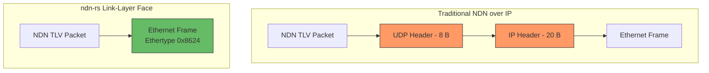
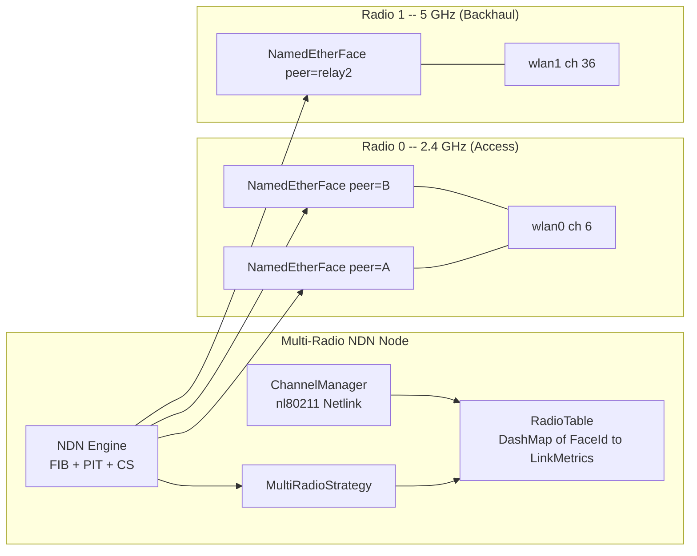
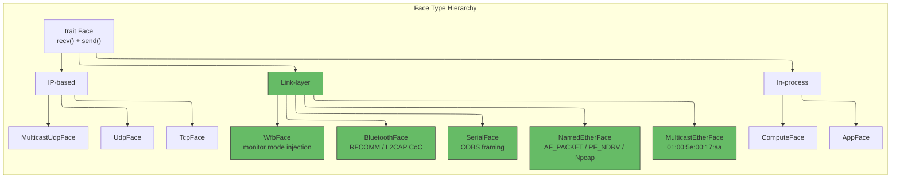

# Link-Layer and Wireless Faces

## The Vision: NDN Doesn't Need IP

NDN was designed around named data, not endpoint addresses. So why, when two nodes sit on the same wireless link, do we force NDN packets through an IP/UDP stack that adds 28 bytes of overhead per packet, requires ARP or NDP to resolve addresses, and imposes a protocol stack that was never designed for content-centric communication?

The answer is: we don't have to. NDN has an IANA-assigned Ethertype (`0x8624`) specifically for carrying NDN packets directly on Ethernet frames. ndn-rs takes this seriously. Its link-layer face implementations bypass IP entirely, putting NDN TLV payloads directly onto the wire -- or into the air -- with nothing in between but the Ethernet (or radio) frame header.



This is not just about saving 28 bytes. Removing IP means removing ARP tables, NDP state machines, UDP checksum computation, socket buffer copies, and an entire address resolution protocol that is redundant when NDN names already identify content. On a constrained wireless link where every microsecond of airtime matters, this adds up.

> **Why this matters for wireless**: 802.11 multicast and broadcast frames are sent at legacy rates (1-6 Mbps) because the MAC layer has no per-receiver rate knowledge for non-unicast frames. A 100-byte NDN Interest at 1 Mbps takes under 1 us of airtime. But those 28 bytes of IP/UDP overhead are not free -- they increase frame size and, more importantly, they add an entire protocol layer that has to be processed at both ends. On battery-powered devices, CPU cycles are milliamp-hours.

## Raw Ethernet: `NamedEtherFace`

The `NamedEtherFace` is the foundational link-layer face. It sends and receives NDN packets as raw Ethernet frames using the IANA-assigned Ethertype `0x8624`. The implementation adapts to the host platform:

- **Linux**: `AF_PACKET` raw sockets with `SOCK_DGRAM` (the kernel handles Ethernet header construction)
- **macOS**: `PF_NDRV` (Network Driver Raw) sockets
- **Windows**: Npcap/WinPcap via the `pcap` crate

On Linux, the face uses TPACKET_V2 memory-mapped ring buffers (`PACKET_RX_RING` and `PACKET_TX_RING`) for zero-copy packet I/O. The kernel fills RX ring frames directly; userspace polls them without per-packet syscall overhead. This largely closes the throughput gap with UDP faces that benefit from GRO (Generic Receive Offload) and `recvmmsg` batching.

The ring geometry allocates 32 blocks of 4 KiB each (128 KiB per ring), with 2048-byte frames that comfortably fit a `tpacket2_hdr` (32 bytes), `sockaddr_ll` (20 bytes), and a full 1500-byte Ethernet payload. The face registers the socket's file descriptor with Tokio's `AsyncFd` reactor so that `recv()` and `send()` integrate naturally with the async runtime -- the face task yields when no packets are available and wakes when the kernel signals readability.

Each `NamedEtherFace` is a **unicast** face bound to a specific peer. It stores the peer's NDN node name and resolved MAC address:

```rust
pub struct NamedEtherFace {
    id: FaceId,
    node_name: Name,      // NDN identity -- stable across channels
    peer_mac: MacAddr,     // resolved once at hello exchange
    iface: String,
    ifindex: i32,
    radio: RadioFaceMetadata,
    socket: AsyncFd<OwnedFd>,
    ring: PacketRing,     // TPACKET_V2 mmap'd RX + TX rings
}
```

> **MAC addresses are an implementation detail.** The MAC address never surfaces above the face layer. The FIB contains entries like `(/node/B/prefix, face_id=7)` -- not MAC addresses. The PIT, strategy, and every pipeline stage operate purely on NDN names. Only inside `send()` does the MAC appear, when constructing the `sockaddr_ll` destination address for `sendto()`. This means mobility is simple: when a peer moves, only the internal MAC binding updates. The `FaceId`, FIB entries, PIT entries, and strategy state all remain valid.

### Multicast Ethernet: Neighbor Discovery

The `MulticastEtherFace` complements the unicast `NamedEtherFace`. It joins the NDN Ethernet multicast group (`01:00:5e:00:17:aa`) on a specified interface and sends all outgoing packets to that multicast address.

Its primary role is **neighbor discovery**. The hello exchange works like this: a node broadcasts an Interest for `/local/hello/nonce=XYZ` on the multicast face at legacy rate. Responding neighbors send Data carrying their source MAC and node name. The `recv_with_source()` method extracts the sender's MAC address from the TPACKET_V2 `sockaddr_ll` embedded in each ring frame -- no extra syscall needed. Once a neighbor is discovered, the engine creates a unicast `NamedEtherFace` for it, and all subsequent traffic flows at full rate adaptation.

This is a cleaner resolution model than ARP in three ways: it is strictly one-hop (only directly adjacent neighbors), it is established once as a side effect of the hello exchange (not per-destination), and it is keyed on stable NDN node names rather than transient MAC-to-IP bindings.

The `MulticastEtherFace` also handles NDNLPv2 fragmentation transparently. When a packet exceeds the 1500-byte Ethernet MTU, it is fragmented before transmission and reassembled on the receiving end. The pipeline never sees fragments.

## Wifibroadcast NG: `WfbFace`

Wifibroadcast NG (wfb-ng) is a radically different kind of link. It uses 802.11 monitor mode with raw frame injection to create a **unidirectional broadcast link** with forward error correction (FEC). There is no association, no ACK, no CSMA/CA -- the entire 802.11 MAC is discarded. This makes it ideal for FPV drone video downlinks and long-range telemetry where you need to push data continuously without the overhead of bidirectional handshaking.

The catch: wfb-ng links are inherently one-way. A drone's air unit broadcasts video on a downlink frequency; the ground station receives it. This creates a fundamental tension with NDN's Interest-Data model, which requires Data to travel the exact reverse path of the Interest (the PIT `InRecord` is the only authorization for Data to flow in a direction).

The `WfbFace` models this asymmetry explicitly with a direction enum:

```rust
pub struct WfbFace {
    id: FaceId,
    direction: WfbDirection,
}

pub enum WfbDirection {
    Rx,  // receive-only (e.g., downlink from air unit)
    Tx,  // transmit-only (e.g., uplink from ground station)
}
```

A TX-only face parks its `recv()` task on `std::future::pending()` -- it will never resolve, so the task simply yields forever without consuming CPU. An RX-only face rejects `send()` calls. This is type-safe asymmetry: you cannot accidentally try to send on a receive-only link.

### `FacePairTable`: Bridging Asymmetric Links

The engine's dispatcher uses a `FacePairTable` to pair RX and TX faces for asymmetric links. When Data needs to return on a wfb-ng RX face, the dispatcher redirects it to the paired TX face:

```rust
// In the dispatch stage, before sending Data:
let send_face_id = self.face_pairs
    .get_tx_for_rx(ctx.pit_token.in_face)
    .unwrap_or(ctx.pit_token.in_face);  // normal faces unaffected
```

Normal (bidirectional) faces return `None` from the lookup and behave identically to before -- the `FacePairTable` is a small, well-contained change that does not affect the common path.

> **Natural fit for named data broadcast**: The drone broadcasts `/drone/video/seg=N` continuously on the downlink. Ground stations receive whatever segments they can; the Content Store buffers them; missed segments are re-requested on the uplink. wfb-ng's FEC and NDN's retransmission mechanism are complementary -- FEC handles transient bit errors, NDN handles segment-level loss.

## Bluetooth: `BluetoothFace`

The `BluetoothFace` targets two transport modes:

- **Bluetooth Classic (RFCOMM)**: On Linux, a paired RFCOMM channel appears as `/dev/rfcommN`. It presents as a serial stream, so it reuses the same `StreamFace` + COBS framing pattern as `SerialFace`. Throughput reaches approximately 3 Mbps with 20-40 ms latency.

- **BLE (L2CAP Connection-Oriented Channels)**: Rather than the 20-byte GATT NUS limit, L2CAP CoC provides bidirectional stream channels with negotiated MTU up to 65535 bytes (around 247 bytes in practice). NDN Interests fit comfortably; NDNLPv2 fragmentation handles larger Data packets.

The BLE mode has an interesting interaction with the Content Store. When a BLE peripheral sleeps between connection intervals (to save battery), consumers with CS hits get data without waking the peripheral at all. Battery-powered sensors only need to push data once per freshness period -- the network caches the rest.

> **Implementation status**: The `BluetoothFace` struct is defined with a `FaceId` but the `Face` trait implementation awaits a Tokio-compatible RFCOMM crate (such as `bluer` or `btleplug`). The design intent is to use `StreamFace<ReadHalf<RfcommStream>, WriteHalf<RfcommStream>, CobsCodec>`, making it structurally identical to `SerialFace` with a different underlying transport.

## Serial: `SerialFace`

The `SerialFace` carries NDN packets over UART, RS-485, and other serial links. It wraps `tokio-serial` as an async stream and uses `tokio_util::codec::Framed` with a custom `CobsCodec`.

```rust
pub type SerialFace = StreamFace<
    ReadHalf<SerialStream>,
    WriteHalf<SerialStream>,
    CobsCodec,
>;
```

Opening a serial face is straightforward:

```rust
let face = serial_face_open(FaceId(1), "/dev/ttyUSB0", 115200)?;
```

### Why COBS?

Serial links have no inherent framing. TCP and UDP have length-prefix framing (TCP stream + TLV length fields, UDP datagram boundaries), but a UART is just a byte stream. There is no delimiter, no packet boundary, no way to tell where one NDN packet ends and the next begins. If you lose synchronization -- a common occurrence on noisy serial links -- there is no recovery mechanism built into the transport.

COBS (Consistent Overhead Byte Stuffing) solves this elegantly. It encodes the payload so that `0x00` never appears in the data, making `0x00` a reliable frame delimiter. The wire format is simply:

```
[ COBS-encoded payload ] [ 0x00 ]
```

After line noise or a partial read, the decoder discards bytes until the next `0x00` and resyncs. Recovery is always at most one frame away. The overhead is minimal: at most 1 byte per 254 input bytes, roughly 0.4%.

The maximum frame length defaults to 8800 bytes (matching the NDN maximum packet size plus COBS overhead). Frames exceeding twice this limit in the decode buffer are discarded as corrupt -- a safety valve against runaway input on a noisy line.

**Use cases**: UART sensor nodes, RS-485 multi-drop industrial buses (NDN's broadcast-and-respond model maps naturally onto multi-drop -- an Interest broadcast reaches all nodes, the node with the named data responds, and CS caching reduces bus traffic in dense polling scenarios), and LoRa radio modems (kilometer range at approximately 5.5 kbps at SF7).

## Multi-Radio Architecture

On a multi-radio wireless node -- say, a mesh relay with a 2.4 GHz client-facing radio and a 5 GHz backhaul radio -- the routing decision (which next hop) and the radio decision (which channel and radio) are the **same decision at different timescales**. Traditional approaches like OLSR try to bridge them, but the bridge is always incomplete because radio state lives outside the routing protocol.

NDN unifies them because the name namespace is the coordination medium. Channel state, neighbor tables, link quality, and radio configuration are all named data. A node wanting the channel load on a neighbor's `wlan1` simply expresses an Interest for `/radio/node=neighbor/wlan1/survey`.



### `RadioTable`: Per-Face Link Metrics

The `RadioTable` is a `DashMap<FaceId, LinkMetrics>` -- concurrent reads from many pipeline tasks, writes from the nl80211 monitoring task. Each face's entry tracks:

```rust
pub struct RadioFaceMetadata {
    pub radio_id: u8,   // physical radio index (0-based)
    pub channel: u8,    // current 802.11 channel number
    pub band: u8,       // 2 = 2.4 GHz, 5 = 5 GHz, 6 = 6 GHz
}

pub struct LinkMetrics {
    pub rssi_dbm: i8,            // received signal strength
    pub retransmit_rate: f32,    // MAC-layer retransmission rate (0.0-1.0)
    pub last_updated: u64,       // ns since Unix epoch
}
```

The `RadioFaceMetadata` is attached directly to each `NamedEtherFace` at construction time. A node reachable on both `wlan0` and `wlan1` gets two separate `NamedEtherFace` entries with different `RadioFaceMetadata` -- the FIB can have nexthop entries for both with different costs, and the strategy selects based on current link quality from the `RadioTable`.

### `ChannelManager`: nl80211 Channel Switching

The `ChannelManager` runs as a companion task alongside the engine. It performs three functions:

1. **Reads nl80211 survey data** and per-station metrics continuously via Netlink -- channel utilization, per-station RSSI, MCS index, retransmission counts
2. **Publishes link state as named NDN content** under `/radio/local/<iface>/state` with short freshness periods
3. **Subscribes to neighbor radio state** via standing Interests on `/radio/+/state`, keeping the local `RadioTable` current

Channel switches are coordinated through NDN itself. To request a neighbor switch channels, a node expresses an Interest to `/radio/node=neighbor/wlan1/switch/ch=36`. The neighbor validates credentials via prefix authorization, executes the nl80211 switch, and returns an Ack Data with actual switch latency. This is cleaner than any IP-based radio management protocol -- authenticated, named, cached, and using the same forwarding infrastructure as data traffic.

> **Channel switch and the PIT**: A channel switch causes brief interface unavailability (10-50 ms). During this window, PIT entries may time out. The strategy suppresses retransmissions during the switch, and XDP/eBPF forwarding cache entries for the affected interface are flushed before issuing the nl80211 command.

### `MultiRadioStrategy`

The `MultiRadioStrategy` holds an `Arc<RadioTable>` and reads it on every `after_receive_interest` call to rank faces by current link quality. It separates radios into roles:

- **Access radio**: client-facing Interests and Data
- **Backhaul radio**: inter-node forwarding

The FIB contains separate nexthop entries per radio for the same name prefix. For established flows, a `FlowTable` maps name prefixes to preferred radio faces based on observed throughput and RTT (EWMA). A video stream like `/video/stream` that consistently performs better via the 5 GHz radio is sent directly to the preferred face without consulting the FIB. The FIB serves as the fallback for new flows.

## Face Type Comparison



| Face | Transport | Framing | Privileges | Platform | Typical Use |
|------|-----------|---------|------------|----------|-------------|
| `NamedEtherFace` | Raw Ethernet (0x8624) | TPACKET_V2 mmap rings | `CAP_NET_RAW` / root | Linux, macOS, Windows | Per-neighbor unicast, full rate adaptation |
| `MulticastEtherFace` | Ethernet multicast | TPACKET_V2 mmap rings | `CAP_NET_RAW` / root | Linux, macOS, Windows | Neighbor discovery, local-subnet broadcast |
| `WfbFace` | 802.11 monitor mode | Raw frame injection + FEC | root | Linux | FPV drone links, long-range unidirectional |
| `BluetoothFace` | RFCOMM / L2CAP CoC | COBS (via StreamFace) | BlueZ access | Linux | Short-range IoT, sensor networks |
| `SerialFace` | UART / RS-485 | COBS (`0x00` delimiter) | Device access | All | Embedded sensors, LoRa modems, industrial bus |

## Performance: Link-Layer vs IP

The honest performance picture for wireless: a single 802.11 hop has 300-500 us minimum latency (DIFS backoff + transmission + ACK). Engine overhead of 10-50 us is 3-15% of that total. The question is not "how do I match kernel bridge performance" but "what is the forwarding overhead relative to what I gain from NDN-aware forwarding decisions." A kernel bridge cannot make multi-radio selection decisions at all.

For the kernel fast path on wireless interfaces: XDP is not supported (no 802.11 driver implements `ndo_xdp_xmit`). The realistic alternative is tc eBPF (`cls_bpf`), which runs post-mac80211 and supports `bpf_redirect()` between wireless interfaces. The `aya` crate provides the Rust interface for loading tc eBPF programs and managing BPF maps. But even without kernel acceleration, the userspace forwarding cache (first packet takes the full pipeline; subsequent packets for known `(in_face, name_hash)` skip all stages) reduces hot-path overhead to approximately 1-2 us.
