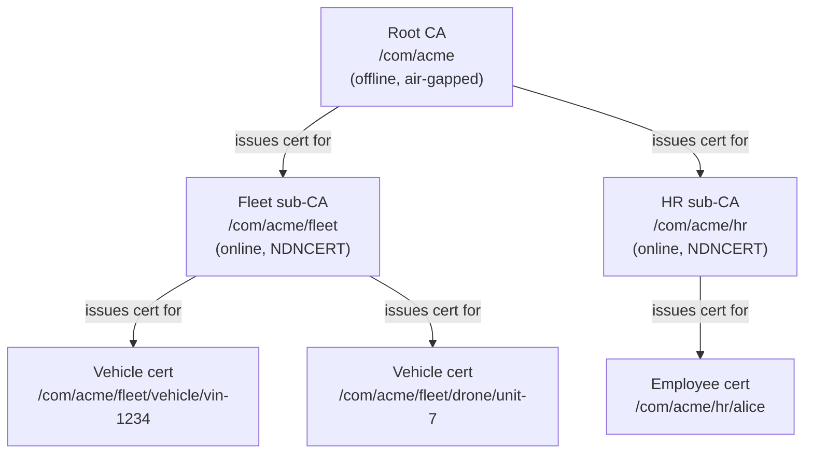

# NDNCERT: Automated Certificate Issuance

## The Problem Without NDNCERT

Before NDNCERT, bootstrapping an NDN identity in a large deployment meant: generate a key pair, bring the public key to an administrator out-of-band, have them sign a certificate, distribute the certificate back to the device, and somehow make that certificate available in the network. For a handful of research nodes, this is manageable. For ten thousand sensors coming off a production line, it is a complete non-starter.

The web solved this problem with Let's Encrypt: an automated CA that issues domain-validated certificates by having your server respond to a challenge. NDNCERT is Let's Encrypt for NDN namespaces — but better suited to the diversity of NDN deployments. A Let's Encrypt challenge requires port 80 or port 443. NDNCERT challenges run over NDN, which means they work on UDP, Ethernet, Bluetooth, and serial links. A challenge can even be an existing NDN certificate you already hold.

## What NDNCERT Does

NDNCERT is a protocol for automated certificate issuance. An applicant that wants a certificate for a namespace contacts an NDNCERT CA, completes a challenge that proves it controls (or is authorized to control) that namespace, and receives a signed certificate. The whole exchange is a few Interest/Data round trips.

Three properties make NDNCERT particularly well-suited to NDN deployments:

1. **It runs over NDN.** The protocol uses ordinary NDN Interests and Data packets. Any NDN transport works — UDP, Ethernet, Bluetooth, LoRa. No HTTP server needed.
2. **Certificates are short-lived by default (24h).** This eliminates the need for revocation infrastructure. If a device is compromised, you stop renewing its certificate. The compromised cert expires within 24 hours with no CRL or OCSP required.
3. **Devices can be mini-CAs.** After a vehicle or gateway receives its certificate, it can run NDNCERT itself and issue certificates for its sub-systems — ECUs, sensors, cameras — without any internet connection.

## Protocol Walk-Through

The NDNCERT exchange has four messages. Here is the happy path:

```
Applicant                                    CA
    |                                        |
    |--- Interest /ca-prefix/INFO ---------->|
    |<-- Data: CA name, challenges, policy --|
    |                                        |
    |--- Interest /ca-prefix/NEW  ---------->|
    |    (public key, desired namespace)     |
    |<-- Data: request-id, challenge type ---|
    |                                        |
    |--- Interest /ca-prefix/CHALLENGE ----->|
    |    (request-id, challenge response)    |
    |<-- Data: status (pending/challenge) ---|
    |                                        |
    |   ... (may repeat for multi-round) ... |
    |                                        |
    |<-- Data: status=success, certificate --|
```

**INFO** — the applicant fetches the CA's info record. This tells it: what is the CA's own certificate (so the applicant can verify subsequent responses), what challenge types are supported, and what namespace policy is in effect. The CA's info record is a normal NDN Data packet, cached by the network. An applicant can discover the CA prefix via NDN discovery or configuration.

**NEW** — the applicant sends its public key and the namespace it wants. The CA checks the namespace against its policy and, if accepted, returns a request-id and the challenge type the applicant must complete.

**CHALLENGE** — the applicant sends its challenge response. Depending on the challenge type, this might be a one-time token, a possession proof, or a code from email. The CA verifies the response and either issues the certificate immediately or asks for another round (email challenges often require the user to click a link before the CA accepts).

**Certificate** — on success, the CHALLENGE response Data packet contains the signed certificate. The applicant installs it in its key store and is ready to sign Data packets.

## Challenge Types

NDNCERT supports multiple challenge types, each suited to a different deployment scenario.

### Token Challenge

A pre-provisioned one-time token is burned into the device at manufacture time. On first boot, the device presents the token as its challenge response. The CA looks up the token in its `TokenStore`, verifies it has not been used before, and issues the certificate.

This is **Zero-Touch Provisioning (ZTP)** for NDN. The factory generates tokens, burns them into firmware, and the field deployment happens automatically — no human intervention at boot time.

```rust
use ndn_cert::{TokenStore, TokenChallenge};

// At CA setup time, pre-generate tokens for 100 devices
let mut store = TokenStore::new();
store.add_many((0..100).map(|_| random_token()));

// Wire the challenge handler into the CA
let challenge = TokenChallenge::new(store);
```

```rust
// On the device, at first boot:
let config = DeviceConfig {
    namespace: "/fleet/vehicle/vin-1234".to_string(),
    factory_credential: FactoryCredential::Token("a3f9...".to_string()),
    ca_prefix: "/fleet/ca".parse()?,
    // ...
};
let identity = NdnIdentity::provision(config).await?;
```

Tokens are single-use. The `TokenStore` marks each token as consumed once used. If the same token is presented again (replay attack), the CA rejects it.

### Possession Challenge

The applicant proves it already holds a certificate that the CA trusts. This is the right challenge for:

- **Renewal** — the device already has a valid (or recently expired) certificate. Presenting it proves continuity of identity.
- **Sub-namespace enrollment** — a vehicle with a `/fleet/vehicle/vin-1234` certificate wants to enroll its brake ECU at `/fleet/vehicle/vin-1234/ecu/brake`. The ECU's possession of the vehicle's cert (or a delegation from it) authorizes the enrollment.

```rust
use ndn_cert::PossessionChallenge;
use ndn_security::Certificate;

// The CA trusts anything signed by the fleet root
let fleet_root: Certificate = load_fleet_root_cert()?;
let challenge = PossessionChallenge::new(vec![fleet_root]);
```

During the challenge exchange, the applicant signs a nonce (provided by the CA in the NEW response) with the trusted certificate's corresponding private key. The CA verifies this signature against the trusted certificate list. Because the applicant had to sign with the private key, possession is proven — not just certificate presence.

### Email Challenge (Feature-Gated)

The CA sends a verification code to an email address. The applicant retrieves the code and submits it in a subsequent CHALLENGE Interest. This is a human-in-the-loop challenge suitable for interactive enrollment of personal devices.

Enable it with the `email-challenge` feature flag in `ndn-cert`.

### OAuth/OIDC (Planned)

The applicant redirects to a Google, GitHub, or enterprise OIDC provider, obtains an ID token, and presents it as the challenge response. This would allow "enroll using your GitHub account" flows for developer namespaces. The RFC for this challenge type is in progress.

## CA Hierarchy and Namespace Scoping

A production NDNCERT deployment has a hierarchy of CAs, mirroring the organizational namespace hierarchy.

The **root CA** is offline and air-gapped. It issues certificates only to operational sub-CAs, and those issuance ceremonies happen infrequently (once per sub-CA, or during periodic rotation). The root CA's certificate is distributed out-of-band as a trust anchor in firmware or configuration.

**Operational sub-CAs** handle day-to-day certificate issuance. Each sub-CA is namespace-scoped — it can only issue certificates *under its own namespace prefix*. A `/com/acme/fleet/CA` cannot issue a certificate for `/com/rival/anything`, even if someone asked nicely.

This scoping is enforced by the CA's `NamespacePolicy`. The default is `HierarchicalPolicy`, which requires the requested namespace to be a suffix of the CA's own name:

```
CA name:        /com/acme/fleet
Allowed:        /com/acme/fleet/vehicle/vin-1234
                /com/acme/fleet/drone/unit-7
Not allowed:    /com/acme/hr/employee/alice   (different subtree)
                /com/rival/vehicle/vin-9999   (different org)
```

For more complex cases, `DelegationPolicy` allows explicit rules — useful when a sub-CA needs to issue certificates in a namespace that doesn't strictly match its own prefix.



Each arrow represents a certificate signature. The trust chain for `/com/acme/fleet/vehicle/vin-1234` is: vehicle cert → fleet sub-CA cert → root CA cert (trust anchor). A validator with the root CA cert as its trust anchor can verify the entire chain.

## Short-Lived Certificates and Revocation

The default certificate lifetime in NDNCERT is 24 hours. This is a deliberate design choice, not a limitation.

Traditional PKI spends enormous engineering effort on revocation. CRLs (Certificate Revocation Lists) are large, stale by the time they are published, and must be distributed to every relying party. OCSP (Online Certificate Status Protocol) requires an always-available responder. OCSP stapling helps but adds complexity.

With 24-hour certificates and automatic renewal, revocation becomes trivial: **just don't renew**. If a vehicle is stolen or a device is compromised:

1. The fleet operator marks the device's namespace as revoked in the CA's policy.
2. The next time the device tries to renew (which it will, since certs are 24h), the CA rejects the renewal.
3. Within 24 hours, the device's certificate expires and becomes invalid.
4. No CRL distribution required. No OCSP infrastructure required.

For time-sensitive revocation (e.g., an actively malicious device), the operator can additionally push a trust schema update that explicitly blocks that namespace — but in practice, the 24-hour window is short enough that this is rarely necessary.

Auto-renewal runs in the background via `RenewalPolicy`:

```rust
// Renew when less than 20% of the cert lifetime remains
// (i.e., renew every ~19h if the cert is 24h)
DeviceConfig {
    renewal: RenewalPolicy::WhenPercentRemaining(20),
    // ...
}
```

If the CA is unreachable during the renewal window, the device continues operating on its current certificate and retries renewal with exponential backoff. The cert does not expire unless the device is completely disconnected for the full 24-hour lifetime.

## Devices as Mini-CAs

After a device enrolls with the fleet CA, it holds a certificate for its own namespace. Nothing stops it from running NDNCERT *itself* and issuing certificates for sub-namespaces — ECUs, sensors, or any other sub-systems.

A vehicle at `/fleet/vehicle/vin-1234` runs its own CA. When the vehicle boots:

1. The vehicle's NDNCERT CA starts listening on the vehicle's internal CAN bus (or Ethernet, or Bluetooth — whatever the internal network is).
2. Each ECU (brake controller, lidar, GPS) sends a NEW Interest to the vehicle's CA prefix.
3. The vehicle CA issues each ECU a certificate under `/fleet/vehicle/vin-1234/ecu/<name>`.
4. ECU enrollment is complete before the vehicle has any internet connection.

The entire sub-system identity hierarchy is established locally, signed by the vehicle's key, which is signed by the fleet CA, which is signed by the root CA. A remote operator who trusts the root CA can verify the authenticity of data from any ECU in the fleet by walking the chain.

## High Availability

NDNCERT CAs are stateless with respect to the network. The only shared state is the `TokenStore` (for token challenges). Everything else — the CA's certificate, the namespace policy, the challenge handlers — is configuration, not runtime state.

This means running multiple CA replicas is straightforward. Point them all at the same `TokenStore` backend (backed by a distributed key-value store if needed), register them all in the FIB under the same CA prefix (`/fleet/ca`), and the forwarder's load balancing distributes requests across replicas automatically. If one replica crashes, requests naturally route to the others.

For token challenges in a multi-replica setup, the `TokenStore` needs to be shared (so a token consumed by one replica is not reusable at another). For possession and other cryptographic challenges, there is no shared state at all — each replica independently verifies the proof.

## See Also

- [Setting Up an NDNCERT CA](../guides/ndncert-setup.md) — step-by-step setup guide with full code examples
- [Fleet and Swarm Security](../guides/fleet-security.md) — NDNCERT in a large-scale deployment
- [Identity and Decentralized Identifiers](./identity-and-did.md) — how DID methods integrate with NDNCERT enrollment
- [Security Model](./security-model.md) — the certificate chain validation that NDNCERT-issued certs participate in
