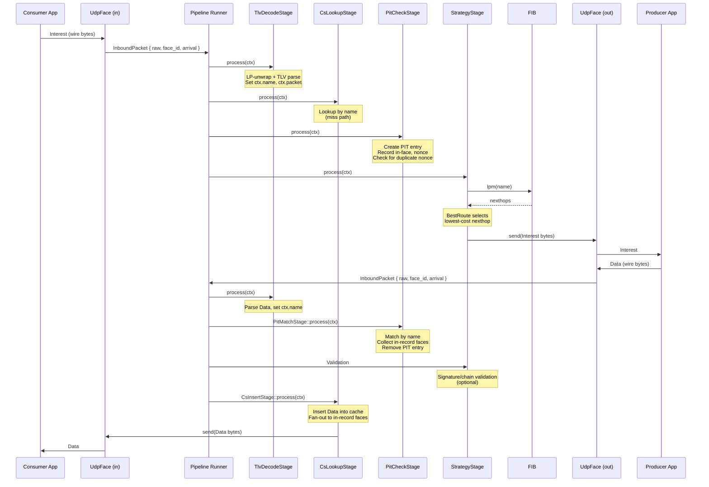
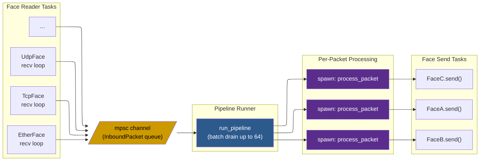
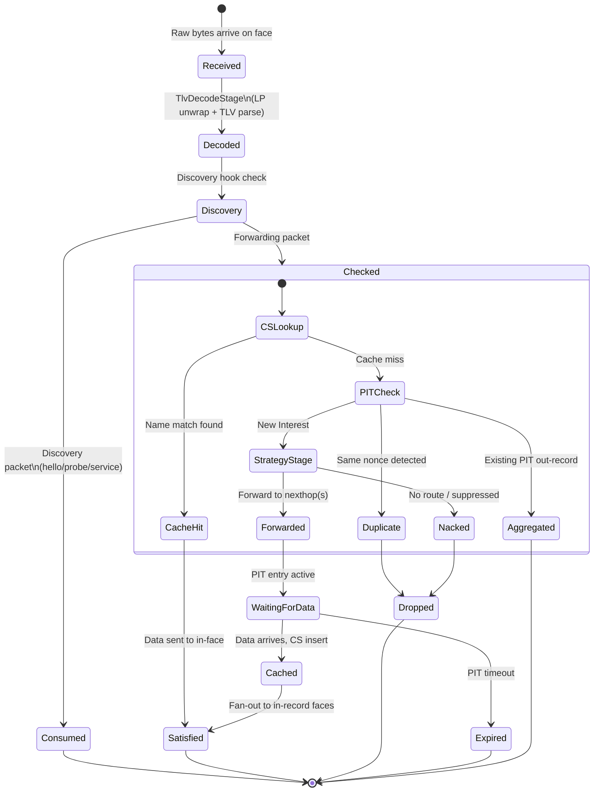

# Pipeline Walkthrough

> **TL;DR** — An Interest enters as raw bytes on a face, flows through decode → CS lookup → PIT check → strategy as a move-only `PacketContext`, and exits toward a producer. Data returns through decode → validation → PIT match → CS insert, then fans out to every waiting consumer. Each stage returns an `Action` enum; anything other than `Continue` short-circuits the pipeline.

## Stage Reference

| Stage | Path | Reads from `ctx` | Writes to `ctx` | Short-circuits |
|-------|------|-------------------|------------------|----------------|
| **TlvDecode** | Both | `raw_bytes`, `face_id` | `name`, `packet`, `name_hashes` | `Drop(MalformedPacket)`, `Drop(ScopeViolation)`, `Drop(FragmentCollect)` |
| **Discovery hook** | Both | `raw_bytes`, `face_id` | — | Consumes hello/probe packets (never enters pipeline) |
| **CsLookup** | Interest | `name` | `cs_hit` | `Satisfy` on cache hit (skips PIT/FIB/strategy entirely) |
| **PitCheck** | Interest | `name`, `name_hashes` | `pit_token`, `out_faces` | `Drop(LoopDetected)` on duplicate nonce; silently aggregates if PIT entry exists |
| **Strategy** | Interest | `name`, `pit_token` | `out_faces` | `Nack(NoRoute)` or `Suppress` |
| **Validation** | Data | `packet` | `verified` | `Drop(ValidationFailed)`, or queues packet pending cert fetch |
| **PitMatch** | Data | `name`, `name_hashes` | `out_faces` | Drops unsolicited Data (no matching PIT entry) |
| **CsInsert** | Data | `name`, `packet` | — | — (always continues to fan-out) |

## How It Works

The pipeline is a fixed sequence of stages compiled at build time. Packets flow through stages as a `PacketContext` value passed **by ownership** — Rust's move semantics ensure exactly one stage owns the packet at any moment. Each stage returns an `Action` enum:

- **`Continue(ctx)`** — pass to the next stage
- **`Satisfy(ctx)`** — Data found, send it back
- **`Send(ctx, faces)`** — forward out selected faces
- **`Drop(reason)`** — discard the packet
- **`Nack(ctx, reason)`** — send a Nack upstream

> **Compile-time pipeline:** Stages are fixed at compile time — no virtual dispatch on the hot path. The compiler inlines across stage boundaries.

## The Full Journey

Here's the complete sequence, from the consumer sending an Interest to receiving the Data back. We'll walk through each box in detail below.



## Act I: Arrival

### Bytes Hit the Wire

An Interest for `/ndn/edu/ucla/cs/class` arrives as a UDP datagram on port 6363. Each face runs its own Tokio task — a tight `recv()` loop pushing packets into a shared channel:

```rust
pub struct InboundPacket {
    pub raw: Bytes,           // Raw wire bytes (zero-copy from socket)
    pub face_id: FaceId,      // Which face received this
    pub arrival: Instant,     // Arrival timestamp
    pub meta: InboundMeta,    // Link-layer metadata (source MAC, etc.)
}
```

The `raw` field is a `bytes::Bytes` — reference-counted, zero-copy. The packet passes through six pipeline stages without a single memcpy of the wire bytes.

> **Note:** `arrival` is a monotonic `Instant`, not wall-clock time — used for PIT expiry and RTT measurement.

### The Batch Drain

The pipeline runner doesn't process packets one at a time. It blocks on the channel for the first packet, then greedily pulls up to 63 more with non-blocking `try_recv()` — amortizing the `tokio::select!` wakeup cost across the entire batch:

```rust
const BATCH_SIZE: usize = 64;

let first = tokio::select! {
    _ = cancel.cancelled() => break,
    pkt = rx.recv() => match pkt { ... },
};
batch.push(first);

while batch.len() < BATCH_SIZE {
    match rx.try_recv() {
        Ok(p) => batch.push(p),
        Err(_) => break,
    }
}
```

> **Performance:** 64 packets share a single wakeup. Under load, this reduces per-packet scheduling overhead by up to 60x.

Task topology — every face feeds one shared channel, the pipeline runner fans out to per-packet processing:



> **Single channel by design:** All face types — UDP, TCP, Ethernet, SHM — feed the same queue. Interest aggregation works correctly even when the same Interest arrives on different face types simultaneously.

### Parallel vs. Single-Threaded Mode

The `pipeline_threads` config controls dispatch:

```rust
if parallel {
    let d = Arc::clone(self);
    tokio::spawn(async move { d.process_packet(pkt).await });
} else {
    self.process_packet(pkt).await;
}
```

| Mode | When | Trade-off |
|------|------|-----------|
| **Single-threaded** (`== 1`) | Embedded, low traffic, deterministic ordering | Zero spawn overhead, no cross-thread sync |
| **Parallel** (`> 1`) | High throughput | ~200ns spawn cost per packet, non-deterministic ordering |

> **Concurrency note:** In parallel mode, two Interests for the same name can race through PIT check concurrently. `DashMap` handles this correctly via fine-grained locking, but in-record ordering may differ between runs.

## Act II: The Interest Pipeline

### Fragment Sieve

NDN Link Protocol packets can be fragmented across multiple LP frames. The sieve collects fragments and only passes reassembled packets forward. For a typical Interest (well under MTU), this is a pass-through — ~2 microseconds overhead.

### Decode: Wire Bytes → Structured Packet

`TlvDecodeStage` does two things:

1. **LP-unwrap** — strip the NDN Link Protocol header, extract LP fields (congestion marks, next-hop face hints)
2. **TLV-parse** — identify packet type (Interest = 0x05), decode the name, create a partially-decoded struct

```rust
let ctx = match self.decode.process(ctx) {
    Action::Continue(ctx) => ctx,
    Action::Drop(DropReason::FragmentCollect) => return,
    Action::Drop(r) => { debug!(reason=?r, "drop at decode"); return; }
    other => { self.dispatch_action(other); return; }
};
```

"Partially" is key: the name is always decoded eagerly (every subsequent stage needs it), but fields like Nonce and InterestLifetime are behind `OnceLock<T>` — decoded on first access only. A CS hit may satisfy the Interest without ever parsing these fields.

### Discovery Hook

After decode, the discovery subsystem gets first look. Hello Interests, service record probes, and SWIM packets are consumed here and never enter the forwarding pipeline:

```rust
if self.discovery.on_inbound(&ctx.raw_bytes, ctx.face_id, &meta, &*self.discovery_ctx) {
    return; // Consumed by discovery — e.g., /localhop/_discovery/hello
}
```

Normal forwarding packets pass through untouched.

### CS Lookup: The Short-Circuit

The Content Store is checked **before** the PIT. On a cache hit, the Interest never touches the PIT, FIB, or strategy — `Action::Satisfy` sends cached Data directly back to the consumer. This is the fastest path: single-digit microseconds, no PIT entry created, and the `OnceLock` lazy decode means Nonce/Lifetime were never even parsed.

> **Why CS before PIT?** A CS hit satisfies with zero PIT state. Checking PIT first would create and immediately clean up an entry for every cache hit — wasted work on what should be the fastest path.

On a cache miss, `Action::Continue` passes the Interest forward.

### PIT Check: Recording Pending State

The PIT records which faces are waiting for which data. Three things happen here:

1. **Create PIT entry** keyed by `(Name, Option<Selector>)`
2. **Record in-face** — the breadcrumb trail for returning Data
3. **Check nonce** — same nonce + same name from a different face = loop → `Drop(LoopDetected)`

> **Interest aggregation:** If a second Interest for the same name arrives (different nonce) while the first is pending, the PIT adds a second in-record but does **not** forward again. When Data returns, both consumers get it — natural multicast with zero configuration.

### Strategy Stage: The Forwarding Decision

Two lookups, one decision:

1. **FIB longest-prefix match** — walk the `NameTrie` component by component (`ndn` → `edu` → `ucla`). The longest matching prefix provides candidate nexthops.
2. **Strategy selection** — a parallel `NameTrie` maps prefixes to `Arc<dyn Strategy>`. The strategy receives an immutable `StrategyContext` (FIB entry, PIT token, measurements) and returns:

| Action | Meaning |
|--------|---------|
| `Forward(faces)` | Send Interest to these faces |
| `ForwardAfter { delay, faces }` | Probe primary; fallback after timeout |
| `Nack(reason)` | No route or suppressed |
| `Suppress` | Do nothing (Interest management) |

The default `BestRoute` selects the lowest-cost nexthop. The Interest is enqueued on the selected outgoing face.

## The Packet Lifecycle at a Glance

Before we follow the Data return path, here's the full state machine. Every packet eventually reaches one of the terminal states: Satisfied, Dropped, or Expired.



## Act III: The Data Returns

Data for `/ndn/edu/ucla/cs/class` arrives on the outgoing face. It enters through the same front door — recv loop, channel, batch drain, fragment sieve, decode — but the decode stage identifies it as Data (TLV type 0x06) and the pipeline switches to the data path.

> **Single pipeline, both directions:** Interests and Data share the inbound path through decode. The fork happens after decoding, based on packet type.

### PIT Match

The PIT match stage:

1. **Looks up** the entry by name — finds the one created when the Interest was forwarded
2. **Collects in-record faces** — all consumers waiting for this Data (one face, or many if aggregation occurred)
3. **Removes the PIT entry** atomically with the match (`DashMap` entry API guarantees no race)

Unsolicited Data (no matching PIT entry) is dropped immediately — the forwarder never forwards Data that wasn't requested.

### Validation: Trust but Verify

`ValidationStage` always runs. **Security is on by default**: if no `SecurityManager` is configured, the stage still verifies cryptographic signatures (`AcceptSigned` behaviour) — it just skips the certificate chain walk and namespace hierarchy check. To turn off all validation, you must explicitly set `SecurityProfile::Disabled`.

The `SecurityProfile` enum controls what the stage does:

| Profile | Behaviour |
|---------|-----------|
| `Default` (no `SecurityManager`) | Crypto-verify the signature; accept if valid. No chain walk. |
| `Default` (with `SecurityManager`) | Full chain validation: trust schema + cert fetching + trust anchor check. |
| `AcceptSigned` | Crypto-verify only; no chain walk. Explicit equivalent of the fallback above. |
| `Disabled` | Skip all validation — every Data passes through unchecked. Must be set explicitly. |
| `Custom(validator)` | Caller-supplied `Validator` with full control. |

The stage may produce three outcomes for each Data packet:

- **`Action::Satisfy`** (valid) -- the signature checks out; the Data is promoted to `SafeData`
- **`Action::Drop`** (invalid signature) -- cryptographic verification failed; discard
- **`Action::Pending`** (certificate needed) -- the certificate for the signing key isn't in the cache yet; a side-channel Interest is issued to fetch it

Pending packets are queued and re-validated by a periodic drain task once the missing certificate arrives. See the [Security Model](security-model.md) deep dive for the full certificate chain walk.

> **🔧 Implementation note:** The `SafeData` typestate ensures that code expecting verified data cannot accidentally receive unverified data -- the compiler enforces the boundary regardless of which `SecurityProfile` was chosen.

### CS Insert + Fan-Out

The Data is inserted into the Content Store (wire-format `Bytes` — a future cache hit sends directly without re-encoding). Then `dispatch_action` fans the Data out to every in-record face from the PIT match.

The loop is closed: Interest left breadcrumbs through the PIT, Data followed them home, and a cached copy now sits in the CS for the next consumer who asks.

## Act IV: When Things Go Wrong

### Nack Pipeline

When a Nack arrives (upstream has no route, producer unreachable), the pipeline:

1. **Looks up PIT entry** — still pending, waiting for Data
2. **Builds `StrategyContext`** with FIB entry + measurements
3. **Asks strategy** via `on_nack_erased`:

| Response | Effect |
|----------|--------|
| `Forward(faces)` | Retry on alternate nexthops — automatic failover |
| `Nack(reason)` | Propagate Nack to all in-record consumers |
| `Suppress` | Silently drop (strategy already initiated retry via `ForwardAfter`) |

> **Resilience:** A `BestRoute` strategy with two nexthops tries the second when the first Nacks — automatic path failover with no application-level retry logic.

## Design Decisions at a Glance

| Decision | Why |
|----------|-----|
| `Arc<Name>` | Names shared across PIT, FIB, pipeline stages without copying |
| `bytes::Bytes` | Zero-copy slicing from socket buffer through Content Store |
| `DashMap` PIT | No global lock on hot path; concurrent Interests for different names never contend |
| `OnceLock<T>` lazy decode | Fields parsed only when accessed — saves CPU on cache hits |
| `SmallVec<[NameComponent; 8]>` | Stack-allocated for typical 4-8 component names |
| Compile-time pipeline | No virtual dispatch per-packet; compiler inlines across stage boundaries |

Each packet flows through the pipeline in isolation, but the shared state — PIT, FIB, CS, measurements — creates NDN's emergent behavior: Interest aggregation, multipath forwarding, ubiquitous caching, and loop-free routing.
