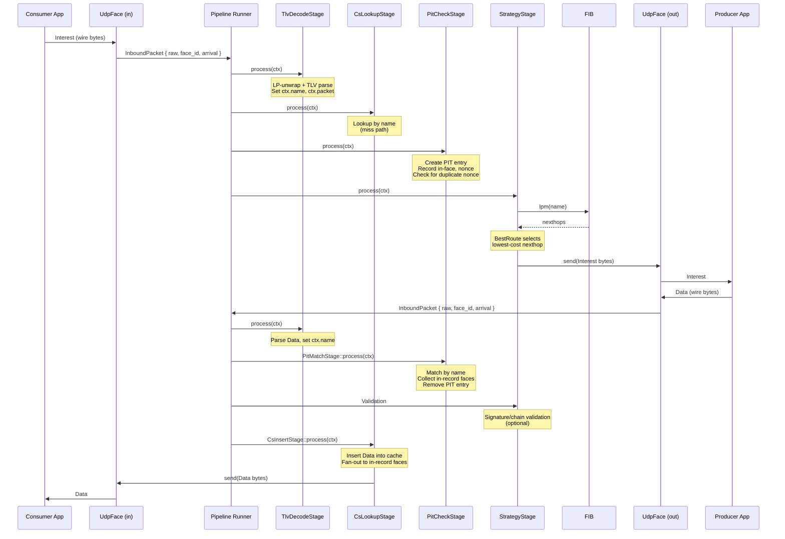
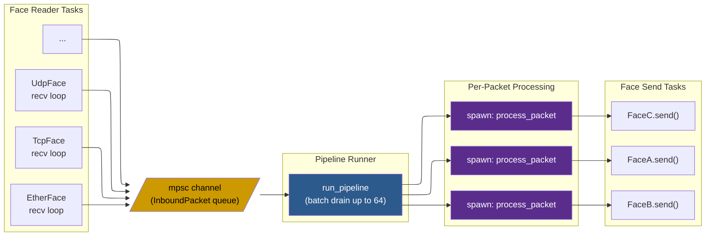
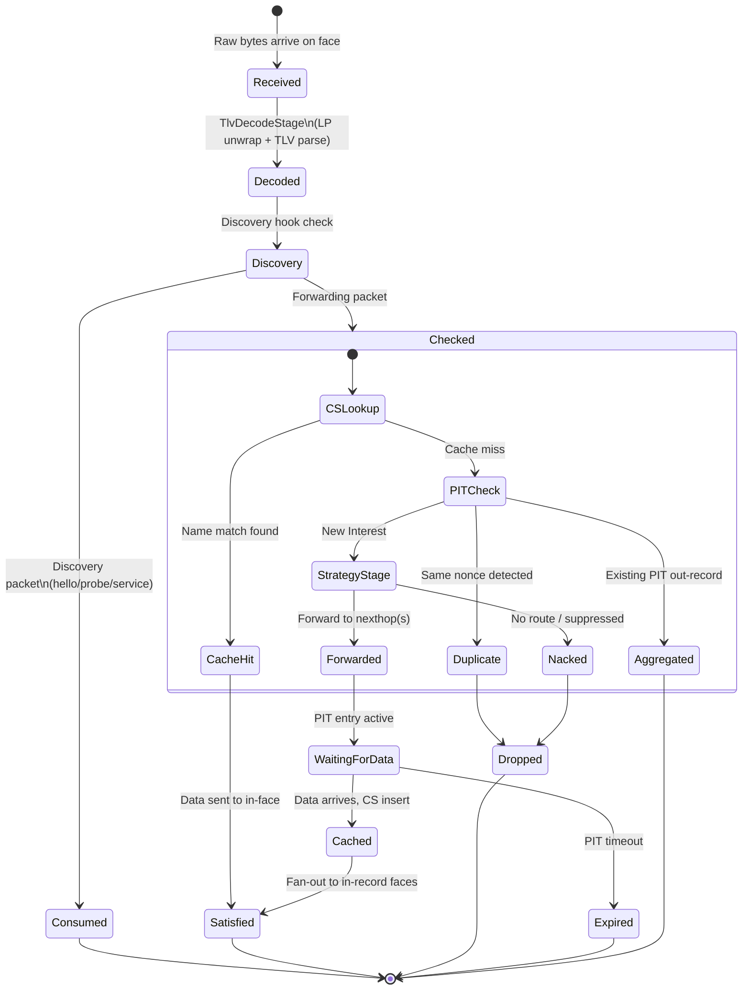

# Pipeline Walkthrough

## The Scene: A Packet Arrives

An Interest for `/ndn/edu/ucla/cs/class` arrives on a UDP face. The consumer application -- maybe a student's laptop running a content-fetching tool -- has just expressed its desire for some course data. The Interest is nothing but raw bytes in a UDP datagram, sitting in a kernel socket buffer. It has no idea what's about to happen to it.

Let's follow it through every stage of the ndn-rs forwarding pipeline, from raw bytes to satisfied consumer.

## The Cast of Characters

The pipeline is a fixed sequence of stages compiled at build time. Packets flow through stages as a `PacketContext` value that is passed **by ownership** -- Rust's move semantics ensure that exactly one stage owns the packet at any given moment. Each stage returns an `Action` enum that tells the pipeline runner what to do next:

- **`Continue(ctx)`** -- pass to the next stage
- **`Satisfy(ctx)`** -- Data found, send it back
- **`Send(ctx)`** -- forward out a face
- **`Drop(reason)`** -- discard the packet
- **`Nack(reason)`** -- send a Nack upstream

> **💡 Key insight:** The pipeline is not a runtime plugin system. Stages are fixed at compile time, which lets the compiler inline aggressively and eliminate virtual dispatch overhead. The `Action` enum drives control flow without dynamic trait objects on the hot path.

## The Full Journey

Here's the complete sequence, from the consumer sending an Interest to receiving the Data back. We'll walk through each box in detail below.



## Act I: Arrival

### Bytes Hit the Wire

Our Interest for `/ndn/edu/ucla/cs/class` arrives as a UDP datagram on port 6363. The `UdpFace` has been waiting for exactly this moment. Each face runs its own Tokio task -- a tight loop calling `face.recv()` and pushing results into a shared channel:

```rust
pub struct InboundPacket {
    pub raw: Bytes,           // Raw wire bytes (zero-copy from socket)
    pub face_id: FaceId,      // Which face received this
    pub arrival: Instant,     // Arrival timestamp
    pub meta: InboundMeta,    // Link-layer metadata (source MAC, etc.)
}
```

The `raw` field is a `bytes::Bytes` -- a reference-counted, zero-copy buffer. The kernel wrote the datagram into a buffer, and `Bytes` lets us slice and share it without ever copying the actual packet data. This matters: our Interest might pass through six pipeline stages, and none of them will memcpy the wire bytes.

> **🔧 Implementation note:** The `InboundPacket` captures an `Instant` at arrival time, not a wall-clock timestamp. This is used later for PIT expiry calculations and RTT measurement -- both of which need monotonic time, not time-of-day.

### The Batch Drain: Amortizing Overhead

Here's where the first clever optimization lives. The pipeline runner doesn't process packets one at a time. It *drains* them in batches.

The runner blocks on the channel waiting for the first packet. But as soon as one arrives, it greedily pulls up to 63 more with non-blocking `try_recv()` calls. In a burst scenario -- say, a hundred Interests arrive in quick succession -- this amortizes the `tokio::select!` wakeup cost across the entire batch:

```rust
const BATCH_SIZE: usize = 64;

let first = tokio::select! {
    _ = cancel.cancelled() => break,
    pkt = rx.recv() => match pkt { ... },
};
batch.push(first);

while batch.len() < BATCH_SIZE {
    match rx.try_recv() {
        Ok(p) => batch.push(p),
        Err(_) => break,
    }
}
```

> **📊 Performance:** Without batch drain, every packet pays the full cost of a `tokio::select!` wakeup -- parking and unparking the task, checking the cancellation token, etc. With batch drain, 64 packets share a single wakeup. Under load, this reduces per-packet scheduling overhead by up to 60x.

Here's the task topology. Every face feeds into one shared channel, and the pipeline runner fans out to per-packet processing:



> **💡 Key insight:** The single `mpsc` channel is intentional. All faces -- UDP, TCP, Ethernet, shared memory -- feed into the same queue. This means Interest aggregation works correctly even when the same Interest arrives on different face types simultaneously. One channel, one PIT, one truth.

### Parallel vs. Single-Threaded Mode

Before the runner dispatches each packet, it makes a choice based on the `pipeline_threads` configuration:

```rust
if parallel {
    let d = Arc::clone(self);
    tokio::spawn(async move { d.process_packet(pkt).await });
} else {
    self.process_packet(pkt).await;
}
```

- **Single-threaded** (`pipeline_threads == 1`): packets are processed inline in the pipeline runner task. No task spawn overhead, no cross-thread synchronization. Best for embedded devices, low-traffic deployments, or when you want deterministic packet ordering.
- **Parallel** (`pipeline_threads > 1`): each packet is spawned as a separate Tokio task and can run on any worker thread. Higher throughput under load, at the cost of task spawn overhead (~200ns per packet) and non-deterministic ordering.

> **⚠️ Important:** In parallel mode, two Interests for the same name can race through the PIT check stage concurrently. The `DashMap`-based PIT handles this correctly through fine-grained locking, but the ordering of in-records may differ between runs. If your application depends on Interest ordering, use single-threaded mode.

> **🔄 What happens next:** The batch is drained, the mode is selected. Now each packet enters the pipeline proper. Our Interest for `/ndn/edu/ucla/cs/class` is about to be decoded.

## Act II: The Interest Pipeline

### The Fragment Sieve: Reassembly on the Fast Path

Before our Interest enters the full pipeline, it passes through the fragment sieve. NDN Link Protocol (LP) packets can be fragmented -- a single NDN packet split across multiple LP frames. The sieve collects fragments and only passes reassembled packets forward.

For our Interest, this is a no-op. A typical Interest for `/ndn/edu/ucla/cs/class` is well under the MTU, so it arrives as a single LP frame. The sieve checks the fragment header, sees it's a complete packet, and passes it through immediately.

> **📊 Performance:** The fragment sieve adds roughly 2 microseconds per packet, even on the fast path (no fragmentation). This is cheap insurance -- without it, a fragmented packet would enter the TLV parser as a truncated blob and fail with a confusing decode error.

> **🔄 What happens next:** Our Interest has survived the sieve intact. Time to find out what it actually says.

### Decode: From Wire Bytes to Structured Packet

The `TlvDecodeStage` is where raw bytes become a structured NDN packet. It does two things:

1. **LP-unwraps** the packet -- strips the NDN Link Protocol header, extracting any LP fields (congestion marks, next-hop face hints, etc.)
2. **TLV-parses** the bare NDN packet -- determines that this is an Interest (type 0x05), decodes the name `/ndn/edu/ucla/cs/class`, and creates a partially-decoded `Interest` struct

```rust
let ctx = match self.decode.process(ctx) {
    Action::Continue(ctx) => ctx,
    Action::Drop(DropReason::FragmentCollect) => return,
    Action::Drop(r) => { debug!(reason=?r, "drop at decode"); return; }
    other => { self.dispatch_action(other); return; }
};
```

The word "partially" is critical here. The name is *always* decoded eagerly -- every subsequent stage needs it. But other Interest fields like the Nonce (4 random bytes for loop detection) and InterestLifetime are behind `OnceLock<T>` -- they'll be decoded on first access, if and when they're needed.

> **🔧 Implementation note:** The `OnceLock<T>` lazy decoding pattern means that a Content Store hit (coming up next) might satisfy the Interest without ever parsing the Nonce or Lifetime fields. On a cache-heavy workload, this saves measurable CPU time.

> **🔄 What happens next:** We now have a decoded Interest with name `/ndn/edu/ucla/cs/class`. But before it enters the forwarding path, someone else gets first dibs.

### Discovery Hook: The Gatekeeper

After decode, the discovery subsystem gets first look at the packet. Hello Interests, service record browse packets, and SWIM protocol probes are consumed here and never enter the forwarding pipeline:

```rust
if self.discovery.on_inbound(&ctx.raw_bytes, ctx.face_id, &meta, &*self.discovery_ctx) {
    return; // Consumed by discovery
}
```

Our Interest for `/ndn/edu/ucla/cs/class` is a normal forwarding packet, so discovery lets it pass. But if it had been a `/localhop/_discovery/hello` Interest, the journey would end here -- handled entirely by the discovery subsystem.

> **🔄 What happens next:** Discovery waves our Interest through. Now the real forwarding begins.

### CS Lookup: The Triumphant Short-Circuit

The Content Store is checked first. If someone recently fetched `/ndn/edu/ucla/cs/class` and the Data is still cached, the Interest never even makes it to the PIT. The pipeline returns `Action::Satisfy`, and the cached Data is sent directly back to the consumer on the face the Interest arrived from.

This is the fastest possible path through the forwarder. No PIT entry created, no FIB lookup, no strategy consultation, no outbound Interest sent. The packet came in, found its answer in the cache, and went home. Total time: single-digit microseconds.

Because of the `OnceLock<T>` lazy decoding, a CS hit is even cheaper than it looks. The Interest's Nonce and Lifetime fields were never decoded -- they're irrelevant when the answer is already sitting in the cache. The only field that mattered was the name, and that was decoded eagerly in the previous stage.

But today, we're not so lucky. The Content Store doesn't have `/ndn/edu/ucla/cs/class` cached. `Action::Continue` passes the Interest to the next stage.

> **💡 Key insight:** Checking the Content Store *before* the PIT is a deliberate design choice. A CS hit satisfies the Interest with zero PIT state. If the PIT were checked first, we'd create (and then immediately clean up) a PIT entry for every cache hit -- wasted work on what should be the fastest path.

> **🔄 What happens next:** Cache miss. Our Interest needs to actually be forwarded. First, we need to record who's waiting for the answer.

### PIT Check: Leaving Breadcrumbs

The Pending Interest Table is the forwarder's memory. It records which faces are waiting for which data, so that when a Data packet eventually arrives, the forwarder knows where to send it.

The PIT stage does three things for our Interest:

1. **Creates a PIT entry** keyed by `(Name, Option<Selector>)` -- in our case, `(/ndn/edu/ucla/cs/class, None)`
2. **Records the in-face** -- the UDP face our Interest arrived on. This is the breadcrumb: when Data comes back, follow this trail.
3. **Checks the nonce** for duplicate suppression. Every Interest carries a random 4-byte nonce. If the same nonce for the same name has been seen recently from a different face, this Interest is a loop -- drop it.

Our Interest has a fresh nonce, and there's no existing PIT entry for this name. The stage creates a new entry and returns `Action::Continue`.

> **⚠️ Important:** Interest aggregation happens here too. If a *second* Interest for `/ndn/edu/ucla/cs/class` arrives (with a different nonce) while the first is still pending, the PIT stage adds a second in-record to the existing entry but does *not* forward the Interest again. When the Data returns, both consumers get it. This is one of NDN's most powerful features -- natural multicast without any special configuration.

> **🔄 What happens next:** PIT entry created, breadcrumb laid. Now we need to figure out *where* to send this Interest.

### Strategy Stage: The Forwarding Decision

This is where the forwarder's intelligence lives. The strategy stage has two jobs: find the routes, then pick the best one.

**FIB longest-prefix match.** The Name trie is walked from the root, matching one component at a time: `ndn` -> `edu` -> `ucla` -> `cs` -> `class`. At each level, the trie follows `HashMap<Component, Arc<RwLock<TrieNode>>>` links. The longest matching prefix wins -- maybe there's a FIB entry for `/ndn/edu/ucla` pointing to two nexthops.

**Strategy selection.** A parallel name trie maps prefixes to `Arc<dyn Strategy>` implementations. The strategy for `/ndn/edu/ucla` might be the default `BestRoute`, or it might be a custom multicast strategy. The strategy receives an immutable `StrategyContext` -- it can see the FIB entry, the PIT token, and the measurements table, but it cannot mutate global state.

**Forwarding decision.** The strategy returns one of:

- `Forward(faces)` -- send the Interest to these faces
- `ForwardAfter { delay, faces }` -- probe-and-fallback: try the primary face, and if no Data arrives within `delay`, try the fallback faces
- `Nack(reason)` -- no route, or strategy decides to suppress
- `Suppress` -- do nothing (used for Interest management)

The default `BestRoute` strategy selects the lowest-cost nexthop from the FIB entry. Our Interest for `/ndn/edu/ucla/cs/class` is enqueued on the selected outgoing face -- say, another UDP face pointing toward a UCLA campus router.

The Interest leaves the forwarder. Now we wait.

> **🔄 What happens next:** The Interest has been forwarded. Somewhere upstream, a producer (or another forwarder's cache) will generate a Data packet. When it arrives, Act III begins.

## The Packet Lifecycle at a Glance

Before we follow the Data return path, here's the full state machine. Every packet eventually reaches one of the terminal states: Satisfied, Dropped, or Expired.



## Act III: The Data Returns

### Closing the Loop

A Data packet for `/ndn/edu/ucla/cs/class` arrives on the outgoing face. A producer upstream -- or another forwarder's cache -- has answered our Interest. The Data enters the pipeline through the same front door: face recv loop, mpsc channel, batch drain, fragment sieve, decode stage.

But this time, the decode stage identifies the packet as a Data (TLV type 0x06) instead of an Interest. The pipeline switches to the data path.

> **💡 Key insight:** Interests and Data share the same inbound path through decode. The fork happens *after* decoding, based on the packet type. This means a single pipeline runner handles both directions -- there's no separate "data pipeline process."

### PIT Match: Following the Breadcrumbs

Remember the PIT entry we created in Act II? The Data's name is `/ndn/edu/ucla/cs/class` -- exactly matching our pending entry. The PIT match stage:

1. Looks up the entry by name
2. Collects all in-record faces -- these are the consumers waiting for this Data. In our case, it's the UDP face the original Interest arrived on. If Interest aggregation had occurred, there might be multiple faces here.
3. Removes the PIT entry -- its job is done

On no match, the Data is *unsolicited* -- nobody asked for it. Unsolicited Data is dropped immediately. This is a security feature: the forwarder never forwards Data that wasn't requested, preventing cache pollution attacks.

> **⚠️ Important:** The PIT entry removal is atomic with the match. Between the match and the removal, no new Interest for the same name can sneak in and miss the Data. The `DashMap` provides this guarantee through its entry API.

> **🔄 What happens next:** We have the Data and we know who's waiting for it. But before we deliver it, we might want to verify it and cache it.

### Validation: Trust but Verify

If signature validation is enabled, the Data's signature is verified against the trust schema and certificate chain. This stage may produce three outcomes:

- **`Action::Satisfy`** (valid) -- the signature checks out, the Data is promoted to `SafeData`
- **`Action::Drop`** (invalid signature) -- cryptographic verification failed, discard
- **`Action::Pending`** (certificate needed) -- the certificate for the signing key isn't available yet and must be fetched over the network

Pending packets are queued and re-validated by a periodic drain task once the missing certificate arrives. See the [Security Model](security-model.md) deep dive for the full certificate chain walk.

> **🔧 Implementation note:** Validation is optional and configured per-deployment. A forwarder running on a trusted local network might skip it entirely. An edge forwarder facing the open internet should always enable it. The `SafeData` typestate ensures that code expecting verified data cannot accidentally receive unverified data -- the compiler enforces the boundary.

### CS Insert: Caching for the Future

The Data is inserted into the Content Store. The next Interest for `/ndn/edu/ucla/cs/class` -- maybe from a different consumer, maybe from the same one a minute later -- will get a cache hit in the CS lookup stage and never need to be forwarded at all.

```rust
let action = self.cs_insert.process(ctx).await;
self.dispatch_action(action);
```

Then comes the fan-out. The `dispatch_action` method sends the Data wireformat to every in-record face collected from the PIT match. Our original consumer's UDP face receives the Data bytes. The face's send task transmits them back to the consumer application.

The loop is closed. The student's laptop receives the course data it asked for. The Interest left a breadcrumb trail through the PIT, the Data followed it home, and a cached copy now sits in the Content Store for the next person who asks.

> **📊 Performance:** The Content Store stores wire-format `Bytes`, not decoded structures. A future cache hit can send the cached bytes directly to a face without re-encoding. Zero-copy in, zero-copy out.

## Act IV: When Things Go Wrong

### The Nack Pipeline

Not every Interest gets answered with Data. Sometimes the upstream forwarder has no route, or the producer is unreachable. In these cases, a Nack arrives -- a negative acknowledgment carrying the original Interest and a reason code.

When a Nack arrives for our previously forwarded Interest, the nack pipeline:

1. **Looks up the PIT entry** by the nacked Interest's name -- the entry is still there, waiting
2. **Builds a `StrategyContext`** with the FIB entry and measurements -- the strategy needs the full picture
3. **Asks the strategy what to do** via `on_nack_erased`:
   - **`Forward(faces)`** -- try alternate nexthops. The original Interest bytes are re-sent on a different face. Maybe there's a backup route to UCLA.
   - **`Nack(reason)`** -- give up. Propagate the Nack back to all in-record consumers. The student's application receives a Nack and can decide whether to retry.
   - **`Suppress`** -- silently drop. Used when the strategy has already initiated a retry via `ForwardAfter`.

> **💡 Key insight:** The strategy's ability to retry on alternate nexthops is what makes NDN resilient to path failures. A `BestRoute` strategy with two nexthops will try the second one when the first returns a Nack -- automatic failover without any application-level retry logic.

## Epilogue: The Architecture in Perspective

What we've traced is a single Interest-Data exchange, but the design scales to millions of concurrent flows. The key structural decisions that make this possible:

- **`Arc<Name>`** -- names are shared across PIT, FIB, and pipeline stages without copying
- **`bytes::Bytes`** -- zero-copy slicing from socket buffer through to Content Store
- **`DashMap` for PIT** -- no global lock on the hot path; concurrent Interests for different names never contend
- **`OnceLock<T>` for lazy decode** -- fields parsed only when accessed, saving CPU on cache hits
- **`SmallVec<[NameComponent; 8]>`** for names -- stack-allocated for typical 4-8 component names, heap-allocated only for unusually deep hierarchies
- **Compile-time pipeline** -- no virtual dispatch on the per-packet hot path; the compiler sees through every stage boundary

The pipeline processes each packet in isolation, but the shared state -- PIT, FIB, CS, measurements -- creates the emergent behavior that makes NDN work: Interest aggregation, multipath forwarding, ubiquitous caching, and loop-free routing. All from following a packet through a few stages.
