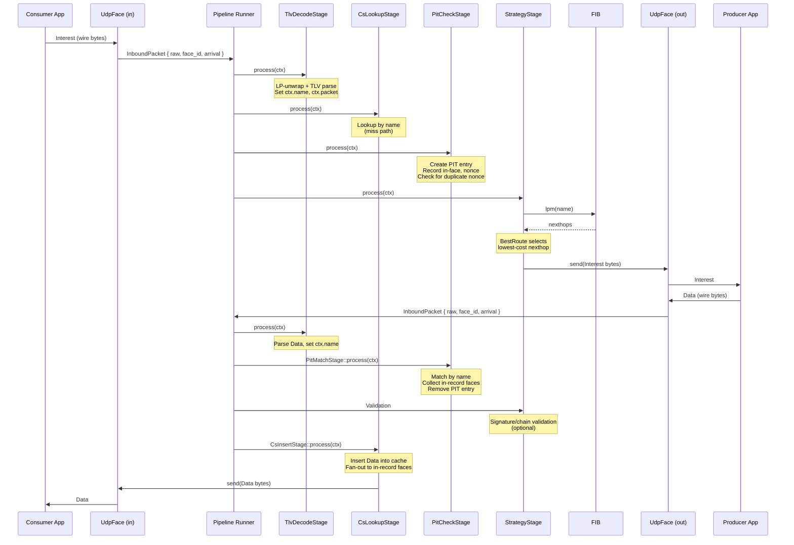
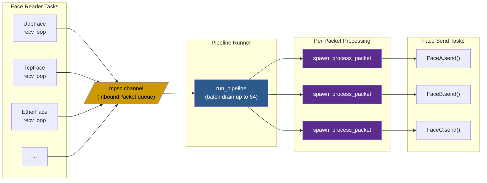
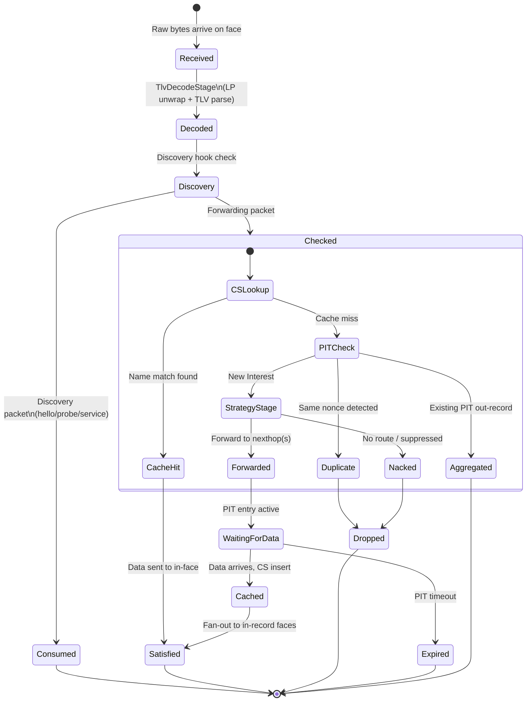

# Pipeline Walkthrough

This page traces a single Interest-Data exchange through the ndn-rs forwarding pipeline, from raw bytes arriving on a UDP face to the Data packet being delivered back to the consumer. Every stage references the actual code in `ndn-engine`.

## Overview

The pipeline is a fixed sequence of stages compiled at build time. Packets flow through stages as a `PacketContext` value that is passed by ownership. Each stage returns an `Action` enum:

- **`Continue(ctx)`** -- pass to the next stage
- **`Satisfy(ctx)`** -- Data found, send it back
- **`Send(ctx)`** -- forward out a face
- **`Drop(reason)`** -- discard the packet
- **`Nack(reason)`** -- send a Nack upstream

## Sequence Diagram



## Tokio Task Topology



## Packet Lifecycle



## Step 1: Bytes Arrive on UdpFace

Raw UDP datagrams arrive on a `UdpFace`. Each face runs its own Tokio task that calls `face.recv()` in a loop and pushes `InboundPacket` structs into a shared `mpsc` channel:

```rust
pub struct InboundPacket {
    pub raw: Bytes,           // Raw wire bytes (zero-copy from socket)
    pub face_id: FaceId,      // Which face received this
    pub arrival: Instant,     // Arrival timestamp
    pub meta: InboundMeta,    // Link-layer metadata (source MAC, etc.)
}
```

## Step 2: Batch Drain

The pipeline runner (`run_pipeline`) drains packets in batches of up to 64 from the channel. After blocking for the first packet, it drains more with non-blocking `try_recv()`. This amortizes the `tokio::select!` overhead across bursts:

```rust
const BATCH_SIZE: usize = 64;

let first = tokio::select! {
    _ = cancel.cancelled() => break,
    pkt = rx.recv() => match pkt { ... },
};
batch.push(first);

while batch.len() < BATCH_SIZE {
    match rx.try_recv() {
        Ok(p) => batch.push(p),
        Err(_) => break,
    }
}
```

## Step 3: Fragment Sieve

Before entering the full pipeline, each packet passes through the fragment sieve. NDN Link Protocol (LP) packets may be fragmented -- the sieve collects fragments and only passes reassembled packets (or non-fragment packets) to `process_packet`. This is cheap (~2 microseconds per fragment) and runs inline.

## Step 4: Decode Stage

`process_packet` first runs the decode stage, which:

1. LP-unwraps the packet (strips the NDN Link Protocol header)
2. TLV-parses the bare NDN packet (Interest, Data, or Nack)
3. Sets `ctx.name` (always decoded eagerly) and `ctx.packet` (the decoded enum variant)

```rust
let ctx = match self.decode.process(ctx) {
    Action::Continue(ctx) => ctx,
    Action::Drop(DropReason::FragmentCollect) => return,
    Action::Drop(r) => { debug!(reason=?r, "drop at decode"); return; }
    other => { self.dispatch_action(other); return; }
};
```

## Step 5: Discovery Hook

After decode, the discovery subsystem gets first look at the packet. Hello Interests/Data, service record browse packets, and SWIM probes are consumed here and never enter the forwarding pipeline:

```rust
if self.discovery.on_inbound(&ctx.raw_bytes, ctx.face_id, &meta, &*self.discovery_ctx) {
    return; // Consumed by discovery
}
```

## Step 6: Interest Pipeline

For Interest packets, the pipeline proceeds through three stages:

### 6a. CS Lookup

The Content Store is checked for a cached Data matching the Interest name. On a **hit**, the pipeline short-circuits with `Action::Satisfy` -- the cached Data is sent directly back on the incoming face without touching the PIT or FIB. On a **miss**, `Action::Continue` passes the Interest to the next stage.

Because the `Interest` struct uses `OnceLock<T>` for lazy field decoding, a CS hit may return without ever decoding the Nonce or Lifetime fields.

### 6b. PIT Check

The Pending Interest Table stage:

1. Creates a new PIT entry keyed by `(Name, Option<Selector>)`
2. Records the incoming face as an in-record
3. Checks the nonce for duplicate suppression (loop detection)

If the Interest is a duplicate (same name + same nonce from a different face), the stage returns `Action::Drop` to prevent Interest loops. If an existing PIT entry already has an out-record, this is Interest aggregation -- the in-record is added but no new forwarding is needed.

### 6c. Strategy Stage

The strategy stage performs FIB lookup and forwarding:

1. **FIB longest-prefix match** -- the Name trie returns the best-matching FIB entry with its nexthop list
2. **Strategy selection** -- a parallel name trie maps prefixes to `Arc<dyn Strategy>` implementations. The strategy receives an immutable `StrategyContext` containing the FIB entry, PIT token, and measurements
3. **Forwarding decision** -- the strategy returns a `ForwardingAction`:
   - `Forward(faces)` -- send to these faces
   - `ForwardAfter { delay, faces }` -- probe-and-fallback
   - `Nack(reason)` -- no route or suppressed
   - `Suppress` -- do nothing

The default `BestRoute` strategy selects the lowest-cost nexthop. The pipeline dispatches the action by enqueueing the Interest bytes on the selected face(s).

## Step 7: Data Return Path

When a Data packet arrives on the outgoing face, it enters the data pipeline:

### 7a. PIT Match

The PIT is looked up by the Data's name. On a match:
- The PIT entry's in-record faces are collected (these are the consumers waiting for this Data)
- The PIT entry is removed
- `Action::Continue` carries the matched context forward

On no match, the Data is unsolicited and dropped.

### 7b. Validation

If signature validation is enabled, the Data's signature is verified against the trust schema and certificate chain. This stage may return `Action::Satisfy` (valid), `Action::Drop` (invalid signature), or `Action::Pending` (certificate needs to be fetched). Pending packets are queued and re-validated by a periodic drain task.

### 7c. CS Insert

The Data is inserted into the Content Store for future cache hits. Then the pipeline fans out the Data bytes to all in-record faces collected from the PIT match:

```rust
let action = self.cs_insert.process(ctx).await;
self.dispatch_action(action);
```

The `dispatch_action` method handles the fan-out, sending the Data wireformat to each waiting consumer face.

## Step 8: Nack Pipeline

When a Nack arrives for a previously forwarded Interest, the nack pipeline:

1. Looks up the PIT entry by the nacked Interest's name
2. Builds a `StrategyContext` with the FIB entry and measurements
3. Asks the strategy what to do via `on_nack_erased`:
   - **`Forward(faces)`** -- try alternate nexthops (the original Interest bytes are re-sent)
   - **`Nack(reason)`** -- give up, propagate the Nack back to all in-record consumers
   - **`Suppress`** -- silently drop

## Parallel vs. Single-Threaded Mode

The pipeline supports both modes, selected by `pipeline_threads`:

- **Single-threaded** (`pipeline_threads == 1`): packets are processed inline in the pipeline runner task. Lower latency for light workloads.
- **Parallel** (`pipeline_threads > 1`): each complete packet is spawned as a separate Tokio task. Higher throughput under load, at the cost of task spawn overhead.

```rust
if parallel {
    let d = Arc::clone(self);
    tokio::spawn(async move { d.process_packet(pkt).await });
} else {
    self.process_packet(pkt).await;
}
```
