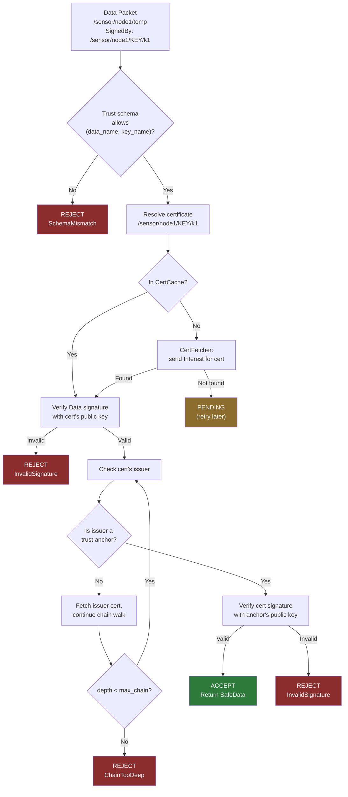

# Security Model

NDN security is fundamentally data-centric: every Data packet is signed by its producer, and the signature travels with the data regardless of how it was retrieved (from a cache, a neighbor, or the original producer). ndn-rs implements this model across the `ndn-security` crate with trait-based signing/verification, trust schemas, certificate chain validation, and a typestate pattern that makes it impossible to forward unverified data where verified data is required.

## Core Principles

1. **Every Data is signed** -- producers attach a signature (Ed25519 or HMAC-SHA256) covering the signed region (Name through SignatureInfo)
2. **Verification is receiver-side** -- consumers and forwarders validate signatures before accepting data
3. **Certificates are Data packets** -- key certificates are fetched via normal Interest/Data exchange, cached in the Content Store like any other data
4. **Trust schemas constrain relationships** -- name-based rules define which keys may sign which data

## Signer and Verifier Traits

Both traits use `BoxFuture` for dyn-compatibility, allowing them to be stored as `Arc<dyn Signer>` in the key store:

```rust
type BoxFuture<'a, T> = Pin<Box<dyn Future<Output = T> + Send + 'a>>;

pub trait Signer: Send + Sync + 'static {
    fn sig_type(&self) -> SignatureType;
    fn key_name(&self) -> &Name;
    fn cert_name(&self) -> Option<&Name> { None }
    fn public_key(&self) -> Option<Bytes> { None }

    fn sign<'a>(&'a self, region: &'a [u8])
        -> BoxFuture<'a, Result<Bytes, TrustError>>;

    /// CPU-only signers (Ed25519, HMAC) override this to
    /// avoid async overhead.
    fn sign_sync(&self, region: &[u8]) -> Result<Bytes, TrustError>;
}

pub trait Verifier: Send + Sync + 'static {
    fn verify<'a>(&'a self, region: &'a [u8], sig_value: &'a [u8],
                   public_key: &'a [u8])
        -> BoxFuture<'a, Result<VerifyOutcome, TrustError>>;
}
```

### Supported Algorithms

| Algorithm | Signer | Signature Size | Use Case |
|-----------|--------|---------------|----------|
| Ed25519 | `Ed25519Signer` | 64 bytes | Default for all Data packets |
| HMAC-SHA256 | `HmacSha256Signer` | 32 bytes | Pre-shared key authentication (~10x faster) |

Both signers implement `sign_sync` for CPU-only fast paths. The async `sign` method delegates to `sign_sync` wrapped in `Box::pin`.

## Trust Schemas

Trust schemas express name-based rules constraining which keys may sign which data. Rules use `NamePattern` with three component types:

```rust
pub enum PatternComponent {
    /// Must match this exact component.
    Literal(NameComponent),
    /// Binds one component to a named variable.
    Capture(Arc<str>),
    /// Binds one or more trailing components.
    MultiCapture(Arc<str>),
}
```

A `SchemaRule` pairs a data pattern with a key pattern. Captured variables must be consistent across both patterns:

```rust
// Rule: Data under /sensor/<node>/<type> must be signed
// by /sensor/<node>/KEY/<id>
SchemaRule {
    data_pattern: NamePattern(vec![
        Literal(comp("sensor")),
        Capture("node"),
        Capture("type"),
    ]),
    key_pattern: NamePattern(vec![
        Literal(comp("sensor")),
        Capture("node"),    // must match same value!
        Literal(comp("KEY")),
        Capture("id"),
    ]),
}
```

Built-in schemas:

- **`TrustSchema::new()`** -- empty, rejects everything (use for strict configurations)
- **`TrustSchema::accept_all()`** -- wildcard, accepts any signed packet
- **`TrustSchema::hierarchical()`** -- data and key must share the same first name component; actual hierarchy enforced by certificate chain walk

## Certificate Chain Validation

The `Validator` performs full certificate chain validation, walking from the Data packet up through intermediate certificates to a trust anchor:



The chain walk detects cycles (a certificate that directly or indirectly signs itself) and enforces a configurable maximum chain depth.

### ValidationResult

```rust
pub enum ValidationResult {
    /// Signature valid, chain terminates at a trust anchor.
    Valid(Box<SafeData>),
    /// Signature invalid or trust schema violated.
    Invalid(TrustError),
    /// Missing certificate -- needs fetching.
    Pending,
}
```

## SafeData Typestate

`SafeData` is a Data packet whose signature has been verified. It can only be constructed by:

1. `Validator::validate_chain()` -- full certificate chain validation
2. `SafeData::from_local_trusted()` -- local face trust (bypasses crypto)

The constructor is `pub(crate)`, preventing application code from creating a `SafeData` without going through validation. Application callbacks receive `SafeData`, not `Data` -- the compiler enforces that unverified data cannot be passed where verified data is required:

```rust
pub struct SafeData {
    pub(crate) inner: Data,
    pub(crate) trust_path: TrustPath,
    pub(crate) verified_at: u64,    // nanoseconds since epoch
}

pub enum TrustPath {
    /// Validated via full certificate chain.
    CertChain(Vec<Name>),
    /// Trusted because it arrived on a local face.
    LocalFace { uid: u32 },
}
```

## CertCache

Certificates are just Data packets with specific content (the subject's public key). The `CertCache` stores resolved `Certificate` structs, each containing:

- Certificate name and public key bytes
- Validity period (`valid_from` / `valid_until` in nanoseconds)
- Issuer name (for chain walking)
- Signed region and signature value (for verifying the cert itself)

When a certificate is not in the cache, the `CertFetcher` sends a normal Interest for the certificate name. The fetched Data is parsed, validated, and cached for future use.

## Local Trust for AppFace

Applications connected via shared memory (SHM) or Unix sockets are locally trusted based on process credentials. On Unix systems, `SO_PEERCRED` provides the connecting process's UID. Data from locally trusted faces skips cryptographic verification and receives a `TrustPath::LocalFace { uid }` path:

```rust
SafeData::from_local_trusted(data, uid)
```

This avoids the overhead of Ed25519 verification for in-process communication while preserving the typestate guarantee that all forwarded Data has been through a trust check.

## KeyChain Facade

The `KeyChain` type in `ndn-app` provides an ergonomic interface for application-level security:

```rust
let keychain = KeyChain::new();  // In-memory (ephemeral)
// Or: let keychain = KeyChain::open("/path/to/pib", &identity)?;

// Generate identity with Ed25519 key + self-signed certificate
let signer = keychain.create_identity("/ndn/app/sensor", None)?;

// Build a validator with the keychain's trust anchors
let validator = keychain.validator();
```

`KeyChain::open` loads keys from a persistent PIB (Public Information Base) directory backed by `FilePib`, enabling key reuse across application restarts.
