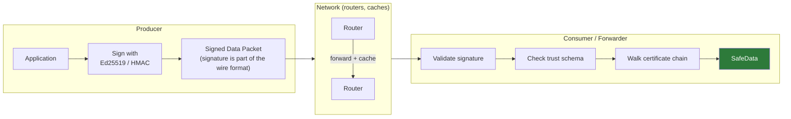
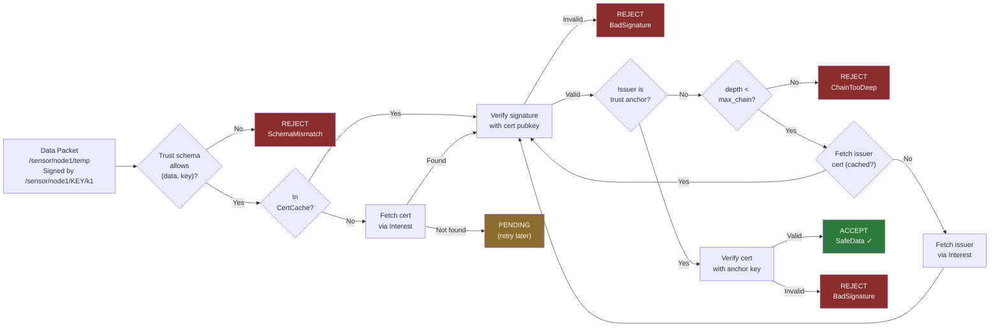

# Security Model

## The Problem: Bolted-On vs. Built-In Security

In IP networking, security is an afterthought. TLS secures the *channel* between two endpoints, but the data itself has no inherent protection. Once a TLS session terminates at a CDN or cache, the original security guarantee evaporates. You trust the server, not the data.

NDN flips this entirely. Every Data packet is signed at birth, and the signature travels with the data forever. A cached copy served by a router three hops away is exactly as trustworthy as one delivered directly by the producer -- the signature is over the content, not the channel. This is a profound architectural advantage, but it creates challenges that don't exist in IP security:

- **Key discovery is a networking problem.** A Data packet says "I was signed by key `/sensor/node1/KEY/k1`" -- but that key's certificate is itself an NDN Data packet that must be fetched over the network.
- **Trust is not transitive by default.** Just because a signature is cryptographically valid doesn't mean you should trust it. Which keys are authorized to sign which data? The answer requires *policy*, not just cryptography.
- **Verification has a cost.** Ed25519 verification is fast, but doing it for every packet on a high-throughput forwarder adds up. Local applications on the same machine shouldn't pay that cost.

ndn-rs addresses all three challenges through a layered design: trust schemas define policy, certificate chain validation handles key discovery, and the `SafeData` typestate makes the compiler enforce that unverified data never reaches code that expects verified data.



The signature is embedded in the packet's wire format. Routers can cache and forward the packet without breaking it. Any consumer, anywhere in the network, can independently verify the signature without contacting the original producer.

## The Journey of a Data Packet

To understand how these pieces fit together, follow a Data packet arriving at a forwarder that has validation enabled.

**A temperature reading arrives.** The packet's name is `/sensor/node1/temp/1712400000`, and its SignatureInfo field says it was signed by key `/sensor/node1/KEY/k1`. The raw bytes are sitting in a buffer. At this point, it's just a `Data` -- an unverified blob.

**First question: does the policy allow this?** Before touching any cryptography, the forwarder consults its trust schema. The schema has a rule saying data under `/sensor/<node>/<type>` must be signed by `/sensor/<node>/KEY/<id>`. The forwarder pattern-matches: `<node>` captures `node1` in both the data name and the key name. The captures are consistent, so the schema allows this combination. If the key name had been `/other-org/KEY/k1`, the schema would reject immediately -- no crypto needed.

**Next: find the certificate.** The key name `/sensor/node1/KEY/k1` points to a certificate, which in NDN is just another Data packet containing the signer's public key. The forwarder checks its `CertCache` first. On a cache hit, it already has the public key bytes and can proceed. On a miss, it sends a normal Interest for `/sensor/node1/KEY/k1` -- the certificate flows through the same Interest/Data machinery as any other content, and gets cached in the Content Store for future lookups.

**Verify the signature.** With the public key in hand, the forwarder runs Ed25519 verification over the packet's signed region (everything from the Name through the SignatureInfo). If the signature doesn't check out, the packet is rejected.

**But who signed the certificate?** The certificate for `/sensor/node1/KEY/k1` is itself a signed Data packet. Maybe it was signed by `/sensor/KEY/root`. The forwarder walks up the chain: fetch that certificate, verify its signature, check *its* issuer, and so on -- until it reaches a trust anchor (a self-signed certificate the forwarder was configured to trust at startup). If the chain exceeds a configurable maximum depth, or if a cycle is detected, validation fails.

**The packet becomes `SafeData`.** If the entire chain checks out, the `Data` is wrapped in a `SafeData` struct. From this point forward, the type system guarantees that this data has been verified. Code that expects `SafeData` literally cannot receive unverified data -- it won't compile.



The result of validation is one of three outcomes:

```rust
pub enum ValidationResult {
    /// Signature valid, chain terminates at a trust anchor.
    Valid(Box<SafeData>),
    /// Signature invalid or trust schema violated.
    Invalid(TrustError),
    /// Missing certificate -- needs fetching.
    Pending,
}
```

The `Pending` state is important: because certificates are fetched over the network, validation can be asynchronous. A forwarder may need to pause validation, send an Interest for a missing certificate, and resume when the certificate arrives.

## How Producers Sign Data

On the other side of the equation, a producer needs to create a cryptographic identity and attach signatures to outgoing Data packets.

`KeyChain` in `ndn-security` is the single entry point for NDN security in both applications and the forwarder:

```rust
use ndn_security::KeyChain;

// Ephemeral identity (tests, short-lived producers) — in-memory only
let keychain = KeyChain::ephemeral("/sensor/node1")?;
let signer = keychain.signer()?;

// Persistent identity — generates on first run, reloads on subsequent runs
let keychain = KeyChain::open_or_create(
    std::path::Path::new("/var/lib/ndn/sensor-id"),
    "/sensor/node1",
)?;
let signer = keychain.signer()?;
```

`ndn-app` re-exports `KeyChain` from `ndn-security`, so `use ndn_app::KeyChain` works too.

The `SignWith` extension trait provides a synchronous one-liner for signing a packet builder without spawning an async task — useful in closures and non-async contexts:

```rust
use ndn_security::SignWith;
use ndn_packet::encode::DataBuilder;

let wire = DataBuilder::new("/sensor/node1/temp".parse()?, b"23.5°C")
    .sign_with_sync(&*signer)?;  // returns Bytes directly
```

Under the hood, signing is handled by the `Signer` trait. Both traits in the security layer (`Signer` and `Verifier`) use `BoxFuture` for dyn-compatibility, so they can be stored as `Arc<dyn Signer>` in the key store and swapped at runtime:

```rust
pub trait Signer: Send + Sync + 'static {
    fn sig_type(&self) -> SignatureType;
    fn key_name(&self) -> &Name;
    fn cert_name(&self) -> Option<&Name> { None }
    fn public_key(&self) -> Option<Bytes> { None }

    fn sign<'a>(&'a self, region: &'a [u8])
        -> BoxFuture<'a, Result<Bytes, TrustError>>;

    /// CPU-only signers (Ed25519, HMAC) override this to
    /// avoid async overhead.
    fn sign_sync(&self, region: &[u8]) -> Result<Bytes, TrustError>;
}
```

ndn-rs ships two signer implementations:

| Algorithm | Signer | Signature Size | Use Case |
|-----------|--------|---------------|----------|
| Ed25519 | `Ed25519Signer` | 64 bytes | Default for all Data packets |
| HMAC-SHA256 | `HmacSh256Signer` | 32 bytes | Pre-shared key authentication (~10x faster) |

Both implement `sign_sync` for a CPU-only fast path -- no async state machine overhead when the operation is pure computation.

## Trust Schemas in Depth

Trust schemas are the *policy layer* that sits between raw cryptographic verification and actual trust. A valid signature from a stranger is meaningless; what matters is whether the signer was *authorized* to sign that particular data.

A schema is a collection of rules, each pairing a data name pattern with a key name pattern. Patterns use three component types:

```rust
pub enum PatternComponent {
    Literal(NameComponent),   // must match exactly
    Capture(Arc<str>),        // binds one component to a named variable
    MultiCapture(Arc<str>),   // binds one or more trailing components
}
```

The key insight is that **capture variables must be consistent across both patterns**. Consider a sensor network where temperature readings under `/sensor/<node>/temp` must be signed by that node's own key:

```rust
SchemaRule {
    data_pattern: NamePattern(vec![
        Literal(comp("sensor")),
        Capture("node"),
        Capture("type"),
    ]),
    key_pattern: NamePattern(vec![
        Literal(comp("sensor")),
        Capture("node"),    // must match the same value as above
        Literal(comp("KEY")),
        Capture("id"),
    ]),
}
```

When a Data packet named `/sensor/node1/temp` arrives signed by `/sensor/node1/KEY/k1`, the schema matches: `node` captures `node1` in both patterns. But if `node2` tried to sign data for `node1`, the captures would conflict and the schema would reject the packet before any cryptographic verification occurs.

This is a lightweight but powerful mechanism. A few well-chosen rules can express policies like:

- **Hierarchical trust**: data and key must share the same organizational prefix
- **Scope restriction**: a department key can only sign data within its department
- **Role-based signing**: only keys under `/admin/KEY/` can sign configuration updates

ndn-rs provides three built-in schemas for common cases:

- `TrustSchema::new()` -- empty, rejects everything (for strict configurations where you add rules explicitly)
- `TrustSchema::accept_all()` -- wildcard, accepts any signed packet (for testing or trusted environments)
- `TrustSchema::hierarchical()` -- data and key must share the same first name component; the actual hierarchy is enforced by the certificate chain walk

## The Local Trust Escape Hatch

Not every Data packet needs cryptographic verification. Applications running on the same machine as the forwarder -- connected via shared memory (SHM) or Unix sockets -- are already authenticated by the operating system.

On Unix systems, `SO_PEERCRED` on a Unix socket provides the connecting process's UID. If the forwarder trusts that UID, Data from that face skips the entire certificate chain walk:

```rust
SafeData::from_local_trusted(data, uid)
```

The resulting `SafeData` carries a `TrustPath::LocalFace { uid }` instead of `TrustPath::CertChain(...)`, recording *how* trust was established. This matters for two reasons:

1. **Performance.** Ed25519 verification, while fast, is not free. On a forwarder handling millions of local application packets per second, skipping crypto for trusted local faces is significant.
2. **Bootstrapping.** A newly started application doesn't have certificates yet. Local trust lets it communicate with the forwarder immediately, even before setting up its cryptographic identity.

The critical point is that the `SafeData` type is the same in both paths. Downstream code doesn't need to know (or care) whether trust was established cryptographically or locally -- it just receives a `SafeData` and knows the data has been through a trust check.

## SafeData: The Compiler as Security Auditor

All of the mechanisms above converge on a single type: `SafeData`. This is a Data packet whose signature has been verified -- either through the full certificate chain or via local trust.

```rust
pub struct SafeData {
    pub(crate) inner: Data,
    pub(crate) trust_path: TrustPath,
    pub(crate) verified_at: u64,    // nanoseconds since epoch
}

pub enum TrustPath {
    /// Validated via full certificate chain.
    CertChain(Vec<Name>),
    /// Trusted because it arrived on a local face.
    LocalFace { uid: u32 },
}
```

The `pub(crate)` fields are the key detail. Application code cannot construct a `SafeData` -- only `Validator::validate_chain()` and `SafeData::from_local_trusted()` (both inside the `ndn-security` crate) can create one. This is the typestate pattern: the type itself encodes a security invariant.

Any API that accepts `SafeData` instead of `Data` is making a compile-time assertion: "this function only operates on verified data." If a developer accidentally tries to pass an unverified `Data` packet to such a function, the code won't compile. There's no runtime check to forget, no boolean flag to misread, no error to swallow. The compiler is the security auditor, and it never takes a day off.

This is especially powerful in the forwarding pipeline. The Content Store insertion stage, for example, can require `SafeData` -- guaranteeing that the cache will never serve unverified content, even if a bug elsewhere in the pipeline skips validation. The guarantee is structural, not procedural.

## Identity and DID Integration

The security primitives described above — certificates, trust schemas, `SafeData` — are the foundation. But they answer *how* to verify data, not *who* to trust in the first place. Two higher-level layers sit above `ndn-security` to close that gap.

### From Certificate to DID Document

`ndn-security`'s `Certificate` type is an NDN Data packet containing a public key, an identity name, a validity period, and an issuer signature. This maps directly onto a W3C DID Document: the identity name becomes the DID URI, the public key becomes a `JsonWebKey2020` verification method, and the issuer signature establishes the chain of trust.

The `ndn-did` crate provides `cert_to_did_document` to perform this conversion explicitly, and `name_to_did` / `did_to_name` to translate between NDN name and DID URI forms. A `Certificate` issued by NDNCERT is simultaneously a valid DID Document with no additional encoding step. This means that any system in the W3C DID ecosystem — a DIF Universal Resolver driver, a Verifiable Credential verifier, a DIDComm messaging layer — can interoperate with NDN identities directly.

See [Identity and Decentralized Identifiers](./identity-and-did.md) for the full treatment: how `did:ndn` names are encoded, how resolution works over NDN transports, how to cross-anchor with `did:web` for web interoperability, and how `did:key` enables offline bootstrapping for factory-provisioned devices.

### NdnIdentity: Identity Lifecycle Above KeyChain

`ndn-security` provides the low-level building blocks (`KeyChain`, `Signer`, `Validator`, `CertCache`). `ndn-identity` wraps `KeyChain` in an `NdnIdentity` type that adds certificate lifecycle management on top.

`NdnIdentity` implements `Deref<Target = KeyChain>`, so every `KeyChain` method (`signer()`, `validator()`, `add_trust_anchor()`, `manager_arc()`) is available directly on `NdnIdentity` without any bridging:

```rust
let identity = NdnIdentity::open_or_create(path, "/sensor/node1").await?;

// These call KeyChain methods via Deref — no indirection required
let signer  = identity.signer()?;
let anchor  = Certificate::decode(anchor_bytes)?;
identity.add_trust_anchor(anchor);
let validator = identity.validator();
```

Beyond `KeyChain`, `NdnIdentity` adds:

- **Persistent storage** — keys and certificates survive reboots via `NdnIdentity::open_or_create`
- **Ephemeral identities** — `NdnIdentity::ephemeral` creates a throw-away in-memory identity for tests
- **Automated NDNCERT enrollment** — `NdnIdentity::provision` runs the full NDNCERT client exchange, handling token and possession challenges
- **Background renewal** — configurable `RenewalPolicy` automatically renews certificates before they expire
- **DID access** — `identity.did()` returns the `did:ndn` URI for the identity's name without any conversion boilerplate

For most applications, `NdnIdentity` is the only security API they need. Direct use of `Validator` or `CertCache` is reserved for advanced scenarios like custom trust schema configuration or building a CA. When framework code needs the underlying `Arc<SecurityManager>`, call `identity.manager_arc()`.

See [NDNCERT: Automated Certificate Issuance](./ndncert.md) for how certificate issuance works end-to-end, including the CA hierarchy, challenge types, and short-lived certificate renewal.
