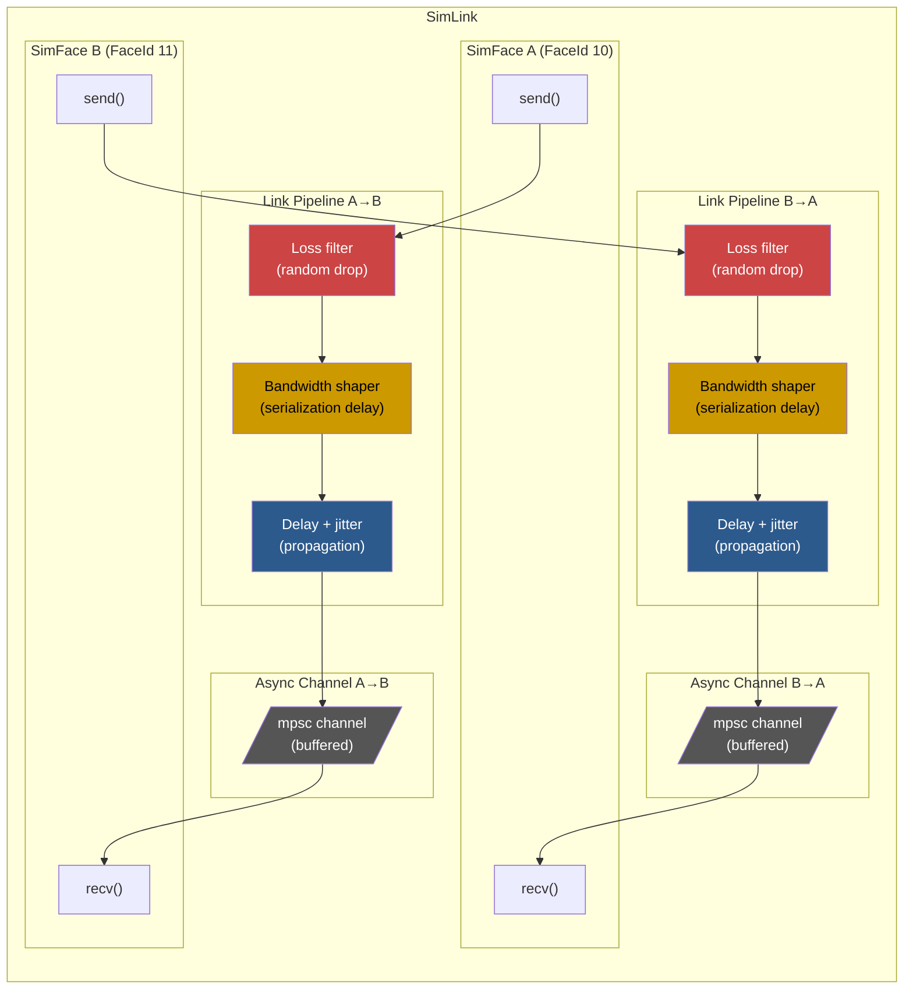
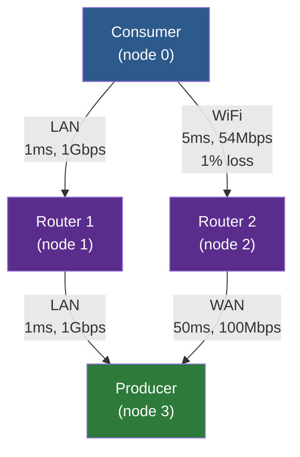

# Simulation

The `ndn-sim` crate provides an in-process simulation framework for testing NDN forwarding topologies without real networks. Simulations run on the Tokio runtime using channel-backed faces with configurable delay, loss, jitter, and bandwidth shaping.

## Core Components

### SimFace

`SimFace` implements the `Face` trait using Tokio MPSC channels. Each face is one endpoint of a `SimLink`. Packets sent through a `SimFace` are subject to the link's configured properties before arriving at the remote end:

```rust
impl Face for SimFace {
    fn id(&self) -> FaceId { self.id }
    fn kind(&self) -> FaceKind { FaceKind::Internal }

    async fn recv(&self) -> Result<Bytes, FaceError> {
        self.rx.lock().await.recv().await
            .ok_or(FaceError::Closed)
    }

    async fn send(&self, pkt: Bytes) -> Result<(), FaceError> {
        // Apply loss, bandwidth shaping, delay...
    }
}
```



The send path applies link properties in order:

1. **Loss** -- random roll against `loss_rate`; packet silently dropped if hit
2. **Bandwidth shaping** -- serialization delay computed from packet size and `bandwidth_bps`; a `next_tx_ready` cursor serializes transmissions to model link capacity
3. **Delay + jitter** -- base propagation delay plus uniform random jitter in `[0, max_jitter]`

When delay is non-zero, delivery is handled by a spawned background task so `send()` returns immediately (modeling store-and-forward behavior).

### SimLink

`SimLink` creates pairs of connected `SimFace`s:

```rust
// Symmetric link
let (face_a, face_b) = SimLink::pair(
    FaceId(10), FaceId(11),
    LinkConfig::wifi(),
    128,  // channel buffer size
);

// Asymmetric link (different properties per direction)
let (face_a, face_b) = SimLink::pair_asymmetric(
    FaceId(10), FaceId(11),
    config_a_to_b,
    config_b_to_a,
    128,
);
```

### LinkConfig Presets

| Preset | Delay | Jitter | Loss | Bandwidth |
|--------|-------|--------|------|-----------|
| `direct()` | 0 | 0 | 0% | Unlimited |
| `lan()` | 1 ms | 100 us | 0% | 1 Gbps |
| `wifi()` | 5 ms | 2 ms | 1% | 54 Mbps |
| `wan()` | 50 ms | 5 ms | 0.1% | 100 Mbps |
| `lossy_wireless()` | 10 ms | 5 ms | 5% | 11 Mbps |

Custom configurations are straightforward:

```rust
let satellite = LinkConfig {
    delay: Duration::from_millis(300),
    jitter: Duration::from_millis(20),
    loss_rate: 0.005,
    bandwidth_bps: 10_000_000,
};
```

## Topology Builder

The `Simulation` type provides a high-level API for constructing multi-node topologies:

```rust
let mut sim = Simulation::new();

// Add forwarding nodes
let producer = sim.add_node(EngineConfig::default());
let router   = sim.add_node(EngineConfig::default());
let consumer = sim.add_node(EngineConfig::default());

// Connect them
sim.link(consumer, router, LinkConfig::lan());
sim.link(router, producer, LinkConfig::wifi());

// Pre-install FIB routes
sim.add_route(consumer, "/ndn/data", router);
sim.add_route(router, "/ndn/data", producer);

// Start all engines
let mut running = sim.start().await?;
```

### Example Topologies

#### Linear Topology


#### Diamond Topology (4-node, multi-path)



This topology enables testing strategy selection between a fast reliable path (Consumer -> Router 1 -> Producer) and a slower/lossier path (Consumer -> Router 2 -> Producer). Strategies like `BestRoute` or `AsfStrategy` can probe both paths and adapt.

When `start()` is called, the builder:

1. Instantiates all `ForwarderEngine`s via `EngineBuilder`
2. Creates `SimLink` pairs and adds the faces to each engine
3. Installs FIB routes using the face map (translating `NodeId` pairs to `FaceId`s)
4. Returns a `RunningSimulation` handle

### RunningSimulation

The running simulation handle provides runtime access:

```rust
// Access individual engines
let engine = running.engine(router);

// Add routes at runtime
running.add_route(consumer, "/ndn/new-prefix", router)?;

// Get the face connecting two nodes
let face_id = running.face_between(consumer, router);

// Shut down all engines
running.shutdown().await;
```

## Event Tracing

`SimTracer` captures structured packet-level events during simulation runs for post-hoc analysis:

```rust
let tracer = SimTracer::new();

// Record events with automatic timestamping
tracer.record_now(
    0,                          // node index
    Some(1),                    // face id
    EventKind::InterestIn,      // event classification
    "/ndn/test/data",           // NDN name
    None,                       // optional detail
);

// After simulation: analyze
let all_events = tracer.events();
let node0_events = tracer.events_for_node(0);
let cache_hits = tracer.events_of_kind(&EventKind::CacheHit);

// Export to JSON
let json = tracer.to_json();
```

### Event Kinds

| Kind | Description |
|------|-------------|
| `InterestIn` / `InterestOut` | Interest received / forwarded |
| `DataIn` / `DataOut` | Data received / sent |
| `CacheHit` / `CacheInsert` | Content Store events |
| `PitInsert` / `PitSatisfy` / `PitExpire` | PIT lifecycle |
| `NackIn` / `NackOut` | Nack events |
| `FaceUp` / `FaceDown` | Face lifecycle |
| `StrategyDecision` | Strategy forwarding decision |
| `Custom(String)` | User-defined events |

The JSON output format:

```json
[
  {"t":1000,"node":0,"face":1,"kind":"interest-in","name":"/ndn/test/data"},
  {"t":1050,"node":0,"face":null,"kind":"cache-hit","name":"/ndn/test/data"},
  {"t":5200,"node":1,"face":2,"kind":"data-out","name":"/ndn/test/data","detail":"fresh"}
]
```

## Use Cases

### Testing Forwarding Strategies

Build a topology with multiple paths and verify that a custom strategy selects the optimal path under varying conditions:

```rust
let mut sim = Simulation::new();
let c = sim.add_node(EngineConfig::default());
let r1 = sim.add_node(EngineConfig::default());
let r2 = sim.add_node(EngineConfig::default());
let p = sim.add_node(EngineConfig::default());

// Two paths: fast but lossy vs. slow but reliable
sim.link(c, r1, LinkConfig { delay: Duration::from_millis(5), loss_rate: 0.1, ..Default::default() });
sim.link(c, r2, LinkConfig { delay: Duration::from_millis(20), loss_rate: 0.0, ..Default::default() });
sim.link(r1, p, LinkConfig::lan());
sim.link(r2, p, LinkConfig::lan());

sim.add_route(c, "/ndn/data", r1);
sim.add_route(c, "/ndn/data", r2);
// ... start, send Interests, measure satisfaction rate
```

### Evaluating Caching Policies

Deploy a tree topology and measure cache hit rates under different Content Store implementations (LRU vs. sharded vs. persistent):

```rust
// Configure each node with a different CS size
let config_small = EngineConfig { cs_capacity: 100, ..Default::default() };
let config_large = EngineConfig { cs_capacity: 10_000, ..Default::default() };
```

### Measuring Convergence

Test how quickly the discovery protocol establishes neighbor relationships and populates the FIB after network partitions and merges:

```rust
// Start with all nodes connected
let mut running = sim.start().await?;

// Simulate partition: remove the link face
// (cancel the face task to simulate link failure)

// Wait and measure: how long until discovery re-establishes routes?
```

### Bandwidth and Latency Profiling

Use asymmetric links to model real-world conditions (e.g., satellite uplink vs. downlink):

```rust
sim.link_asymmetric(ground, satellite,
    LinkConfig { delay: Duration::from_millis(300), bandwidth_bps: 1_000_000, ..Default::default() },
    LinkConfig { delay: Duration::from_millis(300), bandwidth_bps: 10_000_000, ..Default::default() },
);
```
