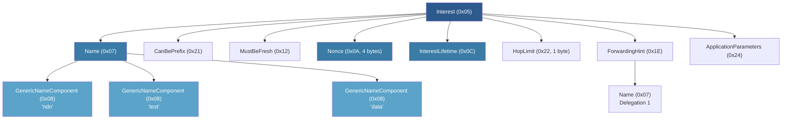

# NDN TLV Encoding

The `ndn-tlv` crate implements the NDN Type-Length-Value wire format that underpins every other crate in the ndn-rs workspace. All parsing is zero-copy over `bytes::Bytes` buffers, and the crate supports `no_std` environments (with an allocator).

## VarNumber Encoding

NDN uses a variable-width unsigned integer encoding called VarNumber for both the Type and Length fields. The encoding is minimal -- the smallest representation that fits the value must be used, and decoders reject non-minimal encodings.

| Value range         | Wire bytes | Format                           |
|---------------------|------------|----------------------------------|
| 0 -- 252            | 1          | Single byte                      |
| 253 -- 65535        | 3          | `0xFD` + 2-byte big-endian       |
| 65536 -- 2^32 - 1   | 5          | `0xFE` + 4-byte big-endian       |
| 2^32 -- 2^64 - 1    | 9          | `0xFF` + 8-byte big-endian       |

The three core functions in `ndn-tlv`:

```rust
/// Read a VarNumber, returning (value, bytes_consumed).
pub fn read_varu64(buf: &[u8]) -> Result<(u64, usize), TlvError>;

/// Write a VarNumber, returning bytes written.
pub fn write_varu64(buf: &mut [u8], value: u64) -> usize;

/// Compute encoded size without allocating.
pub fn varu64_size(value: u64) -> usize;
```

Non-minimal encodings are rejected with `TlvError::NonMinimalVarNumber`. For example, encoding the value 100 with the 3-byte form (`0xFD 0x00 0x64`) is invalid -- it must use the 1-byte form.

## TlvReader -- Zero-Copy Parsing

`TlvReader` wraps a `Bytes` buffer and yields sub-slices that share the same reference-counted allocation. No copies are made during parsing.

```rust
let raw: Bytes = receive_from_network();
let mut reader = TlvReader::new(raw);

// Read a complete TLV element: (type, value_bytes)
let (typ, value) = reader.read_tlv()?;

// value is a Bytes slice into the original allocation
// -- zero copy, reference counted

// Peek without advancing
let next_type = reader.peek_type()?;

// Scoped sub-reader for nested TLV parsing
let mut inner = reader.scoped(value.len())?;
```

Key methods:

- **`read_tlv()`** -- reads type + length + value, returns `(u64, Bytes)`
- **`peek_type()`** -- peeks at the next type without advancing
- **`scoped(len)`** -- returns a sub-reader bounded to `len` bytes, for parsing nested TLV structures
- **`skip_unknown(typ)`** -- skips non-critical TLV elements (even type numbers >= 32), rejects unknown critical types (odd, or <= 31)

The critical-bit rule from NDN Packet Format v0.3 section 1.3: types 0--31 are always critical (grandfathered). For types >= 32, odd numbers are critical and even are non-critical. `skip_unknown` enforces this automatically.

## TlvWriter -- Encoding

`TlvWriter` is backed by a growable `BytesMut` buffer and produces wire-format bytes:

```rust
let mut w = TlvWriter::new();

// Flat TLV element
w.write_tlv(0x08, b"component");

// Nested TLV -- closure writes inner content,
// write_nested wraps it with the correct outer type + length
w.write_nested(0x07, |inner| {
    inner.write_tlv(0x08, b"ndn");
    inner.write_tlv(0x08, b"test");
});

// Raw bytes (pre-encoded content, e.g. signed regions)
w.write_raw(&pre_encoded);

// Snapshot for signing: capture bytes from offset
let signed_region = w.snapshot(start_offset);

let wire_bytes: Bytes = w.finish();
```

`write_nested` writes inner content to a temporary writer first, then emits the outer type, minimal-length VarNumber, and inner bytes. This handles the chicken-and-egg problem of needing the inner length before writing the outer header.

## no_std Support

The `std` feature (enabled by default) provides `std` support in `bytes`. Disabling it (`default-features = false`) enables `#![no_std]` mode. An allocator is still required because `TlvWriter` uses `BytesMut`. This makes `ndn-tlv` suitable for embedded NDN nodes.

## Interest Wire Format

An NDN Interest packet is a nested TLV structure. The outer type `0x05` contains the Name, optional selectors, Nonce, and Lifetime:



In ndn-rs, the `Interest` struct uses `OnceLock<T>` for lazy decoding. The Name is always decoded eagerly (every pipeline stage needs it), but fields like Nonce, Lifetime, and ApplicationParameters are decoded on first access. This means a Content Store hit can short-circuit before paying the cost of decoding the Nonce or signature fields.

## Data Wire Format

A Data packet (type `0x06`) contains the Name, MetaInfo, Content, SignatureInfo, and SignatureValue. The signed region spans from Name through SignatureInfo (inclusive), and the SignatureValue covers that region:

```text
Data (0x06)
+-- Name (0x07)
|   +-- NameComponent (0x08) ...
+-- MetaInfo (0x14)
|   +-- ContentType (0x18)
|   +-- FreshnessPeriod (0x19)
+-- Content (0x15)
|   +-- <application payload>
+-- SignatureInfo (0x16)        --|
|   +-- SignatureType (0x1B)      |  signed region
|   +-- KeyLocator (0x1C)         |
+-- SignatureValue (0x17)       --|  covers above
```

## COBS Framing for Serial Faces

Serial links (UART, RS-485) cannot use NDN's native TLV length-prefix framing because byte-level errors can desynchronize the parser. Instead, `SerialFace` uses Consistent Overhead Byte Stuffing (COBS) to provide unambiguous frame boundaries:

1. Each NDN TLV packet is COBS-encoded, replacing all `0x00` bytes with a run-length scheme.
2. A `0x00` sentinel byte marks the end of each frame.
3. The receiver accumulates bytes until it sees `0x00`, COBS-decodes the frame, and passes the resulting TLV bytes to `TlvCodec` for normal NDN parsing.

The overhead is at most 1 byte per 254 bytes of payload -- negligible for typical NDN packets.

## TlvCodec for Stream Transports

`TlvCodec` implements the `tokio_util::codec::Decoder` and `Encoder` traits for NDN TLV framing over byte streams (TCP, Unix sockets). It reassembles frames from the byte stream by peeking at the type and length VarNumbers, then waiting for the full value to arrive:

```rust
// Used internally by TcpFace and other stream-based faces
let framed = Framed::new(tcp_stream, TlvCodec);

// Decoder yields complete Bytes frames (one NDN packet each)
while let Some(frame) = framed.next().await {
    let pkt: Bytes = frame?;
    // pkt is a complete TLV element: type + length + value
}
```

The decoder pre-allocates buffer space based on the declared length, avoiding repeated reallocations for large packets.
