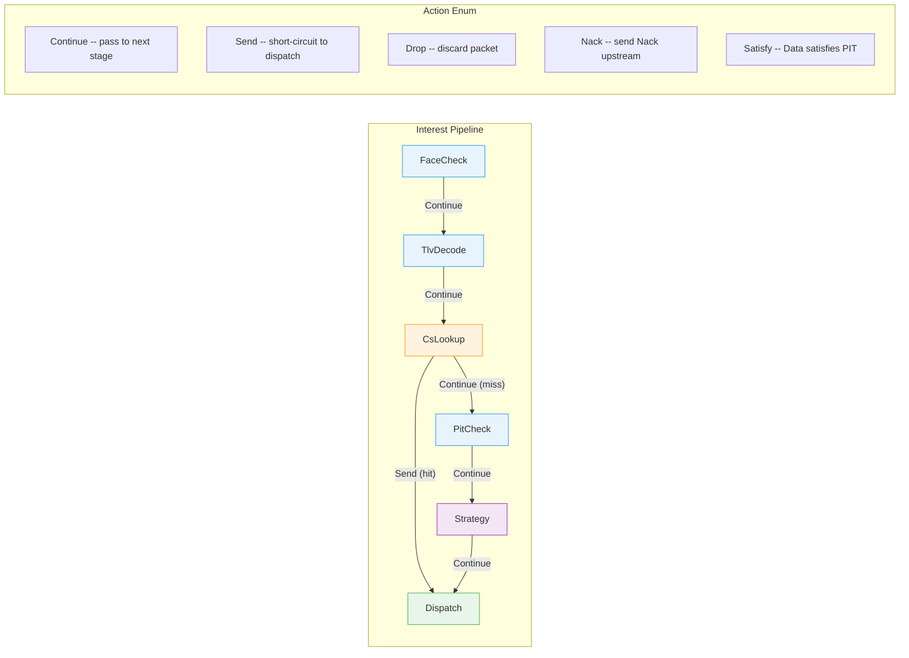
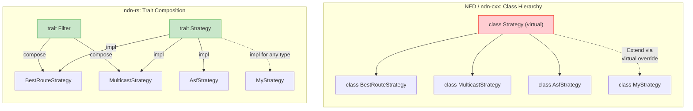
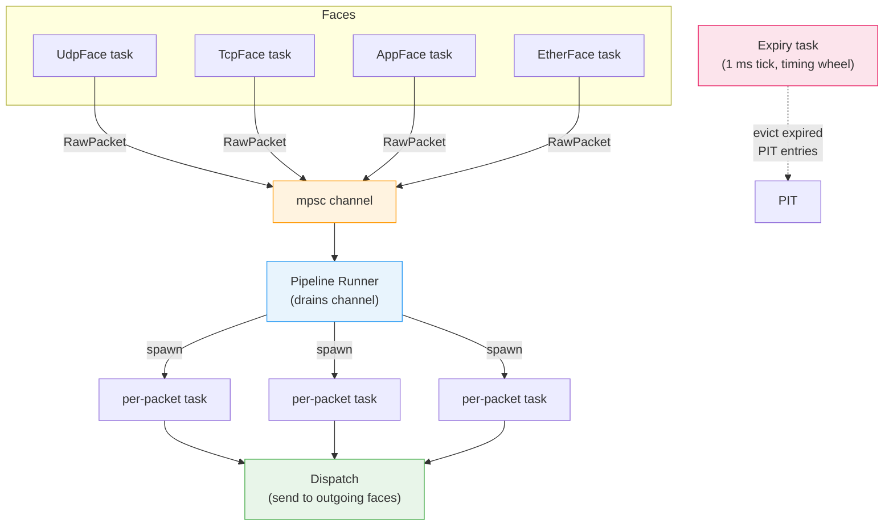

# Design Philosophy

## NDN as Composable Data Pipelines

The central insight behind ndn-rs: Rust's ownership model and trait system map naturally onto NDN's packet processing as **composable data pipelines with trait-based polymorphism**. This stands in deliberate contrast to the class hierarchies used by NFD/ndn-cxx (C++) and the convention-based approach of ndnd (Go).

In ndn-rs, a packet enters the system as a `Bytes` buffer from a face, flows through a sequence of `PipelineStage` trait objects by value, and exits as a `Bytes` buffer sent to one or more faces. Each stage receives ownership of the `PacketContext`, processes it, and either passes it forward or consumes it (short-circuiting). The compiler enforces that no stage can accidentally use a packet after handing it off -- a guarantee that NFD achieves only through runtime checks and careful documentation.

Each stage receives `PacketContext` **by value** and returns an `Action` enum. The dispatcher inspects the action and either passes `PacketContext` to the next stage or terminates the pipeline.

## Library, Not Daemon

ndn-rs is a library. There is no daemon/client split. The forwarding engine (`ndn-engine`) is a Rust library that any application can embed directly. The standalone router (`ndn-router`) is just one binary that links against this library; applications can equally embed the engine in-process and get a thin `AppFace` backed by a shared memory ring buffer.

This means the same codebase runs as a full router, an embedded forwarder on a microcontroller (via `ndn-embedded` with `no_std`), or an in-process forwarder inside an application. No rewrite required.

## Key Design Decisions

| Decision | What | Why |
|---|---|---|
| **Packet ownership by value** | `PacketContext` is passed by value through `PipelineStage::process(ctx)` | Ownership transfer makes short-circuits and hand-offs compiler-enforced. A stage that drops the context ends the pipeline -- no dangling references, no use-after-free. |
| **`Arc<Name>` sharing** | Names are wrapped in `Arc<Name>` and shared across PIT, FIB, pipeline | NDN names appear in many places simultaneously (PIT entries, FIB lookups, CS keys, strategy context). Arc avoids copying multi-component names while keeping them immutable and thread-safe. |
| **`DashMap` PIT** | `DashMap<PitToken, PitEntry>` for the Pending Interest Table | The PIT is the hottest data structure in the forwarder. DashMap provides sharded concurrent access without a global lock, enabling parallel Interest/Data processing across cores. |
| **`NameTrie` FIB** | `HashMap<Component, Arc<RwLock<TrieNode>>>` per level | Concurrent longest-prefix match without holding parent locks. Each trie level is independently locked, so a lookup on `/a/b/c` does not block a concurrent lookup on `/x/y`. |
| **Wire-format `Bytes` in CS** | Content Store stores the original wire-format `Bytes` | A cache hit sends the stored bytes directly to the outgoing face with zero re-encoding. `Bytes` is reference-counted, so multiple cache hits share the same allocation. |
| **`SmallVec<[ForwardingAction; 2]>`** | Strategy returns a small-vec of forwarding actions | Most strategies produce 1-2 actions (forward + optional probe). SmallVec keeps them on the stack, avoiding a heap allocation on every Interest. |
| **`SafeData` typestate** | Separate `Data` and `SafeData` types | The compiler enforces that only cryptographically verified data is inserted into the Content Store or forwarded. You cannot accidentally cache unverified data -- it is a type error. |
| **`u64` nanosecond timestamps** | `arrival`, `last_updated`, and all timing fields use `u64` ns since Unix epoch | Nanosecond resolution is needed for EWMA RTT measurements and sub-millisecond PIT expiry. A single `u64` avoids the overhead and platform variance of `Instant` or `SystemTime` in hot paths. |
| **`OnceLock` lazy decode** | Packet fields decoded on demand via `OnceLock<T>` | A Content Store hit may short-circuit before the nonce or lifetime fields are ever accessed. Lazy decode avoids wasted work on the fast path. |
| **`SmallVec<[NameComponent; 8]>` for names** | Name components stored in a `SmallVec` | Typical NDN names have 4-8 components. SmallVec keeps them on the stack, eliminating a heap allocation for the common case. |

## Trait-Based Polymorphism

Every extension point in ndn-rs is a trait:

- **`Face`** -- async send/recv over any transport (UDP, TCP, Ethernet, serial, shared memory, Bluetooth, Wifibroadcast)
- **`PipelineStage`** -- a single processing step that takes a `PacketContext` by value and returns an `Action`
- **`Strategy`** -- a forwarding decision function that reads `StrategyContext` and returns `ForwardingAction` values
- **`ContentStore`** -- pluggable cache backend (`LruCs`, `ShardedCs`, `FjallCs`)
- **`Signer` / `Verifier`** -- cryptographic operations decoupled from packet types
- **`DiscoveryProtocol`** -- neighbor and service discovery (SWIM, mDNS, etc.)

This trait-based approach means new transports, strategies, and cache backends can be added without modifying the core pipeline. The built-in pipeline is monomorphised at compile time for zero-cost dispatch; only plugin stages use dynamic dispatch via `ErasedPipelineStage`.

## Concurrency Model

ndn-rs is built on Tokio. Each face runs its own async task, pushing `RawPacket` values into a shared `mpsc` channel. A single pipeline runner drains the channel and processes packets inline through the stage sequence. A separate expiry task drains expired PIT entries on a 1 ms tick using a hierarchical timing wheel.

Tracing uses the `tracing` crate with structured spans per packet. The library never initializes a tracing subscriber -- that is the binary's responsibility, following the principle that libraries should not make policy decisions about logging output.
