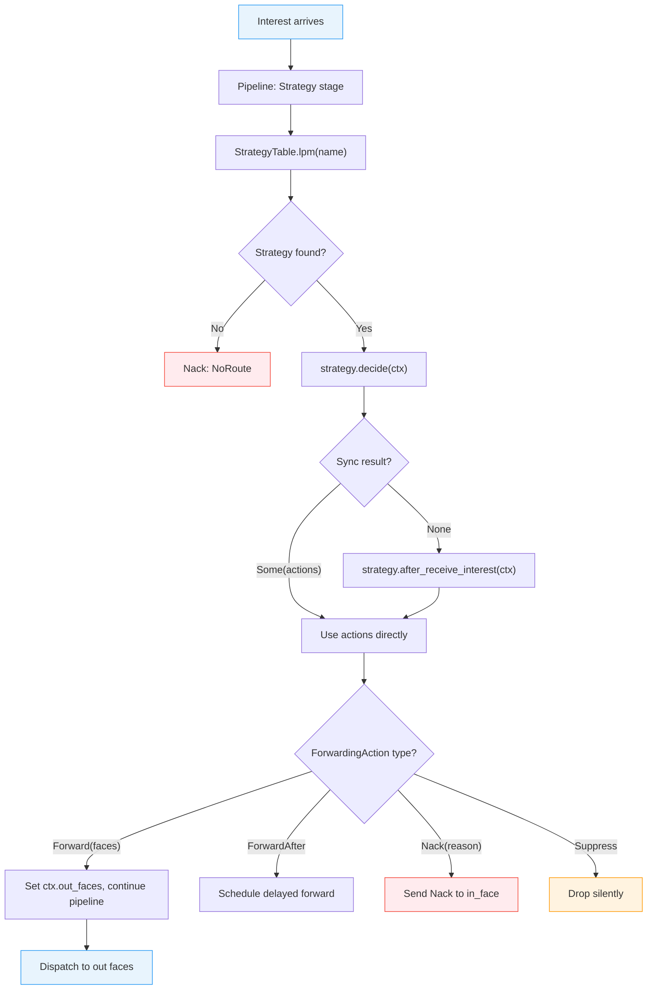

# Strategy Composition

The strategy system is how ndn-rs decides where to forward each Interest. Unlike NFD's class hierarchy, ndn-rs strategies are composable trait objects that can be swapped at runtime -- including hot-loading WASM modules without restarting the router.

## The Strategy Trait

Every strategy implements the `Strategy` trait:

```rust
pub trait Strategy: Send + Sync + 'static {
    /// Canonical name identifying this strategy (e.g., /localhost/nfd/strategy/best-route).
    fn name(&self) -> &Name;

    /// Synchronous fast path. Returns Some(actions) if the decision can be made
    /// without async work, avoiding the Box::pin heap allocation. Returns None
    /// to fall through to the async path.
    fn decide(&self, ctx: &StrategyContext) -> Option<SmallVec<[ForwardingAction; 2]>>;

    /// Called when an Interest arrives and needs a forwarding decision.
    async fn after_receive_interest(&self, ctx: &StrategyContext) -> SmallVec<[ForwardingAction; 2]>;

    /// Called when Data arrives.
    async fn after_receive_data(&self, ctx: &StrategyContext) -> SmallVec<[ForwardingAction; 2]>;

    /// Called when a PIT entry times out. Default: suppress.
    async fn on_interest_timeout(&self, ctx: &StrategyContext) -> ForwardingAction;

    /// Called when a Nack arrives. Default: suppress.
    async fn on_nack(&self, ctx: &StrategyContext, reason: NackReason) -> ForwardingAction;
}
```

Key design points:

- **Pure decision function.** A strategy reads state through `StrategyContext` but cannot modify forwarding tables directly. It returns `ForwardingAction` values and the pipeline runner acts on them. This prevents strategies from introducing subtle side effects.
- **Sync fast path.** The `decide()` method allows synchronous strategies (like BestRoute) to skip the async machinery entirely, avoiding a `Box::pin` allocation on every Interest.
- **`SmallVec<[ForwardingAction; 2]>`** return type. Most strategies produce 1-2 actions (forward to best face, optionally probe an alternative). SmallVec keeps these on the stack.

## StrategyContext

Strategies receive an immutable view of the engine state:

```rust
pub struct StrategyContext<'a> {
    /// The name being forwarded.
    pub name: &'a Arc<Name>,
    /// The face the Interest arrived on.
    pub in_face: FaceId,
    /// FIB entry for the longest matching prefix.
    pub fib_entry: Option<&'a FibEntry>,
    /// PIT token for the current Interest.
    pub pit_token: Option<PitToken>,
    /// Read-only access to EWMA measurements per (prefix, face).
    pub measurements: &'a MeasurementsTable,
    /// Cross-layer enrichment data (radio metrics, flow stats, etc.).
    pub extensions: &'a AnyMap,
}
```

The context is a borrow, not an owned value -- strategies cannot accidentally hold onto engine state beyond the forwarding decision. The `extensions` field provides an escape hatch for cross-layer data (e.g., wireless channel quality from `ndn-research`) without polluting the core context type.

## ForwardingAction

The strategy's output is one or more `ForwardingAction` values:

```rust
pub enum ForwardingAction {
    /// Forward to these faces immediately.
    Forward(SmallVec<[FaceId; 4]>),
    /// Forward after a delay (enables probe-and-fallback patterns).
    ForwardAfter { faces: SmallVec<[FaceId; 4]>, delay: Duration },
    /// Send a Nack back to the incoming face.
    Nack(NackReason),
    /// Suppress -- do not forward (loop detected or policy decision).
    Suppress,
}
```

`ForwardAfter` is particularly important: it enables strategies like ASF (Adaptive Smoothed RTT-based Forwarding) to send a probe on an alternative face after a short delay, falling back only if the primary face does not respond in time.

## Strategy Table

The `StrategyTable` is a `NameTrie` that maps name prefixes to `Arc<dyn Strategy>`:

```rust
pub struct StrategyTable<S: Send + Sync + 'static + ?Sized>(NameTrie<Arc<S>>);
```

When an Interest arrives, the pipeline performs a longest-prefix match on the strategy table to find the strategy responsible for that name. This runs in parallel with the FIB lookup (which finds the nexthops) -- the strategy table determines *how* to choose among nexthops, while the FIB determines *which* nexthops exist.

Operations:

- **`lpm(name)`** -- longest-prefix match, returns the strategy for the deepest matching prefix.
- **`insert(prefix, strategy)`** -- register or replace a strategy at a prefix. This is how hot-swap works: insert a new `Arc<dyn Strategy>` and all subsequent Interests under that prefix use the new strategy immediately.
- **`remove(prefix)`** -- remove a strategy, causing Interests to fall back to a shorter prefix match (ultimately the root, where the default strategy lives).

## Measurements Table

Strategies make informed decisions using the `MeasurementsTable`, a concurrent (`DashMap`-backed) table of per-prefix, per-face statistics:

```rust
pub struct MeasurementsTable {
    entries: DashMap<Arc<Name>, MeasurementsEntry>,
}

pub struct MeasurementsEntry {
    /// Per-face EWMA RTT measurements.
    pub rtt_per_face: HashMap<FaceId, EwmaRtt>,
    /// EWMA satisfaction rate (0.0 to 1.0).
    pub satisfaction_rate: f32,
    /// Last update timestamp (ns since Unix epoch).
    pub last_updated: u64,
}
```

The `MeasurementsUpdateStage` in the Data pipeline updates these measurements on every satisfied Interest. RTT is computed as the difference between the Data arrival time and the PIT entry creation time, smoothed with EWMA (alpha = 0.125, matching TCP's RTT estimation). Satisfaction rate tracks the fraction of Interests that receive Data vs. timing out.

## Built-In Strategies

**BestRouteStrategy.** The default strategy. For each Interest, it selects the FIB nexthop with the lowest cost, excluding the incoming face (split-horizon). If measurements are available, it prefers the face with the lowest smoothed RTT among nexthops with equal cost. Simple, fast, and synchronous (uses the `decide()` fast path).

**MulticastStrategy.** Forwards every Interest to all FIB nexthops except the incoming face. Used for prefix discovery, sync protocols, and scenarios where redundant forwarding improves reliability (e.g., wireless networks with lossy links).

## Strategy Filters

Strategies can be wrapped with `StrategyFilter` to modify their behaviour without subclassing:

```rust
pub trait StrategyFilter: Send + Sync + 'static {
    fn name(&self) -> &str;
    fn filter(&self, actions: SmallVec<[ForwardingAction; 2]>, ctx: &StrategyContext)
        -> SmallVec<[ForwardingAction; 2]>;
}
```

A filter receives the actions produced by the inner strategy and can transform, prune, or augment them. For example, a rate-limiting filter could replace `Forward` with `Suppress` if the face is congested, without the inner strategy needing to know about congestion control.

## WASM Strategies

The `ndn-strategy-wasm` crate enables loading forwarding strategies as WebAssembly modules at runtime:

1. A WASM module exports functions matching the strategy interface (receive Interest, receive Data, timeout, nack).
2. The router loads the WASM binary and wraps it in an `Arc<dyn Strategy>`.
3. The wrapped strategy is inserted into the `StrategyTable` at the desired prefix.
4. All subsequent Interests under that prefix are forwarded by the WASM strategy.
5. To update: load a new WASM module and `insert()` it at the same prefix. The `Arc` swap is atomic -- in-flight packets continue with the old strategy; new packets pick up the new one.

This enables deploying experimental forwarding logic to production routers without recompilation, restart, or downtime.

## Decision Flow



The sync fast path (`decide()`) is critical for performance: BestRouteStrategy, the most common strategy, always returns `Some(actions)` from `decide()`, meaning the async runtime is never involved in the forwarding decision for the common case.
