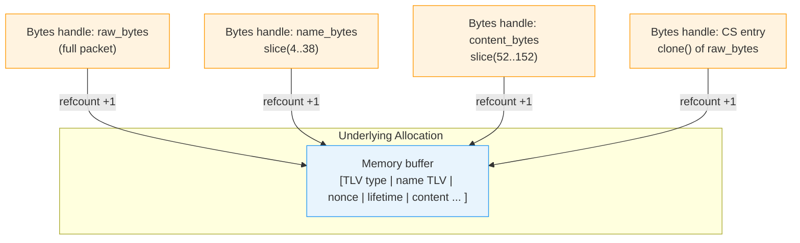
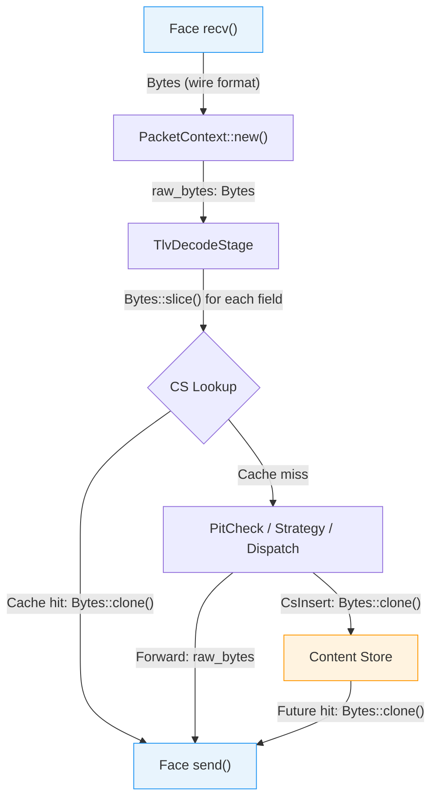
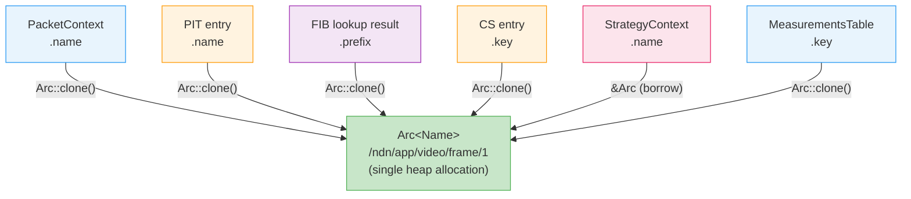
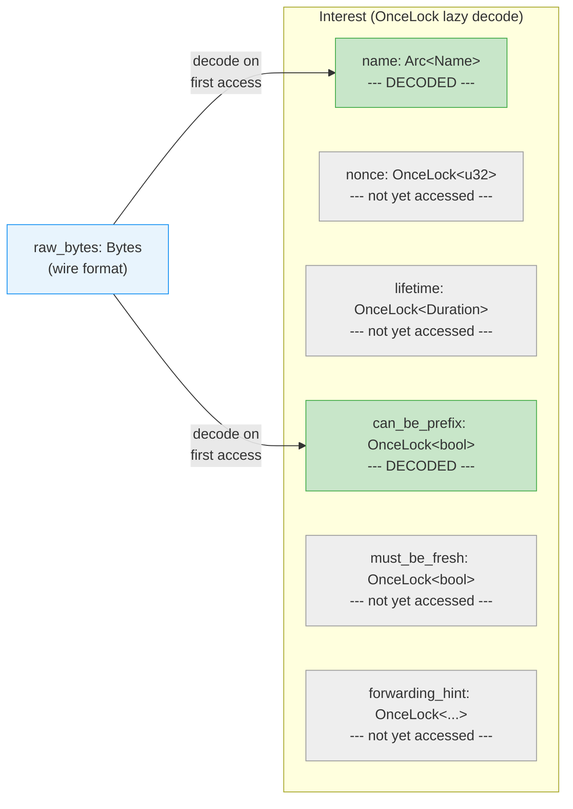

# Zero-Copy Pipeline

ndn-rs is designed so that a packet can travel from ingress face to egress face without a single data copy in the common case. This page explains the mechanisms that make this possible.

## The Core Idea

When a face receives a packet from the network, it arrives as a `bytes::Bytes` buffer. That same buffer -- the exact same allocation -- can be sent out on another face without ever being copied. The Content Store can hold onto it for days and serve it to thousands of consumers, all sharing the same underlying memory.

This is possible because `Bytes` is a reference-counted, immutable byte buffer. `Bytes::clone()` increments an atomic counter and returns a new handle to the same data. `Bytes::slice(start..end)` creates a sub-view into the same allocation. Neither operation copies any packet data.



Each `Bytes` handle (whether a full clone or a sub-slice) points into the same allocation. The buffer is freed only when the last handle is dropped.

## Bytes Through the Pipeline



At every arrow in this diagram, the data does not move. Only a reference-counted handle is passed, cloned, or sliced.

## PacketContext Carries Wire Bytes

Every packet entering the pipeline is wrapped in a `PacketContext`:

```rust
pub struct PacketContext {
    /// Wire-format bytes of the original packet.
    pub raw_bytes: Bytes,
    /// Face the packet arrived on.
    pub face_id: FaceId,
    /// Decoded name -- hoisted because every stage needs it.
    pub name: Option<Arc<Name>>,
    /// Decoded packet -- starts as Raw, transitions after TlvDecodeStage.
    pub packet: DecodedPacket,
    // ... other fields
}
```

The `raw_bytes` field holds the original wire-format buffer for the packet's entire lifetime in the pipeline. When a stage needs to send the packet, it uses `raw_bytes` directly -- no re-encoding.

## TlvReader: Zero-Copy Parsing

The `TlvReader` in `ndn-tlv` parses TLV-encoded packets without copying any data. It works by slicing into the source `Bytes`:

```rust
// TlvReader holds a Bytes and a cursor position.
// Reading a TLV value returns a Bytes::slice() -- same allocation, no copy.
let value: Bytes = reader.read_value(length)?;  // Bytes::slice(), not memcpy
```

When `TlvDecodeStage` runs, it parses the packet's type, name, and other fields by slicing into `raw_bytes`. The resulting `Interest` or `Data` struct contains `Bytes` handles pointing into the original buffer. The original buffer stays alive because `Bytes` is reference-counted -- as long as any slice exists, the underlying allocation persists.

## Content Store: Wire-Format Storage

The Content Store stores the wire-format `Bytes` directly, not a decoded `Data` struct:

```
CsInsert: store raw_bytes.clone() keyed by name
CsLookup: if hit, return stored Bytes -- this IS the wire packet, ready to send
```

This design means a cache hit is nearly free:

1. Look up the name in the CS (hash map lookup).
2. Clone the stored `Bytes` (atomic reference count increment).
3. Send the cloned `Bytes` to the outgoing face.

There is no re-encoding, no field patching, no serialization. The exact bytes that were received from the network are the exact bytes sent to the consumer. This is the fastest possible cache hit.

## Arc\<Name\>: Shared Name References

Names are the most frequently shared data in an NDN forwarder. A single name may appear simultaneously in:

- The `PacketContext` flowing through the pipeline
- A PIT entry waiting for Data
- A FIB entry for route lookup
- A CS entry for cache lookup
- A `StrategyContext` for the forwarding decision
- A `MeasurementsTable` entry for RTT tracking

Copying a name with 6 components means copying 6 `NameComponent` values (each containing a `Bytes` slice and a TLV type). `Arc<Name>` eliminates all of these copies: cloning the `Arc` is a single atomic increment, and all holders share the same `Name` allocation.



```rust
// In PacketContext:
pub name: Option<Arc<Name>>,

// In StrategyContext:
pub name: &'a Arc<Name>,

// In PIT entry, CS key, measurements key: Arc<Name>
```

## OnceLock: Lazy Decode

Not all packet fields are needed on every code path. A Content Store hit, for example, may never need the Interest's nonce or lifetime -- only the name matters for the lookup. Fields that are expensive to decode or rarely needed are wrapped in `OnceLock<T>`:

```rust
// Conceptual: field is decoded on first access, never before
let nonce: &u32 = interest.nonce(); // decodes from raw_bytes on first call, cached thereafter
```



This means the pipeline pays only for what it uses. On the fast path (CS hit), the decode cost is minimal: parse the type byte, extract the name (a `Bytes::slice()`), look up the CS, and send.

## Where Copies Do Happen

Zero-copy is not absolute. Copies occur in specific, deliberate places:

- **NDNLPv2 fragmentation**: If a packet must be fragmented for a face with a small MTU, each fragment is a new allocation containing a header plus a slice of the original.
- **Signature computation**: Computing a signature requires reading the signed portion of the packet, which may involve a copy into the signing buffer depending on the crypto library.
- **Logging/tracing**: Debug-level logging that formats packet contents creates string copies, but this is behind a log-level gate and never runs in production hot paths.
- **Cross-face-type adaptation**: When a packet moves between face types with different framing (e.g., UDP to Ethernet), the link-layer header is different. The NDN packet bytes themselves are not copied, but a new buffer may be allocated for the new framing around them.

The important invariant: **the NDN packet data itself is never copied on the forwarding fast path.** Framing and metadata may be allocated, but the TLV content -- which is the bulk of the bytes -- flows through untouched.
