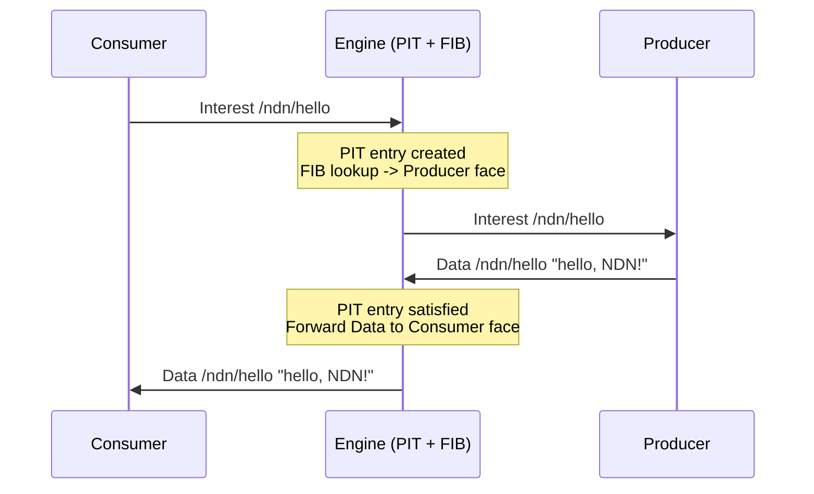

# Hello World

This tutorial shows how to run a complete Interest/Data exchange using the ndn-rs library in a single Rust program. No external router is needed -- everything runs in-process via `AppFace` channel pairs.

## How it works

In NDN, communication follows a pull-based model: a **consumer** sends an Interest packet naming the data it wants, and a **producer** responds with a matching Data packet. The forwarding engine sits between them, matching Interests to Data via the PIT (Pending Interest Table) and FIB (Forwarding Information Base).



## Dependencies

Add these to your `Cargo.toml`:

```toml
[dependencies]
ndn-app        = { path = "crates/ndn-app" }
ndn-engine     = { path = "crates/ndn-engine" }
ndn-face-local = { path = "crates/ndn-face-local" }
ndn-packet     = { path = "crates/ndn-packet", features = ["std"] }
ndn-transport  = { path = "crates/ndn-transport" }
tokio          = { version = "1", features = ["rt-multi-thread", "macros"] }
```

If you are working within the ndn-rs workspace, use `workspace = true` instead of path dependencies.

## Full example

```rust
use ndn_app::{Consumer, EngineBuilder, Producer};
use ndn_engine::EngineConfig;
use ndn_face_local::AppFace;
use ndn_packet::Name;
use ndn_packet::encode::DataBuilder;
use ndn_transport::FaceId;

#[tokio::main]
async fn main() -> anyhow::Result<()> {
    // 1. Create in-process face pairs.
    //    Each AppFace::new() returns a face (for the engine) and a handle
    //    (for the application).  They are connected by an mpsc channel.
    let (consumer_face, consumer_handle) = AppFace::new(FaceId(1), 64);
    let (producer_face, producer_handle) = AppFace::new(FaceId(2), 64);

    // 2. Build the forwarding engine with both faces.
    let (engine, shutdown) = EngineBuilder::new(EngineConfig::default())
        .face(consumer_face)
        .face(producer_face)
        .build()
        .await?;

    // 3. Install a FIB route: Interests for /ndn/hello -> producer face.
    let prefix: Name = "/ndn/hello".parse()?;
    engine.fib().add_nexthop(&prefix, FaceId(2), 0);

    // 4. Create Consumer and Producer from their handles.
    let mut consumer = Consumer::from_handle(consumer_handle);
    let mut producer = Producer::from_handle(producer_handle, prefix.clone());

    // 5. Spawn the producer in a background task.
    //    It loops, waiting for Interests and replying with Data.
    let producer_task = tokio::spawn(async move {
        producer
            .serve(|interest| {
                let name = (*interest.name).clone();
                async move {
                    let wire = DataBuilder::new(name, b"hello, NDN!").build();
                    Some(wire)
                }
            })
            .await
    });

    // 6. Consumer sends an Interest and waits for the Data reply.
    let data = consumer.fetch(prefix.clone()).await?;

    println!("Received Data: {}", data.name);
    println!("Content: {:?}", std::str::from_utf8(
        data.content().unwrap().as_ref()
    ));

    // 7. Clean shutdown: drop consumer/engine, then await the shutdown handle.
    drop(consumer);
    drop(engine);
    shutdown.shutdown().await;
    let _ = producer_task.await;

    Ok(())
}
```

## Step-by-step walkthrough

### 1. Create AppFace pairs

`AppFace::new(face_id, capacity)` creates a face for the engine side and a handle for the application side, connected by a bounded channel. The `capacity` parameter controls backpressure -- 64 is a good default.

### 2. Build the engine

`EngineBuilder` wires the PIT, FIB, content store, pipeline stages, and strategy table. Calling `.face(f)` registers a face with the engine. `.build().await` returns the running `ForwarderEngine` and a `ShutdownHandle`.

### 3. Add a FIB route

The FIB maps name prefixes to outgoing faces. `add_nexthop(&prefix, face_id, cost)` tells the engine: "forward Interests matching this prefix to this face." Cost is used when multiple nexthops exist (lower wins).

### 4. Consumer and Producer

- `Consumer::from_handle(handle)` wraps the application-side handle with methods like `fetch()` and `get()`.
- `Producer::from_handle(handle, prefix)` wraps the handle with a `serve()` loop that dispatches incoming Interests to a callback.

### 5. The exchange

When `consumer.fetch(name)` is called, it builds an Interest packet, sends it through the AppFace channel into the engine, which looks up the FIB, finds the producer face, and forwards the Interest. The producer's `serve()` callback receives it, builds a Data packet, and sends it back through the engine to the consumer.

## Connecting to an external router

If you have a running `ndn-router` instead of an embedded engine, applications connect via the router's face socket:

```rust
use ndn_app::Consumer;

#[tokio::main]
async fn main() -> anyhow::Result<()> {
    // Connect to the router's management socket.
    let mut consumer = Consumer::connect("/tmp/ndn-faces.sock").await?;
    let data = consumer.fetch("/ndn/hello").await?;
    println!("Got: {:?}", data.content());
    Ok(())
}
```

This uses a Unix socket (with optional SHM data plane) instead of in-process channels, but the `Consumer` API is identical.

## Next steps

- [Running the Router](./running-router.md) -- deploy `ndn-router` as a standalone forwarder
- [PIT, FIB, and Content Store](../concepts/pit-fib-cs.md) -- understand the data structures behind the exchange
- [Pipeline Walkthrough](../deep-dive/pipeline-walkthrough.md) -- trace a packet through every pipeline stage
