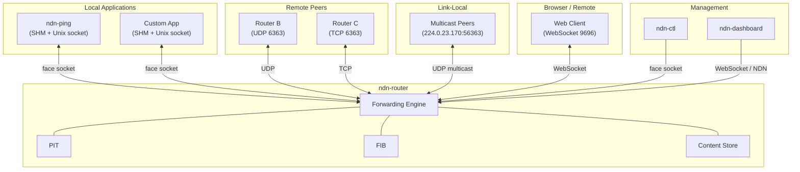

# Running the Router

This page explains how to configure and run `ndn-router` as a standalone NDN forwarder, connect applications and tools to it, and monitor its state.

## Architecture overview

The router is the central forwarding engine. Applications, remote peers, and management tools connect to it through various face types:



## Configuration file

`ndn-router` reads a TOML configuration file. Start from the provided example:

```bash
cp ndn-router.example.toml ndn-router.toml
```

The file is loaded via `--config` (or `-c`) or the `NDN_CONFIG` environment variable.

### Minimal configuration

A minimal config to get started with UDP and multicast:

```toml
[engine]
cs_capacity_mb = 64

# UDP unicast face -- listen for incoming packets
[[face]]
kind = "udp"
bind = "0.0.0.0:6363"

# IPv4 multicast face -- link-local neighbor discovery
[[face]]
kind = "multicast"
group = "224.0.23.170"
port = 56363

# Static route: forward all /ndn Interests out the UDP face
[[route]]
prefix = "/ndn"
face = 0
cost = 10

[management]
transport = "ndn"
face_socket = "/tmp/ndn-faces.sock"

[logging]
level = "info"
```

### Full face type reference

#### UDP unicast

Point-to-point or open UDP face on port 6363 (the NDN default):

```toml
[[face]]
kind = "udp"
bind = "0.0.0.0:6363"
# Optional: restrict to a single remote peer
# remote = "10.0.0.1:6363"
```

#### TCP

Outbound connection to a remote router:

```toml
[[face]]
kind = "tcp"
remote = "192.168.1.1:6363"
# Optional: local bind address
# bind = "0.0.0.0:6363"
```

#### Multicast

Link-local neighbor discovery using the IANA-assigned NDN multicast group:

```toml
[[face]]
kind = "multicast"
group = "224.0.23.170"
port = 56363
# Optional: bind to a specific interface
# interface = "eth0"
```

#### Raw Ethernet multicast

Uses EtherType `0x8624` (IANA-assigned for NDN). Requires `CAP_NET_RAW` on Linux or root on macOS:

```toml
[[face]]
kind = "ether-multicast"
interface = "eth0"
```

#### Unix domain socket

Local app connectivity on Linux/macOS:

```toml
[[face]]
kind = "unix"
path = "/tmp/ndn-app.sock"
```

#### WebSocket

For browser clients or remote NDN-WS connections. Requires the `websocket` feature (enabled by default):

```toml
# Listen mode
[[face]]
kind = "web-socket"
bind = "0.0.0.0:9696"

# Or connect mode (mutually exclusive with bind)
# [[face]]
# kind = "web-socket"
# url = "ws://remote:9696"
```

#### Serial

Point-to-point over RS-232 / USB-serial. Requires the `serial` feature (enabled by default):

```toml
[[face]]
kind = "serial"
path = "/dev/ttyUSB0"
baud = 115200
```

### Content store configuration

```toml
[cs]
variant = "lru"           # "lru", "sharded-lru", or "null"
capacity_mb = 64
# shards = 4              # only for "sharded-lru"
admission_policy = "default"  # "default" or "admit-all"
```

### Static routes

Routes pre-load the FIB at startup. The `face` field is a zero-based index into the `[[face]]` list:

```toml
[[route]]
prefix = "/ndn"
face = 0
cost = 10

[[route]]
prefix = "/localhop"
face = 1
cost = 5
```

Routes can also be added at runtime via `ndn-ctl`.

### Discovery

Enable neighbor discovery and service announcement:

```toml
[discovery]
node_name = "/ndn/site/router1"
profile = "lan"                          # "static", "lan", "campus", "mobile", etc.
served_prefixes = ["/ndn/site/sensors"]
```

## Starting the router

```bash
# Build in release mode for production
cargo build -p ndn-router --release

# Start (sudo required for raw sockets and privileged ports)
sudo ./target/release/ndn-router --config ndn-router.toml
```

Override the log level at runtime:

```bash
sudo ./target/release/ndn-router --config ndn-router.toml --log-level debug

# Or with RUST_LOG for per-crate control
sudo RUST_LOG="info,ndn_engine=debug,ndn_discovery=trace" \
    ./target/release/ndn-router --config ndn-router.toml
```

## Connecting tools

### ndn-ctl

`ndn-ctl` is the management CLI, similar to NFD's `nfdc`. It connects to the router's face socket and sends management commands as NDN Interest/Data:

```bash
# Check router status
ndn-ctl status

# List active faces
ndn-ctl face list

# Create a new UDP face at runtime
ndn-ctl face create udp4://192.168.1.1:6363

# Add a route
ndn-ctl route add /ndn --face 1 --cost 10

# List routes
ndn-ctl route list

# View content store info
ndn-ctl cs info

# List discovered neighbors
ndn-ctl neighbors list

# Announce / withdraw service prefixes
ndn-ctl service announce /ndn/myapp
ndn-ctl service withdraw /ndn/myapp

# Browse discovered services
ndn-ctl service browse

# Set forwarding strategy for a prefix
ndn-ctl strategy set /ndn --strategy /localhost/nfd/strategy/best-route

# Graceful shutdown
ndn-ctl shutdown
```

### ndn-ping

Measure round-trip time to a named prefix. Run the server on one machine and the client on another (or the same machine):

```bash
# Server: register /ping and respond to ping Interests
sudo ndn-ping server --prefix /ping

# Client: send ping Interests and measure RTT
ndn-ping client --prefix /ping --count 10 --interval 1000
```

### ndn-peek and ndn-put

Fetch or publish a single named Data packet:

```bash
# Fetch a packet by name
ndn-peek /ndn/example/data --timeout-ms 4000

# Publish a packet (another terminal)
ndn-put /ndn/example/data --content "hello"
```

### ndn-iperf

Throughput measurement between two NDN endpoints:

```bash
# Server
sudo ndn-iperf server --prefix /iperf

# Client
ndn-iperf client --prefix /iperf --duration 10
```

## Monitoring with ndn-dashboard

The `ndn-dashboard` is a browser-based management UI located at `tools/ndn-dashboard/`. It connects to the router via WebSocket or NDN management protocol and provides real-time views of:

- **Overview** -- engine status, uptime, packet counters
- **Faces** -- active faces with per-face traffic statistics
- **Routes** -- FIB entries and nexthop costs
- **Content Store** -- cache occupancy and hit/miss rates
- **Strategy** -- per-prefix strategy assignments
- **Discovery** -- neighbor table and service records

To use the dashboard, open `tools/ndn-dashboard/index.html` in a browser. Ensure the router has a WebSocket face configured (see the WebSocket face configuration above) or that the dashboard can reach the router's face socket.

## Typical deployment

A common LAN deployment with two routers and local apps:

```bash
# Router A (10.0.0.1) -- ndn-router.toml:
#   UDP face on :6363
#   Multicast face on 224.0.23.170:56363
#   Route /ndn -> UDP face
#   Discovery enabled with node_name = "/ndn/site/routerA"

# Router B (10.0.0.2) -- same config with:
#   remote = "10.0.0.1:6363" on the UDP face for a static tunnel
#   node_name = "/ndn/site/routerB"

# On Router A, start a ping server:
sudo ndn-ping server --prefix /ndn/site/routerA/ping

# From Router B, ping across the link:
ndn-ping client --prefix /ndn/site/routerA/ping --count 5
```

## Next steps

- [Installation](./installation.md) -- build options and feature flags
- [Hello World](./hello-world.md) -- embedded engine tutorial
- [Discovery Protocols](../deep-dive/discovery-protocols.md) -- how neighbor and service discovery work
- [Performance Tuning](../guides/performance-tuning.md) -- optimize `pipeline_threads`, CS sharding, and SHM
