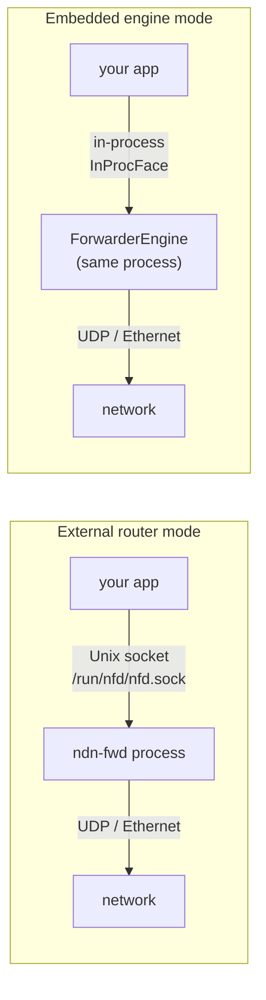

# Building NDN Applications

`ndn-app` provides two ways to connect an application to NDN: through an external router process, or with the forwarder engine embedded directly in your binary. The high-level API — `Consumer`, `Producer`, `Subscriber`, `Queryable` — is the same either way.

This guide walks through both modes with complete, runnable examples.

## The Two Connection Modes



**External router** — `ndn-fwd` runs as a separate process. Your app connects to its Unix socket. This is the standard deployment: one router per host, many apps sharing it. Requires a running router.

**Embedded engine** — the `ForwarderEngine` lives inside your binary. There is no router process. The engine owns all faces and FIB state. This is the right choice for mobile apps, CLI tools, test harnesses, and any scenario where a separate process is inconvenient.

The `Consumer` and `Producer` types accept both connection variants behind an `NdnConnection` enum. The API surface is identical — switching between modes is a one-line change.

## Mode 1: External Router

Add `ndn-app` to your `Cargo.toml`:

```toml
[dependencies]
ndn-app = { path = "crates/engine/ndn-app" }
tokio = { version = "1", features = ["full"] }
```

### Consumer

```rust
use ndn_app::{Consumer, AppError};

#[tokio::main]
async fn main() -> Result<(), AppError> {
    let mut consumer = Consumer::connect("/run/nfd/nfd.sock").await?;

    // Fetch raw content bytes — the simplest call.
    let bytes = consumer.get("/example/hello").await?;
    println!("{}", String::from_utf8_lossy(&bytes));

    // Fetch the full Data packet (includes name, content, metadata).
    let data = consumer.fetch("/example/hello").await?;
    println!("name: {}", data.name());
    if let Some(content) = data.content() {
        println!("content: {} bytes", content.len());
    }

    Ok(())
}
```

`fetch` uses a 4-second Interest lifetime and a 4.5-second local timeout. For custom lifetimes, build the Interest wire yourself:

```rust
use std::time::Duration;
use ndn_packet::encode::InterestBuilder;

let wire = InterestBuilder::new("/example/sensor/temperature")
    .lifetime(Duration::from_millis(500))
    .must_be_fresh(true)
    .build();

let data = consumer.fetch_wire(wire, Duration::from_millis(600)).await?;
```

To set a **hop limit**, **forwarding hint**, or **application parameters**, use `fetch_with`. The local timeout is derived automatically from the Interest lifetime:

```rust
use ndn_packet::encode::InterestBuilder;

// Limit the Interest to 4 forwarding hops
let data = consumer.fetch_with(
    InterestBuilder::new("/ndn/remote/data").hop_limit(4)
).await?;

// Steer via a delegation prefix (forwarding hint)
let data = consumer.fetch_with(
    InterestBuilder::new("/alice/files/photo.jpg")
        .forwarding_hint(vec!["/campus/ndn-hub".parse()?])
).await?;

// ApplicationParameters — the ParametersSha256DigestComponent is
// computed and appended to the Name automatically
let data = consumer.fetch_with(
    InterestBuilder::new("/service/query")
        .app_parameters(b"filter=recent&limit=10")
).await?;
```

On the producer side these fields are accessible via the `Interest` argument:

```rust
producer.serve(|interest| async move {
    println!("hop limit: {:?}", interest.hop_limit());
    println!("params: {:?}", interest.app_parameters());
    println!("hints: {:?}", interest.forwarding_hint());
    // ...
    Some(response_wire)
}).await
```

### Producer

```rust
use bytes::Bytes;
use ndn_app::{Producer, AppError};
use ndn_packet::{Interest, encode::DataBuilder};

#[tokio::main]
async fn main() -> Result<(), AppError> {
    // Register the prefix and start the serve loop.
    let mut producer = Producer::connect("/run/nfd/nfd.sock", "/example").await?;

    producer.serve(|interest: Interest| async move {
        let name = interest.name.to_string();
        println!("Interest for: {name}");

        // Return Some(wire_bytes) to respond, None to silently drop.
        let wire = DataBuilder::new((*interest.name).clone(), b"hello, NDN").build();

        Some(wire)
    }).await
}
```

The handler is `async`, so you can await database queries, file reads, or any other async work before returning the Data. Return `None` to drop the Interest without a response (the forwarder will Nack with `NoRoute` when the Interest times out).

### Error handling

`AppError` has three variants:

```rust
match consumer.fetch("/example/data").await {
    Ok(data) => { /* use data */ }
    Err(AppError::Timeout) => {
        // No response within the timeout window.
        // The Interest either had no route or the producer didn't respond.
    }
    Err(AppError::Nacked { reason }) => {
        // The forwarder sent an explicit Nack (e.g. NoRoute).
        eprintln!("nacked: {:?}", reason);
    }
    Err(AppError::Engine(e)) => {
        // Connection error or protocol violation.
        eprintln!("engine error: {e}");
    }
}
```

## Mode 2: Embedded Engine

The embedded mode builds a `ForwarderEngine` inside your process and connects `Consumer`/`Producer` to it via in-process `InProcFace` channel pairs. No Unix sockets, no separate process.

```rust
use ndn_app::{Consumer, Producer, EngineBuilder};
use ndn_engine::EngineConfig;
use ndn_faces::local::InProcFace;
use ndn_packet::{Name, encode::DataBuilder};
use ndn_transport::FaceId;

#[tokio::main]
async fn main() -> anyhow::Result<()> {
    // Create one InProcFace for the consumer and one for the producer.
    // Each InProcFace::new returns the face (engine side) and its handle (app side).
    let (consumer_face, consumer_handle) = InProcFace::new(FaceId(1), 64);
    let (producer_face, producer_handle) = InProcFace::new(FaceId(2), 64);

    // Build the engine, registering both faces.
    let (engine, _shutdown) = EngineBuilder::new(EngineConfig::default())
        .face(consumer_face)
        .face(producer_face)
        .build()
        .await?;

    // Install a FIB route: Interests for /example go to the producer face.
    let prefix: Name = "/example".parse()?;
    engine.fib().add_nexthop(&prefix, FaceId(2), 0);

    // Build Consumer and Producer from their handles.
    let mut consumer = Consumer::from_handle(consumer_handle);
    let mut producer = Producer::from_handle(producer_handle, prefix);

    // Run the producer in a background task.
    tokio::spawn(async move {
        producer.serve(|interest| async move {
            let wire = DataBuilder::new((*interest.name).clone(), b"hello from embedded engine").build();
            Some(wire)
        }).await.ok();
    });

    // Fetch from the consumer — goes through the in-process engine.
    let bytes = consumer.get("/example/greeting").await?;
    println!("{}", String::from_utf8_lossy(&bytes));

    Ok(())
}
```

The embedded mode is useful for:

- **Integration tests** — spin up a full forwarding engine in `#[tokio::test]` without any external process
- **Mobile / Android / iOS** — ship the engine as part of your app binary; no system daemon required
- **CLI tools** — tools like `ndn-peek` and `ndn-ping` embed the engine so they work on machines that don't have `ndn-fwd` running

> **Mobile shortcut:** If you are targeting Android or iOS, use `ndn-mobile` instead of assembling `EngineBuilder` by hand. It pre-configures the engine with mobile-tuned defaults (8 MB CS, single pipeline thread, security enabled), exposes background suspend/resume lifecycle hooks, and provides Bluetooth face support. See the [Mobile Apps guide](./mobile-apps.md).

## Synchronous Applications

The `blocking` feature wraps `Consumer` and `Producer` in synchronous types that manage an internal Tokio runtime, following the same pattern as `reqwest::blocking`:

```toml
[dependencies]
ndn-app = { path = "crates/engine/ndn-app", features = ["blocking"] }
```

```rust
use ndn_app::blocking::{BlockingConsumer, BlockingProducer};

// No async, no #[tokio::main].
fn main() -> Result<(), ndn_app::AppError> {
    let mut consumer = BlockingConsumer::connect("/run/nfd/nfd.sock")?;
    let bytes = consumer.get("/example/hello")?;
    println!("{}", String::from_utf8_lossy(&bytes));
    Ok(())
}
```

`BlockingProducer::serve` takes a plain `Fn(Interest) -> Option<Bytes>` with no async:

```rust
let mut producer = BlockingProducer::connect("/run/nfd/nfd.sock", "/sensor")?;

producer.serve(|interest| {
    // Synchronous handler — called on the runtime thread.
    let reading = read_sensor();  // blocking I/O is fine here
    let wire = DataBuilder::new((*interest.name).clone(), reading.as_bytes()).build();
    Some(wire)
})?;
```

The blocking API is a good fit for Python extensions (`ndn-python` uses it internally), command-line tools, and any codebase that doesn't use async.

## Fetching with Security Verification

`Consumer::fetch_verified` validates the Data's signature against a trust schema before returning it. The result is `SafeData` — a newtype that the compiler uses to enforce that only verified data reaches security-sensitive code.

```rust
use ndn_app::Consumer;
use ndn_security::KeyChain;

let keychain = KeyChain::open_or_create(
    std::path::Path::new("/etc/ndn/keys"),
    "/com/example/app",
)?;
let validator = keychain.validator();

let mut consumer = Consumer::connect("/run/nfd/nfd.sock").await?;
let safe_data = consumer.fetch_verified("/example/data", &validator).await?;

// safe_data is SafeData — the compiler knows it's been verified.
println!("verified: {}", safe_data.data().name());
```

If the certificate needed to verify the Data is not yet in the local cache, the validator expresses a side-channel Interest to fetch it. This happens transparently; `fetch_verified` waits for the certificate before returning.

## Subscribe / Queryable

For datasets that change over time, `Subscriber` joins an SVS sync group and delivers new samples as they arrive. `Queryable` registers a prefix and handles request-response patterns more explicitly than `Producer`.

### Subscriber

```rust
use ndn_app::{Subscriber, SubscriberConfig};

let mut sub = Subscriber::connect(
    "/run/nfd/nfd.sock",
    "/chat/room1",
    SubscriberConfig::default(),
).await?;

while let Some(sample) = sub.recv().await {
    println!(
        "[{}] seq {}: {:?}",
        sample.publisher,
        sample.seq,
        sample.payload,
    );
}
```

`SubscriberConfig::auto_fetch` (default `true`) automatically expresses an Interest for each sync update and populates `sample.payload` with the fetched bytes. Set it to `false` if you only need the name/seq and will fetch content selectively.

### Queryable

```rust
use ndn_app::{Queryable, AppError};

let mut queryable = Queryable::connect("/run/nfd/nfd.sock", "/compute").await?;

while let Some(query) = queryable.recv().await {
    let name = query.interest().name().to_string();
    let result = compute_something(&name);

    let wire = DataBuilder::new(query.interest().name().clone())
        .content(result.as_bytes())
        .build_unsigned();

    query.reply(wire).await?;
}
```

`Queryable` differs from `Producer` in that the reply goes directly to the querying consumer via the engine's PIT, without re-entering the producer's serve loop. It is better suited to stateless request handlers that want explicit control over the response.

## Putting It Together: A Complete Sensor App

This example shows a sensor producer and a monitor consumer running side-by-side against an external router.

```rust
use std::time::Duration;
use bytes::Bytes;
use ndn_app::{Consumer, Producer, AppError};
use ndn_packet::{Interest, encode::DataBuilder};
use tokio::time::sleep;

#[tokio::main]
async fn main() -> Result<(), AppError> {
    const SOCKET: &str = "/run/nfd/nfd.sock";
    const PREFIX: &str = "/ndn/sensor/temperature";

    // Spawn the producer in a background task.
    tokio::spawn(async move {
        let mut producer = Producer::connect(SOCKET, PREFIX).await?;
        producer.serve(|interest: Interest| async move {
            // Read a sensor value and build a Data response.
            let reading = format!("{:.1}", read_temperature());
            let wire = DataBuilder::new((*interest.name).clone(), reading.as_bytes())
                .freshness(Duration::from_secs(5))
                .build();
            Some(wire)
        }).await
    });

    // Give the producer a moment to register its prefix.
    sleep(Duration::from_millis(100)).await;

    // Poll the sensor every second from the consumer.
    let mut consumer = Consumer::connect(SOCKET).await?;
    loop {
        match consumer.get(PREFIX).await {
            Ok(bytes) => println!("temperature: {}°C", String::from_utf8_lossy(&bytes)),
            Err(AppError::Timeout) => eprintln!("no response"),
            Err(e) => return Err(e),
        }
        sleep(Duration::from_secs(1)).await;
    }
}

fn read_temperature() -> f32 { 23.5 }
```

## Identity Management with NdnIdentity

`ndn-identity` provides a higher-level identity API that sits above the raw `KeyChain`. It manages certificate lifecycle, handles NDNCERT enrollment, and exposes a `did()` method that returns the W3C DID URI for the identity — all in a single type that persists across restarts.

### Ephemeral Identities for Tests

`NdnIdentity::ephemeral` creates a throw-away identity entirely in memory. The key pair is generated fresh each time and is gone when the process exits. This is ideal for unit tests and integration tests where you want real signing behavior without touching the filesystem:

```rust
use ndn_identity::NdnIdentity;
use ndn_packet::encode::DataBuilder;

#[tokio::test]
async fn test_signed_producer() -> anyhow::Result<()> {
    // A fresh Ed25519 identity for this test run
    let identity = NdnIdentity::ephemeral("/test/sensor").await?;

    println!("test DID: {}", identity.did());
    // → did:ndn:test:sensor

    // Get a signer and sign a packet
    let signer = identity.signer()?;
    let wire = DataBuilder::new("/test/sensor/reading".parse()?, b"23.5°C")
        .sign(&*signer)
        .await?;

    // wire is now a signed Data packet whose key traces back to this identity
    Ok(())
}
```

### Persistent Identities for Applications

`NdnIdentity::open_or_create` creates the identity (and persists it to disk) on first run, then loads it on subsequent runs without re-generating keys:

```rust
use std::path::PathBuf;
use ndn_identity::NdnIdentity;
use ndn_app::Producer;
use ndn_packet::{Interest, encode::DataBuilder};

#[tokio::main]
async fn main() -> anyhow::Result<()> {
    // First run: generates key, creates self-signed cert, saves to /var/lib/ndn/sensor-id
    // Subsequent runs: loads existing key and cert from disk
    let identity = NdnIdentity::open_or_create(
        &PathBuf::from("/var/lib/ndn/sensor-id"),
        "/ndn/sensor/node42",
    ).await?;

    println!("Running as: {}", identity.name());
    println!("DID:        {}", identity.did());

    let signer = identity.signer()?;

    let mut producer = Producer::connect("/run/nfd/nfd.sock", "/ndn/sensor/node42").await?;

    producer.serve(move |interest: Interest| {
        // Clone the signer Arc for each handler invocation
        let signer = signer.clone();
        async move {
            let reading = format!("{:.1}", read_sensor());
            // Sign with the identity's key
            let wire = DataBuilder::new((*interest.name).clone(), reading.as_bytes())
                .sign(&*signer)
                .await
                .ok()?;
            Some(wire)
        }
    }).await?;

    Ok(())
}

fn read_sensor() -> f32 { 23.5 }
```

### Advanced: Custom Validator

`NdnIdentity` implements `Deref<Target = KeyChain>`, so all `KeyChain` methods are available directly. For advanced scenarios — custom trust schemas, adding external trust anchors — use `manager_arc()` to access the underlying `SecurityManager`:

```rust
use ndn_identity::NdnIdentity;
use ndn_security::{Validator, TrustSchema};
use std::path::PathBuf;

let identity = NdnIdentity::open_or_create(
    &PathBuf::from("/var/lib/ndn/app-id"),
    "/example/app",
).await?;

// NdnIdentity Derefs to KeyChain — signer() and validator() are available directly
let signer = identity.signer()?;

// For advanced access, use manager_arc()
let mgr = identity.manager_arc();
let my_cert = mgr.get_certificate()?;
let validator = Validator::new(TrustSchema::hierarchical());
validator.cert_cache().insert(my_cert);

// ... use validator to verify incoming SafeData
```

For most applications `identity.signer()` covers the signing case and `Consumer::fetch_verified` covers the verification case. `manager_arc()` is the escape hatch for framework code that needs to share the manager across async tasks.

For factory provisioning with NDNCERT, see [`NdnIdentity::provision`](../deep-dive/ndncert.md) and the [Fleet and Swarm Security](./fleet-security.md) guide.

## Cargo Features

| Feature | What it enables |
|---------|----------------|
| *(default)* | `Consumer`, `Producer`, `Subscriber`, `Queryable` |
| `blocking` | `BlockingConsumer`, `BlockingProducer` via an internal Tokio runtime |

`KeyChain` lives in `ndn-security` and is re-exported by `ndn-app` for convenience.
