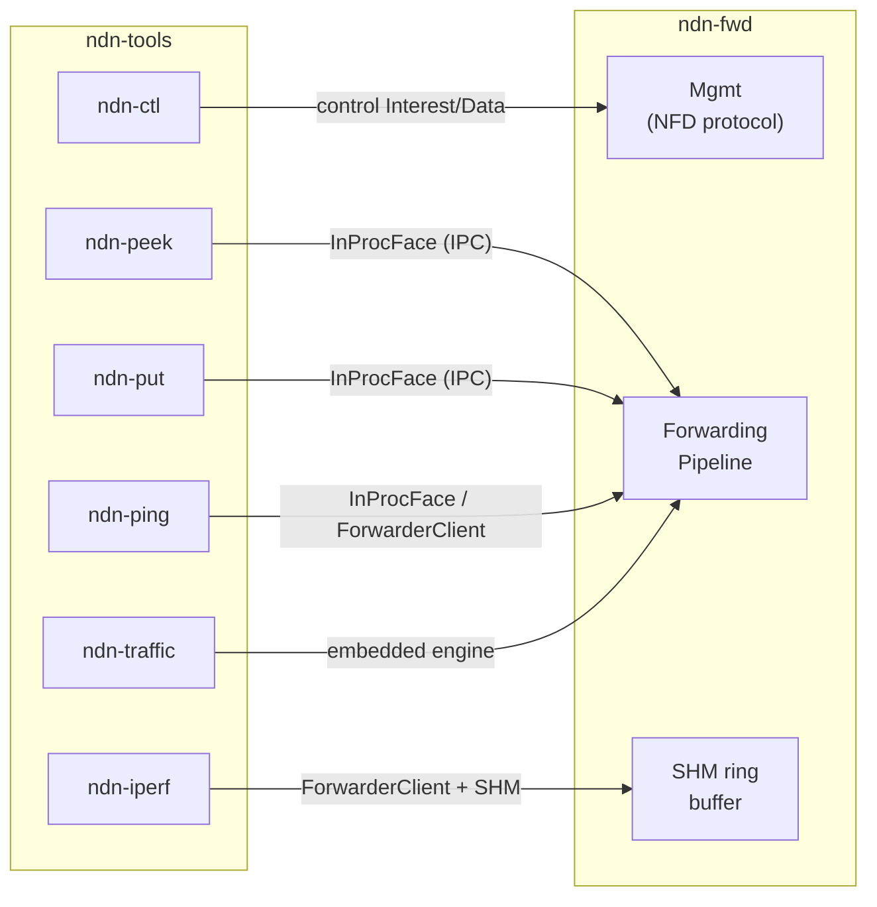

# CLI Tools

You've got ndn-fwd running. Now what? The ndn-tools suite gives you the equivalent of ping, curl, and iperf for NDN networks.

Every tool in the suite communicates with the local router over the same IPC path: a Unix domain socket (default `/run/nfd/nfd.sock`) with an optional shared-memory data plane for high throughput. The management commands use the NFD-compatible control protocol; the data-plane tools use an `InProcFace` channel that plugs directly into the forwarding pipeline.



All data-plane tools accept a `--face-socket` flag (or `$NDN_FACE_SOCK` environment variable) to override the default socket path, and `--no-shm` to fall back to pure Unix-socket transport when shared memory is unavailable.


## ndn-peek and ndn-put

These are the simplest tools in the suite -- the equivalent of `curl` for NDN. One sends a single Interest and prints the Data it gets back; the other publishes a file as named Data segments.

### ndn-peek

Fetch a single named Data packet:

```bash
ndn-peek /ndn/edu/ucla/ping/42
ndn-peek /ndn/video/frame-001 --timeout-ms 2000
```

The first argument is the NDN name to request. By default, ndn-peek waits 4 seconds for a response before giving up. Override this with `--timeout-ms`.

### ndn-put

Publish a file as one or more named Data segments:

```bash
ndn-put /ndn/files/readme README.md
ndn-put /ndn/video/clip clip.mp4 --chunk-size 4096
```

ndn-put reads the file, splits it into segments using the NDN segmentation convention, and registers a prefix handler on the router to serve them. The default segment size follows the NDN standard (`NDN_DEFAULT_SEGMENT_SIZE`); use `--chunk-size` to override it for larger payloads.


## ndn-ping

Reachability and latency testing for named prefixes, modeled directly after ICMP ping. It runs in two modes: a **server** that registers a prefix and replies to ping Interests, and a **client** that sends those Interests and measures round-trip time.

### Server

Start a ping responder on the default `/ping` prefix:

```bash
ndn-ping server
ndn-ping server --prefix /ndn/my-node/ping --freshness 1000 --sign
```

The server registers the prefix with the router, then loops: for every Interest it receives, it sends back an empty Data packet. Passing `--sign` generates an ephemeral Ed25519 identity and signs each reply -- useful for testing the cost of cryptographic verification in the pipeline.

The `--freshness` flag sets the FreshnessPeriod on response Data in milliseconds. A value of 0 (the default) omits the field entirely, meaning the Content Store will not serve stale cached copies.

### Client

Measure RTT to a running ping server:

```bash
ndn-ping client --prefix /ping --count 10
ndn-ping client --prefix /ndn/remote/ping -c 100 -i 500 --lifetime 2000
```

The client sends Interests sequentially, printing per-packet timing as they return. When it finishes (or you press Ctrl-C), it prints a summary that mirrors the familiar `ping` format:

```
--- /ping ping statistics ---
10 transmitted, 10 received, 0 nacked, 0.0% loss, time 9.0s
rtt min/avg/max/p50/p99/stddev = 45µs/62µs/120µs/58µs/120µs/22 µs
```

| Flag | Default | Meaning |
|------|---------|---------|
| `--prefix` | `/ping` | Name prefix to ping |
| `-c`, `--count` | 4 | Number of pings (0 = unlimited) |
| `-i`, `--interval` | 1000 | Milliseconds between pings |
| `--lifetime` | 4000 | Interest lifetime in milliseconds |
| `--no-shm` | false | Disable shared-memory transport |


## ndn-ctl

Runtime management of a running router, following the same `noun verb` pattern as NFD's `nfdc`. Under the hood, ndn-ctl sends NFD management Interests over the IPC socket and decodes the ControlResponse Data that comes back.

### Face management

```bash
ndn-ctl face create udp4://192.168.1.1:6363
ndn-ctl face create tcp4://router.example.com:6363
ndn-ctl face destroy 3
ndn-ctl face list
```

### Route management

```bash
ndn-ctl route add /ndn --face 1 --cost 10
ndn-ctl route remove /ndn --face 1
ndn-ctl route list
```

### Strategy management

```bash
ndn-ctl strategy set /ndn --strategy /localhost/nfd/strategy/best-route
ndn-ctl strategy unset /ndn
ndn-ctl strategy list
```

### Content Store

```bash
ndn-ctl cs info                          # capacity, entry count, memory usage
ndn-ctl cs config --capacity 1000000     # set max capacity in bytes
ndn-ctl cs erase /ndn/video              # evict cached entries by prefix
ndn-ctl cs erase /ndn/video --count 100  # evict at most 100 entries
```

### Service discovery

```bash
ndn-ctl service list                    # locally announced services
ndn-ctl service browse                  # all known services (local + peers)
ndn-ctl service browse /ndn/sensors     # filter by prefix
ndn-ctl service announce /ndn/my-app    # announce a service at runtime
ndn-ctl service withdraw /ndn/my-app    # withdraw announcement
```

### Neighbors, status, and shutdown

```bash
ndn-ctl neighbors list
ndn-ctl status
ndn-ctl shutdown
```

### Security (local, no router needed)

The `security` subcommands operate on the local PIB (Public Information Base) and do not require a running router:

```bash
ndn-ctl security init --name /ndn/my-identity
ndn-ctl security info
ndn-ctl security export --name /ndn/my-identity -o cert.hex
ndn-ctl security trust cert.ndnc
```

> **Tip:** ndn-ctl also supports a `--bypass` flag that uses the legacy JSON-over-Unix-socket transport instead of the NFD management protocol. This is mainly useful for debugging the router's management layer itself.


## ndn-traffic

A self-contained traffic generator that does not need a running router. It spins up an embedded forwarding engine with in-process `InProcFace` pairs and drives configurable Interest/Data traffic through the full pipeline. This makes it ideal for stress-testing the pipeline stages in isolation.

```bash
ndn-traffic --count 100000 --rate 50000 --size 1024 --concurrency 4
ndn-traffic --mode sink --count 10000   # no producer, all Interests Nack
```

| Flag | Default | Meaning |
|------|---------|---------|
| `--mode` | `echo` | `echo` = producer replies with Data; `sink` = no producer (everything Nacks) |
| `--count` | 10,000 | Total Interests to send (split across flows) |
| `--rate` | 0 (unlimited) | Target aggregate rate in packets/sec |
| `--size` | 1024 | Data payload size in bytes |
| `--concurrency` | 1 | Number of parallel consumer flows |
| `--prefix` | `/traffic` | Name prefix for generated traffic |

In `echo` mode, ndn-traffic creates a FIB route from the prefix to a producer face, so every Interest is satisfied. In `sink` mode, no producer exists, so every Interest results in a Nack -- useful for measuring Nack processing overhead.

The output includes loss percentage, throughput in pps and Mbps, and latency percentiles (min, avg, p50, p95, p99, max):

```
ndn-traffic: mode=echo count=100000 rate=unlimited size=1024B concurrency=4
  sent=100000  received=100000  lost=0 (0.00%)
  throughput: 245000 pps, 2006.42 Mbps
  latency: min=8us avg=16us p50=14us p95=32us p99=58us max=210us
  elapsed: 0.41s
```


## ndn-iperf

Sustained bandwidth measurement between two nodes, modeled after iperf3. Unlike ndn-traffic (which embeds its own engine), ndn-iperf connects to a running router and measures real network throughput including IPC overhead, SHM transfer, and pipeline processing.

### Server

```bash
ndn-iperf server
ndn-iperf server --prefix /iperf --size 8192 --sign
ndn-iperf server --hmac --freshness 1000
```

The server registers its prefix, optionally announces it via service discovery, then replies to every Interest with a Data packet of the configured payload size. Signing options:

- `--sign`: Ed25519 signatures (cryptographically strong, slower)
- `--hmac`: HMAC-SHA256 signatures (faster, uses a fixed benchmark key)

### Client

```bash
ndn-iperf client
ndn-iperf client --prefix /iperf --duration 30 --window 128
ndn-iperf client --cc cubic --window 64 --duration 60
```

The client sends Interests in a sliding window and measures throughput, loss, and RTT. It prints periodic interval reports during the test and a final summary:

```
--- ndn-iperf results ---
  duration:    10.02s
  transferred: 78.45 MB (82247680 bytes)
  throughput:  62.58 Mbps
  packets:     10032 sent, 10030 received, 2 lost (0.0% loss)
  RTT:         avg=523us min=89us max=4201us
               p50=412us p95=1205us p99=2880us
```

### Congestion control

ndn-iperf includes three congestion control algorithms, selectable via `--cc`:

| Algorithm | Description |
|-----------|-------------|
| `aimd` (default) | Additive-increase, multiplicative-decrease. Classic TCP-like behavior. |
| `cubic` | CUBIC algorithm, less aggressive backoff on loss. |
| `fixed` | Constant window, no adaptation. Good for controlled benchmarks. |

Fine-tuning flags for advanced use:

```bash
ndn-iperf client --cc aimd --ai 2.0 --md 0.7 --min-window 4 --max-window 512
ndn-iperf client --cc cubic --cubic-c 0.2 --window 32
```

| Flag | Default | Meaning |
|------|---------|---------|
| `--duration` | 10 | Test duration in seconds |
| `--window` | 64 | Initial (and for `fixed`, constant) window size |
| `--cc` | `aimd` | Congestion control: `aimd`, `cubic`, or `fixed` |
| `--lifetime` | 4000 | Interest lifetime in milliseconds |
| `--interval` | 1 | Interval in seconds between periodic status reports |
| `-q`, `--quiet` | false | Suppress periodic reports, show only the final summary |

> **Note:** The `--window` flag also sets the initial slow-start threshold (`ssthresh`). This prevents unbounded slow start from rocketing the window on low-RTT links. For high-BDP (bandwidth-delay product) paths, increase `--window` and `--max-window` together.


## ndn-bench

A lightweight micro-benchmark for measuring the overhead of the forwarding pipeline's internal channels. It spins up an embedded engine and drives Interests through `InProcFace` channel round-trips, reporting latency percentiles and aggregate throughput.

```bash
ndn-bench
ndn-bench --interests 50000 --concurrency 20 --name /bench/test
```

| Flag | Default | Meaning |
|------|---------|---------|
| `--interests` | 1000 | Total Interests to process |
| `--concurrency` | 10 | Number of parallel worker tasks |
| `--name` | `/bench` | Name prefix for benchmark Interests |

Sample output:

```
ndn-bench: 50000 interests, concurrency=20, prefix=/bench/test
ndn-bench: 1250000 interests/sec over 0.04s
rtt: n=50000 avg=3µs p50=2µs p95=5µs p99=8µs
```

> **Note:** ndn-bench currently measures InProcFace channel overhead only (the Interest is not wired through the full pipeline). It is most useful for establishing a baseline cost for the IPC mechanism itself.


## Common Workflows

The tools compose naturally. Here is a typical sequence for validating a new link and measuring its capacity.

### 1. Check reachability

First, verify that the remote prefix is reachable through the forwarding plane:

```bash
# On the remote node
ndn-ping server --prefix /ndn/remote

# On the local node
ndn-ping client --prefix /ndn/remote -c 10
```

If pings succeed, the FIB routes and faces are correctly configured. If they time out, use `ndn-ctl` to inspect the forwarding state:

```bash
ndn-ctl face list
ndn-ctl route list
ndn-ctl status
```

### 2. Measure throughput

Once reachability is confirmed, run a sustained bandwidth test:

```bash
# On the remote node
ndn-iperf server --prefix /ndn/remote/iperf --size 8192

# On the local node
ndn-iperf client --prefix /ndn/remote/iperf --duration 30 --window 128
```

Start with the default AIMD congestion control. If you see high loss or oscillating throughput, try CUBIC or a fixed window to isolate the issue:

```bash
ndn-iperf client --prefix /ndn/remote/iperf --cc fixed --window 32
```

### 3. Stress-test the local pipeline

For profiling the forwarder itself without network variables, use ndn-traffic with the embedded engine:

```bash
ndn-traffic --count 1000000 --concurrency 8 --size 4096
```

### 4. Monitor in real-time

While any of the above tests are running, use ndn-ctl in another terminal to watch the router state:

```bash
watch -n 1 ndn-ctl status
ndn-ctl cs info
ndn-ctl service browse
```
