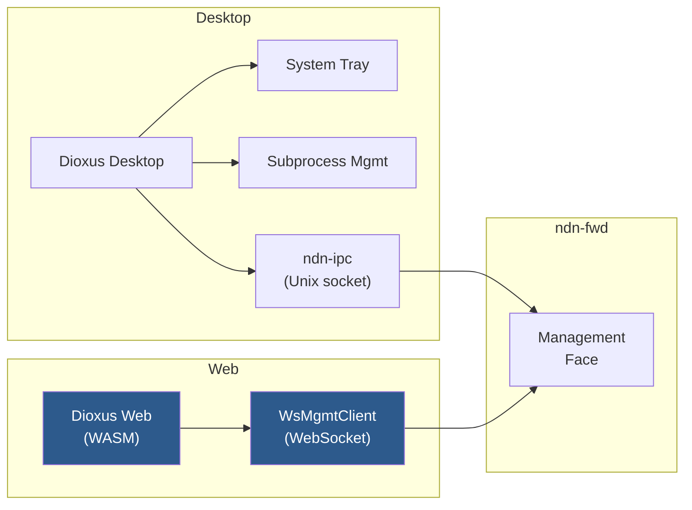

# Dashboard

The NDN Dashboard is a full management UI for `ndn-fwd`, available as a **desktop app** (native window + system tray) and a **web app** (pure Rust compiled to WASM).

> All management commands go through `ndn-ipc::MgmtClient` which uses `ndn-config` for NFD-compatible TLV encoding. The dashboard never reimplements protocol logic.

## Quick Start

### Desktop

```bash
cargo build -p ndn-dashboard --release
./target/release/ndn-dashboard
```

Requires a running `ndn-fwd` instance on the default socket (`/run/nfd/nfd.sock` on Unix, `\\.\pipe\ndn` on Windows).

### Web (WASM)

```bash
dx serve --features web --platform web
```

Connects to the router via WebSocket (`ws://localhost:9696` by default). The router must have a WebSocket face listener enabled. The web version uses the same TLV codec and packet types as the native build, demonstrating ndn-rs portability.

## Features

| View | What it does |
|------|-------------|
| **Overview** | Forwarder status, per-face throughput sparklines (3-min history), CS stats |
| **Routes** | FIB management: add/remove/inspect entries, cost adjustment |
| **Strategy** | Per-prefix forwarding strategy assignment |
| **Faces** | Face creation/destruction, URI inspection, counter display |
| **Fleet** | Discovered neighbors, NDNCERT enrollment, discovery config |
| **Routing** | DVR protocol status and runtime configuration |
| **Security** | Trust anchors, certificate management, trust schema rules |
| **Logs** | Live structured log stream with regex filtering, adjustable level |
| **Tools** | Embedded ping, iperf, peek, put with real-time results |
| **Config** | Full TOML configuration export/import with categorized knobs |
| **Session** | Command recording and replay for scripting |

## Architecture



The desktop build includes system tray integration, subprocess management (start/stop `ndn-fwd`), and embedded tool servers. The web build omits these (no OS-level access in a browser) but retains full monitoring and management capability.

### Feature Gates

| Feature | Desktop | Web |
|---------|---------|-----|
| Router start/stop | `forwarder_proc.rs` | Not available |
| System tray | `tray-icon` crate | Not available |
| Embedded tools (ping, iperf) | `ndn-tools-core` | Not available |
| Settings persistence | `~/.config/ndn-dashboard/` | `localStorage` |
| Management transport | Unix socket (`ndn-ipc`) | WebSocket (`gloo-net`) |
| TLV codec | `ndn-tlv` + `ndn-packet` | Same crates, compiled to WASM |

### Polling Model

The dashboard polls the router every 3 seconds via NDN management Interests on `/localhost/nfd/`. All responses are decoded using `ndn-config` types (`FaceStatus`, `FibEntry`, `StrategyChoice`, etc.) and converted to display-friendly Dioxus signals.

## Configuration

Dashboard settings are persisted separately from router config:

- **Desktop:** `~/.config/ndn-dashboard/settings.json`
- **Web:** Browser `localStorage` under key `ndn-dashboard-settings`

Settings include node prefix, tool server configuration, experimental feature toggles, and UI preferences.

## Building for Web

The web target compiles the entire dashboard — including NDN packet encoding, management protocol, and reactive UI — to WebAssembly:

```bash
# Install Dioxus CLI
cargo install dioxus-cli

# Serve locally with hot reload
cd tools/ndn-dashboard
dx serve --features web --platform web

# Production build
dx build --features web --platform web --release
```

The output in `dist/` is a static site that can be deployed anywhere. The [live version](../dashboard/) is deployed to GitHub Pages alongside the wiki and explorer.
