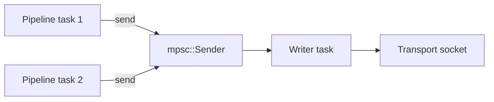

# Implementing a Face

This guide walks through implementing a custom face type for ndn-rs. Faces are the abstraction over network transports -- every link-layer connection (UDP, TCP, Ethernet, serial, in-process channel) is a face.

## The Face Trait

The core trait lives in `ndn-transport` (`crates/ndn-transport/src/face.rs`):

```rust
pub trait Face: Send + Sync + 'static {
    fn id(&self) -> FaceId;
    fn kind(&self) -> FaceKind;

    fn remote_uri(&self) -> Option<String> { None }
    fn local_uri(&self) -> Option<String> { None }

    fn recv(&self) -> impl Future<Output = Result<Bytes, FaceError>> + Send;
    fn send(&self, pkt: Bytes) -> impl Future<Output = Result<(), FaceError>> + Send;
}
```

Key points:

- **`id()`** returns a `FaceId(u32)` assigned by the `FaceTable`. Call `face_table.alloc_id()` to get one before constructing your face.
- **`kind()`** returns a `FaceKind` variant classifying the transport. This determines the face's scope (local vs. non-local) and is used for NFD management reporting.
- **`recv()`** is called from a single dedicated task per face. It blocks (async) until a packet arrives or the face closes.
- **`send()`** may be called concurrently from multiple pipeline tasks. It takes `&self`, so internal synchronization is required if the underlying transport is not inherently concurrent.
- **`remote_uri()` / `local_uri()`** are optional and used for NFD management status reporting.

There is also an optional `recv_with_addr()` method for multicast/broadcast faces that need to return the link-layer sender address alongside the packet.

## Adding a FaceKind Variant

If your transport does not fit an existing `FaceKind`, add a new variant:

1. Add the variant to the `FaceKind` enum in `crates/ndn-transport/src/face.rs`
2. Update `scope()` to classify it as `Local` or `NonLocal`
3. Update the `Display` and `FromStr` implementations

```rust
pub enum FaceKind {
    // ... existing variants ...
    MyTransport,
}
```

If your transport is network-facing, return `FaceScope::NonLocal` from `scope()`. If it is same-host IPC, return `FaceScope::Local`.

## Example: A Face Wrapping a Custom Transport

Here is a minimal face wrapping a hypothetical `CustomSocket` type:

```rust
use std::sync::Arc;
use bytes::Bytes;
use tokio::sync::mpsc;
use ndn_transport::{Face, FaceId, FaceKind, FaceError};

pub struct CustomFace {
    id: FaceId,
    /// Incoming packets buffered by the reader task.
    rx: tokio::sync::Mutex<mpsc::Receiver<Bytes>>,
    /// Sender half for outgoing packets, consumed by a writer task.
    tx: mpsc::Sender<Bytes>,
}

impl CustomFace {
    pub fn new(
        id: FaceId,
        socket: CustomSocket,
        buffer_size: usize,
    ) -> (Self, CustomFaceReader) {
        let (in_tx, in_rx) = mpsc::channel(buffer_size);
        let (out_tx, out_rx) = mpsc::channel(buffer_size);

        let face = Self {
            id,
            rx: tokio::sync::Mutex::new(in_rx),
            tx: out_tx,
        };

        // The reader/writer tasks run separately.
        let reader = CustomFaceReader {
            socket: socket.clone(),
            in_tx,
            out_rx,
        };

        (face, reader)
    }
}

impl Face for CustomFace {
    fn id(&self) -> FaceId {
        self.id
    }

    fn kind(&self) -> FaceKind {
        FaceKind::Tcp // or your custom variant
    }

    fn remote_uri(&self) -> Option<String> {
        Some("custom://10.0.0.1:9000".to_string())
    }

    async fn recv(&self) -> Result<Bytes, FaceError> {
        self.rx
            .lock()
            .await
            .recv()
            .await
            .ok_or(FaceError::Closed)
    }

    async fn send(&self, pkt: Bytes) -> Result<(), FaceError> {
        self.tx
            .send(pkt)
            .await
            .map_err(|_| FaceError::Closed)
    }
}
```

## Registering with FaceTable

The engine's `FaceTable` manages all active faces. After constructing your face:

```rust
// Allocate an ID from the table.
let id = face_table.alloc_id();

// Construct the face with that ID.
let (face, reader) = CustomFace::new(id, socket, 256);

// Register it. The table wraps it in Arc<dyn ErasedFace>.
face_table.insert(face);

// Spawn the reader/writer task.
tokio::spawn(reader.run());
```

The `FaceTable` uses `DashMap<FaceId, Arc<dyn ErasedFace>>` internally. Pipeline stages clone the `Arc` handle out of the table before calling `send()`, so no table lock is held during I/O. Face IDs are recycled when a face is removed.

## Design Tips

### recv: one task, one consumer

`recv()` is only ever called from the face's own reader task. The engine spawns one task per face that loops on `recv()` and pushes decoded packets into the shared pipeline channel. You do not need to make `recv()` safe for concurrent callers.

### send: must be `&self` and synchronized

`send()` is called from arbitrary pipeline tasks -- potentially many at once. Since the signature is `&self` (not `&mut self`), you must synchronize internally. The standard pattern is an `mpsc::Sender` that buffers outgoing packets for a dedicated writer task:



The `mpsc::Sender::send()` is itself safe to clone and call from multiple tasks.

### Backpressure via mpsc channels

Use bounded `mpsc::channel(capacity)` for both the inbound and outbound paths. This provides natural backpressure:

- **Inbound:** if the pipeline is slow, the reader task blocks on `in_tx.send()` until there is room, applying backpressure to the transport.
- **Outbound:** if the transport is slow, `send()` blocks on `out_tx.send()` until the writer task drains the queue, propagating backpressure to the pipeline.

A capacity of 128--256 packets is a reasonable starting point. Too small and you starve throughput; too large and you add latency during congestion.

### LP encoding convention

Network-facing transports (UDP, TCP, Ethernet, serial) should wrap packets in an NDNLPv2 `LpPacket` envelope before writing to the wire. Local transports (Unix, App, SHM) send the raw packet as-is. The existing `StreamFace` makes this explicit via an `lp_encode` constructor parameter -- follow the same convention based on `FaceKind::scope()`.

### Error handling

Return `FaceError::Closed` when the underlying transport is permanently gone. Return `FaceError::Io(e)` for transient I/O errors. Return `FaceError::Full` if a non-blocking send would exceed buffer capacity (the pipeline may retry or Nack).

## Existing face implementations

Study these for patterns:

| Face | Crate | Notes |
|------|-------|-------|
| `UdpFace` | `ndn-face-net` | Datagram transport, simplest network face |
| `TcpFace` | `ndn-face-net` | Stream transport via `StreamFace` helper |
| `AppFace` | `ndn-face-local` | In-process channel pair, no serialization |
| `ShmFace` | `ndn-face-local` | Shared-memory ring buffer, highest throughput |
| `NamedEtherFace` | `ndn-face-l2` | Raw Ethernet via `AF_PACKET` |
| `SerialFace` | `ndn-face-serial` | UART/serial with framing |
| `WfbFace` | `ndn-face-l2` | Wifibroadcast NG integration |
| `WebSocketFace` | `ndn-face-net` | WebSocket transport |
| `ComputeFace` | `ndn-compute` | Named function networking |
