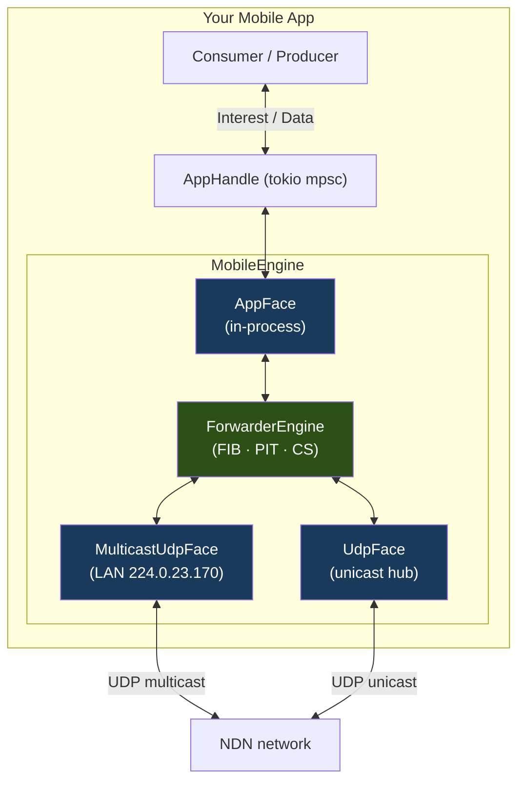

# NDN on Android and iOS

`ndn-mobile` packages the NDN forwarding engine into a pre-configured crate tuned for Android and iOS. The forwarder runs inside the app process — no system daemon, no Unix sockets, no raw Ethernet faces. All app traffic uses in-process `AppFace` channels (zero IPC overhead), while UDP faces handle LAN and WAN connectivity.



## When to Use `ndn-mobile` vs. Raw `EngineBuilder`

Use `ndn-mobile` when:
- You are targeting Android or iOS/iPadOS
- You want sensible mobile defaults (8 MB CS, single pipeline thread, full security validation) without assembling them from parts
- You need background suspend / foreground resume lifecycle hooks

Use raw `EngineBuilder` when:
- You are building a desktop router, simulation harness, or test fixture
- You need fine-grained control over every face (custom strategies, raw Ethernet, etc.)

## Quick Start

Add `ndn-mobile` to your `Cargo.toml`:

```toml
[dependencies]
ndn-mobile = { path = "crates/ndn-mobile" }
tokio = { version = "1", features = ["full"] }
```

Build the engine and fetch some content:

```rust
use ndn_mobile::{Consumer, MobileEngine};

#[tokio::main]
async fn main() -> anyhow::Result<()> {
    let (engine, handle) = MobileEngine::builder().build().await?;

    let mut consumer = Consumer::from_handle(handle);
    let data = consumer.fetch("/ndn/edu/example/data/1").await?;
    println!("got {} bytes", data.content().map_or(0, |b| b.len()));

    engine.shutdown().await;
    Ok(())
}
```

`MobileEngine::builder()` returns a [`MobileEngineBuilder`] with mobile-tuned defaults:

| Setting | Default | Why |
|---------|---------|-----|
| Content store | 8 MB | Typical phone cache budget |
| Pipeline threads | 1 | Minimises wake-ups and battery drain |
| Security profile | `SecurityProfile::Default` | Full chain validation |
| Multicast | disabled | Opt-in; requires a local IPv4 interface |
| Discovery | disabled | Opt-in alongside multicast |
| Persistent CS | disabled | Opt-in; requires the `fjall` feature |

## LAN Connectivity: UDP Multicast

To discover and exchange content with other NDN nodes on the same Wi-Fi network, add a multicast face pointing at the device's local interface:

```rust
use std::net::Ipv4Addr;
use ndn_mobile::MobileEngine;

let wifi_ip: Ipv4Addr = "192.168.1.10".parse()?;

let (engine, handle) = MobileEngine::builder()
    .with_udp_multicast(wifi_ip)
    .build()
    .await?;
```

This joins the standard NDN multicast group `224.0.23.170:6363` on the specified interface. The face is created after `build()` returns, so it is immediately active.

On iOS, pass the current Wi-Fi interface IP obtained from `NWPathMonitor` or `getifaddrs`. On Android, use `WifiManager.getConnectionInfo().getIpAddress()`.

## Neighbor Discovery

When `with_discovery` is set alongside `with_udp_multicast`, the engine runs the NDN Hello protocol (SWIM-based) to discover other ndn-rs nodes on the LAN and populate the FIB automatically:

```rust
use std::net::Ipv4Addr;
use ndn_mobile::MobileEngine;

let (engine, handle) = MobileEngine::builder()
    .with_udp_multicast("192.168.1.10".parse()?)
    .with_discovery("/mobile/device/phone-alice")
    .build()
    .await?;
```

`node_name` identifies this device on the NDN network. `DiscoveryProfile::Mobile` is used automatically — it uses conservative hello intervals tuned for topology changes at human-movement timescales, with fast failure detection.

Calling `with_discovery` without `with_udp_multicast` logs a warning and silently disables discovery.

## WAN Connectivity: Unicast UDP Peers

To connect to a known NDN hub (e.g. a campus router or testbed node):

```rust
use ndn_mobile::MobileEngine;

let hub: std::net::SocketAddr = "203.0.113.10:6363".parse()?;

let (engine, handle) = MobileEngine::builder()
    .with_unicast_peer(hub)
    .build()
    .await?;
```

Multiple unicast peers can be added; each becomes a `Persistent` UDP face.

## Producing Data

`register_producer` allocates a new `AppFace`, installs a FIB route, and returns a ready `Producer` — all synchronously, with no async overhead:

```rust
let mut producer = engine.register_producer("/mobile/sensor/temperature");

producer.serve(|interest| async move {
    let reading = read_sensor().to_string();
    let wire = ndn_packet::encode::DataBuilder::new(
        (*interest.name).clone(),
        reading.as_bytes(),
    ).build();
    Some(wire)
}).await?;
```

Call `register_producer` once per prefix. Each call creates an independent `AppFace` — a producer registered on `/a` and one on `/b` are isolated and can run concurrently.

## Multiple App Components

If several independent components in the same app (e.g. a background service and a UI layer) need their own NDN faces, use `new_app_handle`:

```rust
let (face_id, bg_handle) = engine.new_app_handle();
let (face_id2, ui_handle) = engine.new_app_handle();

// Install FIB routes for each component.
engine.add_route(&"/background/prefix".parse()?, face_id, 0);
engine.add_route(&"/ui/prefix".parse()?, face_id2, 0);

let mut bg_consumer = ndn_mobile::Consumer::from_handle(bg_handle);
let mut ui_consumer = ndn_mobile::Consumer::from_handle(ui_handle);
```

## Background and Foreground Lifecycle

Mobile OSes aggressively restrict network I/O while apps are backgrounded. Call `suspend_network_faces` when the app moves to background and `resume_network_faces` when it returns to the foreground. The in-process `AppFace` (and any active consumers / producers) remains fully functional throughout.

```rust
// Android: call from onStop() or onPause()
// iOS: call from applicationDidEnterBackground(_:) or sceneDidEnterBackground(_:)
engine.suspend_network_faces();

// ... app is in background; in-process communication still works ...

// Android: call from onStart() or onResume()
// iOS: call from applicationWillEnterForeground(_:) or sceneWillEnterForeground(_:)
engine.resume_network_faces().await;
```

`suspend_network_faces` cancels all network face tasks. `resume_network_faces` recreates the UDP multicast face (if one was configured) using the same `FaceId`, preserving the discovery module's state.

Unicast peer faces are **not** automatically resumed — their socket addresses are not stored. Re-add them via `engine.engine()` after calling `resume_network_faces`.

## Bluetooth NDN Faces

Bluetooth requires a platform-supplied connection. The Rust side accepts any async `AsyncRead + AsyncWrite` pair — you bridge from Android's `BluetoothSocket` or iOS's `CBL2CAPChannel` over FFI and wrap it with COBS framing:

```rust
use ndn_mobile::{bluetooth_face_from_parts, CancellationToken};

// reader and writer come from your platform bridge (JNI / C FFI).
let face = bluetooth_face_from_parts(
    engine.engine().faces().alloc_id(),
    "bt://AA:BB:CC:DD:EE:FF",
    reader,
    writer,
);

// Use network_cancel_token() so the face suspends with UDP faces on background.
engine.engine().add_face(face, engine.network_cancel_token().child_token());
```

`bluetooth_face_from_parts` uses COBS framing — the same codec as `ndn-face-serial`. COBS is correct for Bluetooth because RFCOMM and L2CAP are stream-oriented; `0x00` never appears in a COBS-encoded payload, making it a reliable frame boundary after a dropped connection.

### Android (Kotlin → JNI)

1. Open a `BluetoothSocket` with `createRfcommSocketToServiceRecord()` and call `connect()`.
2. Get the socket fd via `getFileDescriptor()` on the underlying `ParcelFileDescriptor`.
3. Pass the raw fd to Rust over JNI and wrap:

```rust
use std::os::unix::io::FromRawFd;
use tokio::net::UnixStream;

// SAFETY: fd is a valid, owned RFCOMM socket fd transferred from the JVM.
let stream = unsafe { UnixStream::from_raw_fd(raw_fd) };
let (r, w) = tokio::io::split(stream);
let face = bluetooth_face_from_parts(id, "bt://AA:BB:CC:DD:EE:FF", r, w);
```

### iOS / iPadOS (Swift → C FFI)

1. Use `CoreBluetooth` to open an L2CAP channel (`CBPeripheral.openL2CAPChannel`) and retrieve the `CBL2CAPChannel`.
2. Bridge `inputStream` / `outputStream` to Rust via a `socketpair(2)` or a Swift-side copy loop.
3. Wrap the resulting fd in `tokio::io::split` and pass to `bluetooth_face_from_parts`.

## Persistent Content Store

By default, the content store is an in-memory LRU cache that does not survive app restarts. To enable a persistent on-disk store, add the `fjall` feature and call `with_persistent_cs`:

```toml
[dependencies]
ndn-mobile = { path = "crates/ndn-mobile", features = ["fjall"] }
```

```rust
let (engine, handle) = MobileEngine::builder()
    .with_persistent_cs("/data/user/0/com.example.app/files/ndn-cs")
    .build()
    .await?;
```

On **iOS**, to share the content store between your main app and extensions (widgets, share extensions) in the same App Group:

```swift
// Swift — resolve the App Group container path, pass to Rust over FFI
let url = FileManager.default
    .containerURL(forSecurityApplicationGroupIdentifier: "group.com.example.app")!
    .appendingPathComponent("ndn-cs")
rust_engine_set_cs_path(url.path)
```

On **Android**, use `Context.getFilesDir()` in Kotlin/Java and pass the path to Rust via JNI.

## Security Profiles

The default security profile (`SecurityProfile::Default`) performs full chain validation — every Data packet's signature is verified against its cert chain up to a trust anchor. For isolated test networks or local-only deployments, this can be relaxed:

```rust
use ndn_mobile::{MobileEngine, SecurityProfile};

// Accept any signed packet (verify signature, skip cert-chain fetch):
let (engine, _handle) = MobileEngine::builder()
    .security_profile(SecurityProfile::AcceptSigned)
    .build()
    .await?;

// Disable validation entirely (isolated test network only):
let (engine, _handle) = MobileEngine::builder()
    .security_profile(SecurityProfile::Disabled)
    .build()
    .await?;
```

Do not use `Disabled` in production; it allows any unsigned or improperly signed Data to be accepted and cached.

## Tuning Pipeline Threads

The default of one pipeline thread minimises battery drain. If your app saturates the forwarder at high Interest/Data rates (e.g. a video-streaming producer), increase the thread count:

```rust
let (engine, handle) = MobileEngine::builder()
    .pipeline_threads(2)
    .build()
    .await?;
```

Profile first with `cargo flamegraph` or Android Profiler / Instruments before increasing this.

## Platform Notes

| Feature | Android | iOS/iPadOS |
|---------|---------|------------|
| AppFace (in-process) | ✓ | ✓ |
| UDP multicast | ✓ (Wi-Fi) | ✓ (Wi-Fi) |
| UDP unicast | ✓ | ✓ |
| Neighbor discovery (Hello/UDP) | ✓ | ✓ |
| Bluetooth NDN (via FFI stream) | ✓ | ✓ |
| Persistent content store | ✓ | ✓ (incl. App Groups) |
| Background suspend / resume | ✓ | ✓ |
| Raw Ethernet (L2) | ✗ | ✗ |
| Unix domain socket IPC | ✗ | ✗ |
| POSIX shared-memory face | ✗ | ✗ |

Raw Ethernet, Unix socket IPC, and POSIX SHM faces are excluded because they require OS capabilities unavailable in the Android and iOS application sandboxes.

## Cross-Compiling

Install the target toolchains:

```bash
# iOS device
rustup target add aarch64-apple-ios

# iOS simulator (Apple Silicon Mac)
rustup target add aarch64-apple-ios-sim

# Android arm64
rustup target add aarch64-linux-android
cargo install cargo-ndk
```

Build:

```bash
# iOS — requires Xcode and the iOS SDK
cargo build --target aarch64-apple-ios -p ndn-mobile

# Android — requires Android NDK r27+
cargo ndk -t arm64-v8a build -p ndn-mobile

# With persistent CS (fjall links C++)
cargo ndk -t arm64-v8a build -p ndn-mobile --features fjall
```

The CI workflow `.github/workflows/mobile.yml` runs `cargo check` against both targets on every push to `main`.

## Complete Example: Mobile Sensor App

```rust
use std::net::Ipv4Addr;
use ndn_mobile::{Consumer, MobileEngine, SecurityProfile};

#[tokio::main]
async fn main() -> anyhow::Result<()> {
    let wifi_ip: Ipv4Addr = get_wifi_ip(); // platform-specific

    let (engine, consumer_handle) = MobileEngine::builder()
        .with_udp_multicast(wifi_ip)
        .with_discovery("/mobile/device/my-phone")
        .security_profile(SecurityProfile::Default)
        .build()
        .await?;

    // Producer: serve temperature readings
    let mut producer = engine.register_producer("/mobile/sensor/temperature");
    tokio::spawn(async move {
        producer.serve(|interest| async move {
            let reading = read_sensor();
            let wire = ndn_packet::encode::DataBuilder::new(
                (*interest.name).clone(),
                reading.as_bytes(),
            ).build();
            Some(wire)
        }).await.ok();
    });

    // Consumer: fetch data from another node on the LAN
    let mut consumer = Consumer::from_handle(consumer_handle);
    let data = consumer.fetch("/mobile/device/other-phone/sensor/temp").await?;
    println!("remote temp: {:?}", data.content());

    engine.shutdown().await;
    Ok(())
}

fn get_wifi_ip() -> Ipv4Addr { "192.168.1.42".parse().unwrap() }
fn read_sensor() -> String { "23.5".into() }
```
