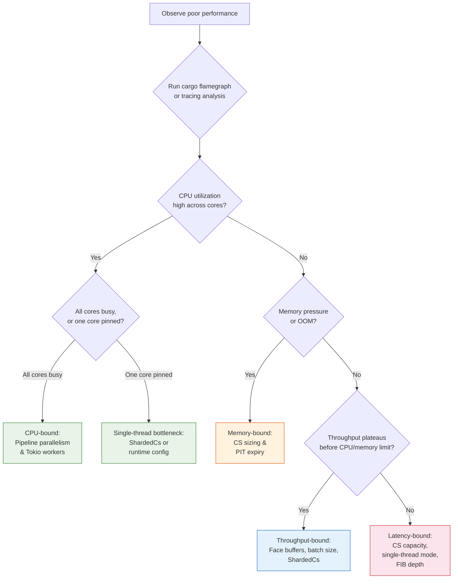

# Performance Tuning

ndn-rs is fast out of the box. But if you're pushing millions of packets per second or running on constrained hardware, here's how to squeeze out more performance — and more importantly, how to decide which knobs to turn first.

The single most important principle in performance tuning is this: **measure before you change anything**. The sections below are organized around the bottleneck you actually have, not the one you think you have. If you skip straight to tweaking settings, you will waste time optimizing the wrong thing.

## Find Your Bottleneck First

Not all tuning is equal. Doubling your Content Store size does nothing if your pipeline is CPU-bound. Adding Tokio workers is pointless if your CS lock is the contention point. Before turning any knob, ask: **where is my bottleneck?**

The following decision tree will guide you to the right section:



### CPU-bound

Your cores are maxed out processing packets. The forwarding pipeline itself — TLV decode, CS lookup, PIT operations, FIB longest-prefix match — is consuming all available CPU.

**What to do:** Increase Tokio worker threads to spread pipeline work across cores. If contention on shared data structures (CS, PIT) is the issue, switch to `ShardedCs` and confirm PIT sharding via `DashMap` is effective. See [Tokio Runtime Configuration](#tokio-runtime-configuration) and [ShardedCs](#shardedcs-for-concurrent-access).

### Memory-bound

You're running out of RAM, or garbage collection / eviction overhead is dominating. This is common on constrained devices or when caching large Data packets.

**What to do:** Reduce CS capacity, tighten PIT expiry lifetimes, or switch to a no-op CS on embedded targets. See [Content Store Sizing](#content-store-sizing) and [PIT Expiry](#pit-expiry-interval).

### Throughput-bound

CPU and memory look fine, but packets per second plateaus. This usually means something is blocking the pipeline: face readers stalling on a full channel, CS lock contention serializing concurrent lookups, or insufficient buffering on high-speed links.

**What to do:** Increase `pipeline_channel_capacity`, enlarge face buffers for fast links, and adopt `ShardedCs`. See [Pipeline Channel Capacity](#pipeline-channel-capacity) and [Face Buffer Sizes](#face-buffer-sizes).

### Latency-bound

Individual packet latency is too high, even though aggregate throughput is acceptable. Packets sit in queues too long, or CS misses dominate when hits would be possible with a larger cache.

**What to do:** Consider a current-thread runtime to eliminate cross-thread scheduling jitter. Increase CS capacity so more lookups are hits (CS hits short-circuit the pipeline early). Keep FIB prefixes short to reduce trie traversal depth. See [Content Store Sizing](#content-store-sizing) and [FIB Lookup Optimization](#fib-lookup-optimization).

## Profiling: How to Find the Actual Bottleneck

> **⚠️ Important:** Always profile before tuning. The most common mistake is optimizing the wrong thing. Run `cargo flamegraph` or `perf record` on a realistic workload first — the actual bottleneck is often not where you expect. The Criterion benchmark suite measures individual components in isolation, but production bottlenecks emerge from the interaction between components under load.

### Tracing spans

ndn-rs instruments the pipeline with `tracing` spans. To see where time is spent, attach a tracing subscriber that records span durations. The `tracing-timing` or `tracing-chrome` crates produce per-span histograms and Chrome trace files, respectively.

A practical approach: run your workload with `RUST_LOG=ndn_engine=trace` and a timing subscriber, then look for spans with unexpectedly high durations. Common culprits are `cs_lookup`, `pit_insert`, and `fib_lpm`.

> **🔍 Tip:** The library never initializes a tracing subscriber — that's your binary's responsibility. This means you can swap between a lightweight production subscriber and a detailed profiling subscriber without recompiling the engine.

### Flamegraphs

Flamegraphs give you a visual map of where CPU time goes:

```bash
# Install cargo-flamegraph if needed
cargo install flamegraph

# Generate a flamegraph from a benchmark or your router binary
cargo flamegraph --bin ndn-fwd -- --config my-config.toml

# Or from the benchmark suite
cargo flamegraph --bench pipeline -- --bench "interest_pipeline"
```

Look for wide bars (functions consuming a lot of time). Common findings:

- Wide bars in `TlvDecode` — your packets are large or complex; consider whether you need full decode on every path.
- Wide bars in `RwLock::read` or `RwLock::write` — lock contention; switch to `ShardedCs` or check PIT access patterns.
- Wide bars in `HashMap::get` — FIB or PIT hash collisions; check name distributions.

### The benchmark suite

ndn-rs includes a Criterion-based benchmark suite in `crates/engine/ndn-engine/benches/pipeline.rs`. Use it to measure the impact of individual tuning changes in isolation before applying them to production:

```bash
# Run all benchmarks
cargo bench -p ndn-engine

# Run a specific benchmark group
cargo bench -p ndn-engine -- "cs/"

# Generate HTML reports (in target/criterion/)
cargo bench -p ndn-engine
open target/criterion/report/index.html
```

Key benchmarks to watch:

| Benchmark | What it measures |
|-----------|-----------------|
| `decode/interest` | TLV decode cost per Interest |
| `cs/hit`, `cs/miss` | Content Store lookup latency |
| `pit/new_entry`, `pit/aggregate` | PIT insert and aggregation |
| `fib/lpm` | FIB longest-prefix match at 10/100/1000 routes |
| `interest_pipeline/no_route` | Full Interest pipeline (decode + CS miss + PIT new) |
| `data_pipeline` | Full Data pipeline (decode + PIT match + CS insert) |

See [Pipeline Benchmarks](../benchmarks/pipeline-benchmarks.md) for detailed results and [Methodology](../benchmarks/methodology.md) for how measurements are collected.

> **📊 Tip:** Run benchmarks with `--save-baseline before` before a tuning change, then `--baseline before` after. Criterion will show you a statistical comparison so you know whether your change actually helped or just added noise.

## Pipeline Channel Capacity

The engine uses a shared `mpsc` channel to funnel packets from all face reader tasks into the pipeline runner. This is one of the most impactful tuning knobs because it sits at the convergence point of all inbound traffic.

```rust
let config = EngineConfig {
    pipeline_channel_capacity: 4096, // default: 1024
    ..Default::default()
};
```

**The tradeoff:** Increasing `pipeline_channel_capacity` from 1024 to 4096 absorbs traffic bursts — a face reader can dump a batch of received packets without blocking, keeping the network stack moving. But a larger channel uses more memory and, more subtly, can hide backpressure problems. If your pipeline is slow, a deep queue lets packets pile up, increasing latency for all of them. You want the queue deep enough that face readers rarely block, but shallow enough that packets do not age in the queue.

**When to increase:** If tracing shows face reader tasks spending significant time blocked on channel sends, your channel is too small. This manifests as throughput drops that correlate with high face counts or bursty traffic patterns.

**When to decrease:** If you care about tail latency more than peak throughput (e.g., real-time applications), a smaller channel ensures packets are processed promptly or dropped, rather than delivered late.

> **🎯 Tip:** The three highest-impact tuning knobs are, in order: (1) **ShardedCs** on multi-threaded runtimes (eliminates CS lock contention), (2) **pipeline channel capacity** (prevents face reader stalls), and (3) **Tokio worker threads** (scales forwarding across cores). Start with these before touching anything else.

## Content Store Sizing

The `LruCs` is sized in **bytes**, not entry count. This is a deliberate design choice: a Content Store holding 1 KiB Data packets behaves very differently from one holding 100-byte packets, and byte-based sizing adapts automatically.

```rust
let cs = LruCs::new(256 * 1024 * 1024); // 256 MiB
```

**The tradeoff:** A larger CS means more cache hits, which short-circuit the Interest pipeline early (before PIT insertion, FIB lookup, or outbound forwarding). Each CS hit saves significant work. But memory is finite, and on constrained devices, an oversized CS starves the OS page cache or other processes.

Rules of thumb:

- **Router with diverse traffic:** 256 MiB -- 1 GiB depending on available RAM. The CS stores wire-format `Bytes`, so the overhead per entry is minimal beyond the packet data itself.
- **Edge device / IoT gateway:** 16 -- 64 MiB. Enough to cache frequently-requested sensor data or configuration objects.
- **Embedded (no CS):** Use a no-op CS implementation. Zero memory overhead, zero lookup cost.

When the byte limit is exceeded, the least-recently-used entries are evicted. This happens inline during insertion, so eviction cost is amortized across inserts rather than appearing as periodic GC pauses.

### ShardedCs for Concurrent Access

Under high concurrency (many pipeline tasks hitting the CS simultaneously), lock contention on a single `LruCs` becomes the bottleneck. You will see this in flamegraphs as wide bars on `RwLock::read` or `RwLock::write` inside CS operations. `ShardedCs` distributes entries across multiple independent shards, each with its own lock:

```rust
use ndn_store::ShardedCs;

// 16 shards, 256 MiB total (16 MiB per shard).
let cs = ShardedCs::<LruCs>::new(16, 256 * 1024 * 1024);
```

**The tradeoff:** Sharding eliminates contention but sacrifices global LRU accuracy. Each shard maintains its own LRU list, so an entry that is "least recently used" globally might survive if its shard has capacity, while a more recently used entry in a full shard gets evicted. In practice, with reasonable shard counts (8--32), the hit rate impact is negligible and the throughput gain is substantial.

**When to use ShardedCs:**
- You are running a multi-threaded Tokio runtime (`multi_thread`)
- Benchmark or profiling shows CS lock contention
- Pipeline throughput plateaus despite available CPU

**When plain LruCs is fine:**
- Single-threaded runtimes or low-throughput scenarios
- CS hit rate is low (most Interests miss the cache anyway, so CS access is not the bottleneck)

> **📊 Performance:** In benchmarks, `ShardedCs` with 16 shards on an 8-core machine shows 3-5x throughput improvement over plain `LruCs` when the CS hit rate is high. The tradeoff is slightly less optimal LRU ordering (each shard maintains its own LRU list), which can marginally reduce hit rates. For most workloads, the concurrency gain far outweighs the eviction accuracy loss.

## FIB Lookup Optimization

The FIB is a name trie with `HashMap<Component, Arc<RwLock<TrieNode>>>` per level. Longest-prefix match traverses from the root to the deepest matching node, locking each level independently (so concurrent lookups on disjoint branches do not contend).

**The key insight:** lookup cost is proportional to name depth, not route count. A lookup for `/a/b` touches 2 trie levels; `/a/b/c/d/e/f` touches 6. The trie fans out at each level via hash maps, so 1,000 routes under `/app` with 2-component names is fast, while 10 routes with 10-component names is slower per lookup.

**What you can control:**
- **Keep prefixes short.** If your application can use shorter prefixes without ambiguity, do so. This is the single most effective FIB optimization.
- **Minimize deep nesting.** Hierarchical naming is powerful, but deeply nested names (8+ components) incur measurable per-lookup cost under high Interest rates.

For FIB sizes above ~10,000 routes, monitor LPM latency via the benchmark suite (see [Pipeline Benchmarks](../benchmarks/pipeline-benchmarks.md)). At that scale, hash collision rates in per-level `HashMap`s can start to matter; the benchmark will tell you if they do in your name distribution.

## PIT Expiry Interval

PIT entries are expired using a hierarchical timing wheel with O(1) insert and cancel. Entries expire based on their Interest Lifetime (typically 4 seconds), and the timing wheel granularity is 1 ms.

**The tradeoff:** The timing wheel is efficient by design, so under normal loads you do not need to tune it. However, at extremely high Interest rates (>1M/s), the expiry tick task competes with pipeline work for Tokio worker time. If expiry falls behind, stale PIT entries accumulate, consuming memory and potentially causing false aggregation (a new Interest matches a stale PIT entry instead of being forwarded).

**What to do if PIT memory grows:** Check whether the timing wheel tick task is being starved. If it is, either dedicate a Tokio worker thread to it or use `spawn_blocking` for the expiry sweep. On memory-constrained devices, consider reducing the default Interest Lifetime at the application level to keep PIT entries short-lived.

> **⚠️ Warning:** Reducing Interest Lifetime aggressively (below 1 second) can cause legitimate Interests to expire before Data returns, leading to retransmissions that increase load rather than reducing it. Only shorten lifetimes if your RTT budget genuinely supports it.

## Face Buffer Sizes

Each face uses bounded `mpsc` channels for inbound and outbound packet buffering. The buffer size determines the tradeoff between burst absorption and memory usage.

```rust
// In your face constructor:
let (tx, rx) = mpsc::channel(256); // 256 packets
```

**The tradeoff:** Larger buffers absorb traffic bursts without dropping packets, which is critical on high-speed links where a momentary pipeline stall could cause packet loss. But each buffer slot holds a `Bytes` handle (~32 bytes plus the packet data), so over-buffering across many faces adds up. On a router with 100 active faces, the difference between 128 and 2048 per face is significant.

| Scenario | Suggested size | Rationale |
|----------|---------------|-----------|
| Local face (App, SHM, Unix) | 128 -- 256 | Low latency path, rarely bursts |
| Network face (UDP, TCP) | 256 -- 512 | Network jitter causes bursty arrivals |
| High-throughput link (10G Ethernet) | 512 -- 2048 | Must absorb line-rate bursts during pipeline stalls |
| Low-bandwidth link (Serial, BLE) | 16 -- 64 | Limited bandwidth means limited burst size; save memory |

> **🔍 Tip:** If you see packet drops on a face but the pipeline has spare capacity, the face buffer is too small. If you see high memory usage but low throughput, the face buffers may be too large across too many idle faces. Consider dynamically sizing buffers based on link speed if you have heterogeneous faces.

## Tokio Runtime Configuration

ndn-rs is built on Tokio throughout. The runtime configuration is one of the highest-leverage tuning decisions because it determines how pipeline work is scheduled across cores.

### Multi-threaded runtime (recommended for routers)

```rust
let rt = tokio::runtime::Builder::new_multi_thread()
    .worker_threads(4)       // match available cores
    .max_blocking_threads(2) // for CS persistence, crypto
    .enable_all()
    .build()?;
```

**`worker_threads`** controls how many OS threads run the Tokio executor. Set this to the number of cores you want dedicated to forwarding. On a 4-core router, use 4. On a shared system where other services need CPU, use fewer. More workers means more parallelism, but also more contention on shared data structures (CS, PIT, FIB locks) — which is why `ShardedCs` matters on multi-threaded runtimes.

**`max_blocking_threads`** caps the thread pool used for blocking operations: `PersistentCs` (RocksDB/redb) disk I/O and signature validation. 2 is usually enough. Increasing this only helps if profiling shows blocking tasks queueing up.

### Current-thread runtime (embedded / latency-sensitive)

```rust
let rt = tokio::runtime::Builder::new_current_thread()
    .enable_all()
    .build()?;
```

All tasks run cooperatively on one thread — no synchronization overhead, no cross-thread scheduling jitter, but no parallelism. This is the right choice for:

- **Embedded deployments** where only one core is available
- **Latency-sensitive applications** where predictable per-packet timing matters more than aggregate throughput
- **Testing and debugging** where deterministic execution simplifies reasoning

> **🔍 Tip:** A single-threaded runtime with plain `LruCs` often has *lower* per-packet latency than a multi-threaded runtime with `ShardedCs`, because there is no lock contention or cross-thread wake-up cost. If your bottleneck is latency rather than throughput, try single-threaded first.

### Thread pinning on NUMA systems

For maximum throughput on NUMA systems, pin Tokio workers to specific cores to avoid cross-socket memory access:

```rust
let rt = tokio::runtime::Builder::new_multi_thread()
    .worker_threads(4)
    .on_thread_start(|| {
        // Pin to core using core_affinity or similar crate.
    })
    .build()?;
```

This is an advanced optimization that only matters on multi-socket servers. If you are running on a single-socket machine or a VM, thread pinning provides no benefit.

## Putting It All Together

The tuning process should follow this cycle:

1. **Profile** your workload with tracing and flamegraphs. Identify the actual bottleneck.
2. **Change one thing.** Adjust the knob that addresses your identified bottleneck.
3. **Benchmark.** Run the Criterion suite or your production workload and compare before/after.
4. **Repeat.** If performance is still insufficient, profile again — the bottleneck may have shifted.

> **⚠️ Important:** Resist the urge to change multiple settings at once. If you increase channel capacity, switch to ShardedCs, and add worker threads simultaneously, you will not know which change helped (or hurt). Methodical, one-change-at-a-time tuning converges faster than shotgun optimization.

### Quick reference: which knob for which bottleneck

| Bottleneck | First knob to turn | Second knob | Third knob |
|------------|-------------------|-------------|------------|
| CPU-bound | Tokio `worker_threads` | `ShardedCs` | FIB prefix depth |
| Memory-bound | CS byte capacity | PIT Interest Lifetime | Face buffer sizes |
| Throughput-bound | `ShardedCs` | `pipeline_channel_capacity` | Face buffer sizes |
| Latency-bound | Current-thread runtime | CS capacity (more hits) | FIB prefix depth |
