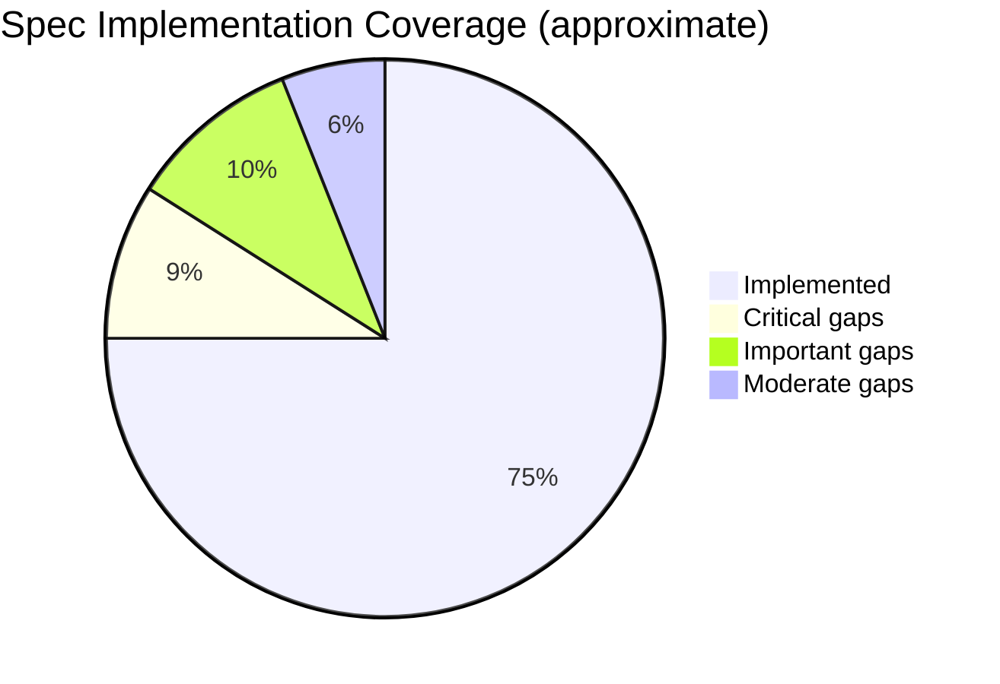

# NDN Specification Compliance

This page summarizes what ndn-rs implements from the NDN specifications and where known gaps exist. For the full gap analysis with exact code locations, see [`docs/spec-gaps.md`](https://github.com/user/ndn-rs/blob/main/docs/spec-gaps.md) in the repository.

## Reference Specifications

| Document | Scope |
|----------|-------|
| [RFC 8569](https://datatracker.ietf.org/doc/rfc8569/) | NDN Forwarding Semantics |
| [RFC 8609](https://datatracker.ietf.org/doc/rfc8609/) | NDN TLV Wire Format |
| [NDN Packet Format Spec](https://docs.named-data.net/NDN-packet-spec/current/) | Canonical TLV encoding, packet types, name components |
| [NFD Developer Guide](https://named-data.github.io/NFD/current/) | Forwarder behavior, management protocol, strategy API |

## Implemented Features

### Packet Types

- **Interest**: decode and encode, including Name, Nonce, InterestLifetime, CanBePrefix, MustBeFresh
- **Data**: decode and encode, including Name, Content, MetaInfo (ContentType, FreshnessPeriod), SignatureInfo, SignatureValue
- **Nack**: encode and decode with NackReason (NoRoute, Duplicate, Congestion)

### TLV Encoding

- VarNumber encoding (1, 2, 4, 8 byte forms)
- TLV-TYPE and TLV-LENGTH parsing
- Non-negative integer encoding
- Name TLV with GenericNameComponent (type 0x08) and ImplicitSha256DigestComponent (type 0x01)

### Forwarding

- **FIB**: name trie with longest-prefix match, multi-nexthop with costs
- **PIT**: concurrent hash map with Interest aggregation, nonce-based loop detection, expiry via timing wheel
- **Content Store**: trait-based with LRU eviction, byte-based sizing, sharded variant for concurrency
- **Strategy layer**: BestRoute and Multicast strategies, StrategyTable with per-prefix LPM, MeasurementsTable with EWMA RTT and satisfaction rate
- **Pipeline stages**: FaceCheck, TlvDecode, CsLookup, PitCheck, Strategy, PitMatch, MeasurementsUpdate, CsInsert, Validation, Dispatch

### Security

- Ed25519 signature generation and verification
- Trust anchor management
- Trust schema validation
- Certificate storage and lookup

### Face Types

- UDP (unicast and multicast)
- TCP
- Unix domain socket
- Ethernet (raw, via AF_PACKET on Linux / BPF on macOS)
- Shared memory (SHM) ring buffer
- In-process AppFace
- Serial (UART)
- Bluetooth
- Wifibroadcast NG (WFB)
- WebSocket
- Compute (named function networking)

### Management

- NFD-compatible management protocol over Unix domain socket
- Face creation, destruction, and listing
- FIB route management
- Strategy assignment
- Status dataset serving

## Known Gaps

### Critical (spec violations)

These must be fixed for basic interoperability with other NDN implementations:

| Gap | Spec Requirement | Status |
|-----|-----------------|--------|
| HopLimit not enforced | MUST drop Interest if HopLimit is 0; MUST decrement before forwarding | Not decoded or checked |
| Nonce not added by forwarder | MUST add Nonce if Interest has none | Not implemented |
| Ed25519 signature type code | Spec assigns code 5 | Code uses 7 |
| NDNLPv2 framing missing | Network packets MUST be wrapped in LpPacket (0x50) | Bare TLV sent on all faces |
| VarNumber shortest-encoding | MUST use shortest encoding | Non-shortest accepted on read |
| Types 0--31 critical handling | Types 0--31 are always critical regardless of LSB | Only LSB checked |
| Zero-component Name | Interest with zero-component Name MUST be discarded | Not validated |
| ForwardingHint not decoded | Optional Interest field for delegation | TLV type defined, never decoded |
| Nack LP framing | Nacks are LP headers inside LpPacket wrapping the original Interest | Standalone TLV, missing wrapper |

### Important (interoperability)

| Gap | Notes |
|-----|-------|
| Signed Interests | InterestSignatureInfo/Value not implemented |
| ParametersSha256Digest verification | Type defined but digest not verified |
| Name canonical ordering | No `Ord` impl on Name |
| NDNLPv2 fragmentation/reassembly | Not implemented |
| KeyDigest in SignatureInfo | Type defined but not decoded |
| ValidityPeriod format | Uses u64 nanoseconds instead of ISO 8601 strings |
| Certificate naming convention | Arbitrary names used instead of `/<Identity>/KEY/<KeyId>/<IssuerId>/<Version>` |
| Certificate DER/SPKI content | Raw public key bytes instead of DER-wrapped |
| CachePolicy LP header | Not implemented |
| Scope enforcement (`/localhost`, `/localhop`) | No scope checking in pipeline |

### Moderate (completeness)

| Gap | Notes |
|-----|-------|
| Typed name components | KeywordNameComponent, SegmentNameComponent, etc. not defined |
| Signature sub-fields | SignatureNonce, SignatureTime, SignatureSeqNum missing |
| Certificate extension TLVs | AdditionalDescription etc. not implemented |
| TLV element ordering validation | No ordering checks on decode |
| Nested TLV length encoding | `write_nested` always uses 5-byte length instead of shortest |

## Summary

**25 total gaps identified.** 9 critical (must fix for basic interop), 10 important (full compliance), 6 moderate (completeness). The critical gaps primarily relate to NDNLPv2 framing and HopLimit handling -- both are prerequisites for wire-compatible operation with NFD and other NDN forwarders.

See [`docs/spec-gaps.md`](https://github.com/user/ndn-rs/blob/main/docs/spec-gaps.md) for the full analysis with exact file locations and code references.
