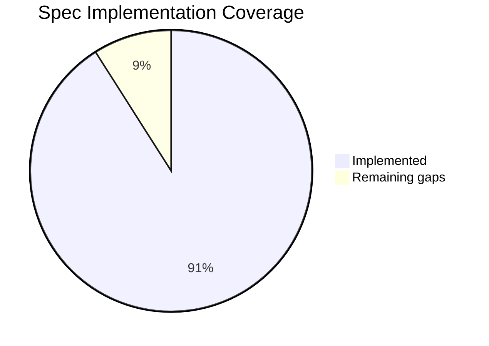

# NDN Specification Compliance

ndn-rs has strong compliance with the core NDN specifications. The forwarder correctly implements TLV wire format encoding and decoding, NDNLPv2 link-layer framing, Interest and Data processing semantics, and the security signing and verification pipeline. Of the 25 spec gaps originally identified during early development, all 9 critical items and most important items have been resolved. The remaining gaps are moderate and do not affect wire-level interoperability with NFD or other NDN forwarders.

For the full gap analysis with exact code locations, see [`docs/spec-gaps.md`](https://github.com/Quarmire/ndn-rs/blob/main/docs/spec-gaps.md) in the repository.

## Reference Specifications

| Document | Scope |
|----------|-------|
| [RFC 8569](https://datatracker.ietf.org/doc/rfc8569/) | NDN Forwarding Semantics |
| [RFC 8609](https://datatracker.ietf.org/doc/rfc8609/) | NDN TLV Wire Format |
| [NDN Packet Format Spec](https://docs.named-data.net/NDN-packet-spec/current/) | Canonical TLV encoding, packet types, name components |
| [NFD Developer Guide](https://named-data.github.io/NFD/current/) | Forwarder behavior, management protocol, strategy API |

## What's Implemented

### TLV Wire Format (RFC 8609)

The TLV codec handles the full range of VarNumber encodings (1, 2, 4, and 8 byte forms) and enforces shortest-encoding on read -- a `NonMinimalVarNumber` error is returned if a longer form is used when a shorter one would suffice. Non-negative integers, Name TLVs with GenericNameComponent (type 0x08) and ImplicitSha256DigestComponent (type 0x01), and all standard Interest and Data fields are correctly encoded and decoded.

TLV types in the 0--31 critical range are handled correctly: the `skip_unknown` logic grandfathers these types so they are always treated as critical regardless of the LSB rule, matching the spec requirement. Zero-component Names are rejected at Interest decode time.

### Packet Types

- **Interest**: full decode and encode including Name, Nonce, InterestLifetime, CanBePrefix, MustBeFresh, HopLimit, ForwardingHint, and InterestSignatureInfo/Value for signed Interests.
- **Data**: full decode and encode including Name, Content, MetaInfo (ContentType, FreshnessPeriod), SignatureInfo, and SignatureValue.
- **Nack**: encode and decode with NackReason (NoRoute, Duplicate, Congestion).

### NDNLPv2 Link Protocol

All network faces use NDNLPv2 LpPacket framing (type 0x50). This includes:

- **LpPacket encode/decode** for wrapping Interest, Data, and Nack packets on the wire.
- **Nack LP framing**: `encode_lp_nack` correctly wraps the original Interest inside an LpPacket with the NackReason header, matching the spec requirement that Nacks are LP headers rather than standalone TLV packets.
- **CachePolicy LP header**: decoded on incoming Data and enforced during CS insert -- the content store respects `CachePolicyType::NoCache` and skips caching when instructed.
- **Fragmentation and reassembly**: `fragment_packet` splits oversized packets into sequenced fragments, and `ReassemblyBuffer` collects and reassembles them on the receiving end, enabling operation over MTU-constrained links.

### Forwarding Semantics (RFC 8569)

- **HopLimit**: decoded at the TLV decode stage. Interests arriving with HopLimit=0 are dropped. Before forwarding, the forwarder decrements HopLimit by one.
- **Nonce handling**: `ensure_nonce()` in the decode stage adds a random Nonce to any Interest that lacks one, satisfying the requirement that forwarders MUST add a Nonce before forwarding.
- **FIB**: name trie with longest-prefix match and multi-nexthop entries with costs.
- **PIT**: concurrent hash map (DashMap) with Interest aggregation, nonce-based loop detection, and expiry via a hierarchical timing wheel.
- **Content Store**: trait-based with pluggable backends (LRU, sharded, persistent via RocksDB/redb), byte-based sizing, and zero-copy cache hits from wire-format `Bytes`.
- **Strategy layer**: BestRoute and Multicast strategies, StrategyTable with per-prefix longest-prefix match, MeasurementsTable tracking EWMA RTT and satisfaction rate per face/prefix.
- **Pipeline stages**: FaceCheck, TlvDecode, CsLookup (short-circuit on hit), PitCheck, Strategy, PitMatch, MeasurementsUpdate, CsInsert, Validation, Dispatch.
- **Scope enforcement**: `/localhost` scope is enforced -- the decode stage and dispatch logic prevent `/localhost`-prefixed packets from being forwarded to or received from non-local faces.

### Security

- **Ed25519 signatures**: signature type code 5 is correctly mapped per the spec. Generation and verification work end to end.
- **Signed Interests**: InterestSignatureInfo and InterestSignatureValue are decoded and the signing path supports Interest packets.
- **Trust infrastructure**: trust anchor management, trust schema validation, certificate storage and lookup.

### Face Types

UDP (unicast and multicast), TCP, Unix domain socket, Ethernet (raw, via AF_PACKET on Linux / BPF on macOS), shared memory (SHM) ring buffer, in-process AppFace, serial (UART), Bluetooth, Wifibroadcast NG (WFB), WebSocket, and Compute (named function networking).

### Management

NFD-compatible management protocol over Unix domain socket, including face creation/destruction/listing, FIB route management, strategy assignment, and status dataset serving.

## Remaining Gaps

Nine items remain unimplemented. None of these affect basic wire-level interoperability, but they prevent full compliance with the complete NDN specification suite.

### Forwarding

- **/localhop scope enforcement**: only `/localhost` scope is currently checked. The `/localhop` prefix, which restricts packets to a single hop, is not enforced. Multi-hop `/localhop` packets will be forwarded as if they were ordinary packets.

### Naming and Ordering

- **Name canonical ordering**: there is no `Ord` implementation on `Name` or `NameComponent`. Code that needs sorted name sets (such as sync protocols or ordered repositories) cannot rely on the standard library's `BTreeMap` or `.sort()`.
- **Typed name components**: the spec defines `KeywordNameComponent`, `SegmentNameComponent`, `ByteOffsetNameComponent`, `VersionNameComponent`, `TimestampNameComponent`, and others. These are not represented as distinct types; all non-digest components are treated as `GenericNameComponent`.

### Security and Certificates

- **Signature sub-fields**: `SignatureNonce`, `SignatureTime`, and `SignatureSeqNum` (used for signed Interest replay prevention) are not decoded or generated.
- **Certificate extension TLVs**: `AdditionalDescription` and other certificate extension types are not implemented.
- **Certificate DER/SPKI content format**: certificates store raw public key bytes rather than DER-wrapped SubjectPublicKeyInfo structures. This means certificates are not directly exchangeable with NDN implementations that expect standard SPKI encoding.
- **Certificate naming convention**: certificate Data packets use arbitrary names instead of the spec-mandated `/<Identity>/KEY/<KeyId>/<IssuerId>/<Version>` convention.
- **ValidityPeriod format**: validity periods are stored as `u64` nanoseconds internally rather than ISO 8601 timestamp strings. The wire encoding does not match what other implementations expect.

### TLV Encoding

- **TLV element ordering validation**: the decoder does not verify that TLV elements appear in the order specified by the packet format spec. Out-of-order elements are silently accepted.

## Summary

Of 25 originally identified spec gaps, 16 have been fixed. The 9 critical gaps (HopLimit, Nonce insertion, NDNLPv2 framing, Ed25519 type code, VarNumber validation, critical type handling, zero-component Name rejection, ForwardingHint, and Nack framing) are all resolved. ndn-rs is wire-compatible with NFD and other standards-compliant NDN forwarders.

The remaining 9 gaps are concentrated in certificate format details, typed name components, and a few validation checks. These affect full spec completeness but not day-to-day forwarding or application development.

See [`docs/spec-gaps.md`](https://github.com/Quarmire/ndn-rs/blob/main/docs/spec-gaps.md) for the full analysis with exact file locations and code references.
